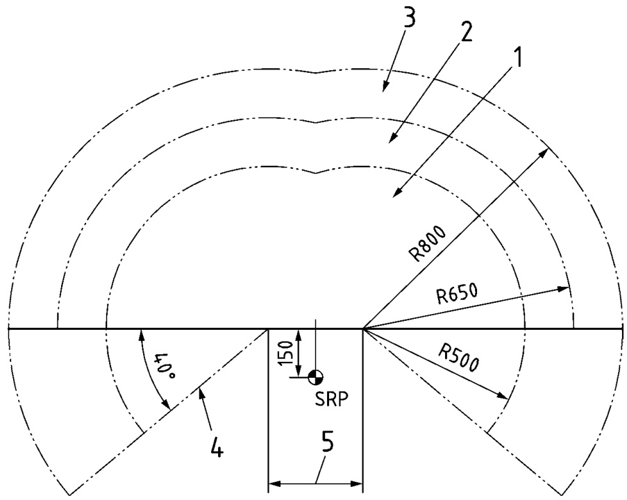
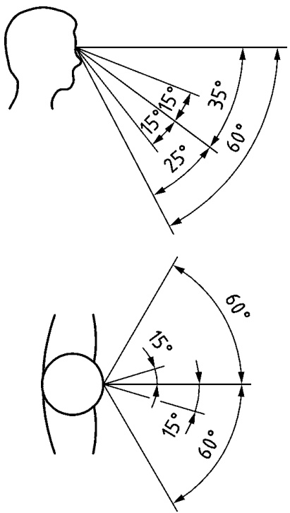

# 铁路应用 - 司机驾驶室

第二部分：显示器、控制装置和指示器的集成

# 国家前言

本英国标准是 EN 16186-2:2017 在英国的实施版本。

英国参与其制定工作已委托给技术委员会 RAE/4/-/4，铁路应用 - 驾驶室。

该委员会的成员组织名单可应要求向其秘书处索取。

本出版物不意图包含合同所需的所有条款。使用者对其正确应用负责。

$\circledcirc$ 英国标准学会 2017
由 BSI 标准有限公司 2017 出版

ISBN 978 0 580 74371 9

ICS 45.060.10

# 符合英国标准并不能免除法律义务。

本英国标准于2017年8月31日由标准政策与战略委员会发布。

自发布以来发行的修正案/勘误

日期 受影响的文本

# 英文版

# 铁路应用 - 驾驶室 - 第2部分：显示器、控制装置和指示器的集成

铁路应用 - 驾驶室 - 第2部分：显示器、控制装置和指示器的集成

铁路应用 - 驾驶室 - 第2部分：显示器、控制装置和指示器的集成

本欧洲标准于2017年5月14日由CEN批准。

CEN成员受CEN/CENELEC内部规章约束，该规章规定了将本欧洲标准作为国家标准实施的条件，且不得进行任何修改。关于此类国家标准的最新列表和书目引用可向CEN/CENELEC管理中心或任何CEN成员申请获得。

本欧洲标准存在三种官方版本（英语、法语、德语）。由CEN成员将其翻译成其本国语言并通知CEN/CENELEC管理中心的版本，与官方版本具有相同的地位。

CEN成员是奥地利、比利时、保加利亚、克罗地亚、塞浦路斯、捷克共和国、丹麦、爱沙尼亚、芬兰、前南斯拉夫共和国马其顿、法国、德国、希腊、匈牙利、冰岛、爱尔兰、意大利、拉脱维亚、立陶宛、卢森堡、马耳他、荷兰、挪威、波兰、葡萄牙、罗马尼亚、塞尔维亚、斯洛伐克、斯洛文尼亚、西班牙、瑞典、瑞士、土耳其和联合王国的国家标准机构。

# 目录

欧洲前言...... 5
引言 ... 6
1 范围 .....
2 规范性引用 .....
3 术语和定义 ... 8
4 符号和缩写 .. 9
5 驾驶室显示器、控制装置和运行功能指示器 .......................... ..... 10
5.1 一般.. 10
5.2 列车通信、监控和控制显示器或单元 ..... 10
5.3 控制装置.... 10
5.3.1 对讲机控制 ... 10
5.3.2 外部乘客通道控制.. 10
5.3.3 驾驶室温度控制 10
5.3.4 车辆的连接和断开控制 ................. 11
5.3.5 辅助台控制 .. 11
5.4 警告 .. 11
5.4.1 由于安全系统引起的警报 .. 11
5.4.2 由于一个或多个外部车门紧急打开引起的警报...... 11
5.4.3 驾驶员与灭火系统的接口 .... 12
5.4.4 由于速度降低引起的警报 ... 12
6 显示器、控制装置和指示器的特性 .... 12
6.1 一般 12
6.1.1 设计原则.. 12
6.1.2 阅读区域..... 12
6.1.3 清洁活动造成的损坏抵抗力... 12
6.1.4 防止积灰的设计 .... 12
6.1.5 标签 .... ..... 12
6.2 显示器的特性 . 13
6.2.1 模拟和字母数字显示器的使用 ...... ... 13
6.2.2 显示器阵列的要求..... 13
6.2.3 指针和刻度要求 .. 13
6.3 控制装置的特性 . 13
6.3.1 一般原则 13
6.3.2 设计标准 ... ... 14
6.3.3 DAC、外部灯光和远程控制的一般特性.... 15
6.4 指示器的特性 . 15
6.4.1 可读性... 15
6.4.2 警告设计原则... 15
6.4.3 与驾驶相关的声音信号的听觉性 . 16
6.4.4 扬声器的音量 16
7 显示器和控制装置的定位 .... .. 16
7.1 定位的通用规则 16
驾驶台设计.. 16
7.1.2 人体工程学/工效学方面......... ... 16
7.1.3 设备定位原则 .. 17
7.1.4 驾驶位置在侧窗处 ... 17
7.1.5 座位位置 ... 17
7.2 触及范围和视野范围 ... 17
8 驾驶员界面 ... 18
9 符号和文本定义 .. .. 22
9.1 符号外观.. 22
9.2 统一符号............ ..... 22
9.2.1 一般 .. 22
9.2.2 颜色组合 ........ ... 23
9.2.3 符号样式........ .... 23
9.2.4 相对于控制装置的位置 ...... .... 23
9.2.5 符号区域.. .... 23
9.2.6 新符号.. 23
9.3 字符类型.. 23
附录A（规范性） 台面的触及范围和视野范围 .. 24
图A.1 — 臂部触及范围 ... .. 24
图A.2 — 座位姿势下的最佳和首选视野范围 ... .. 25
附录B（信息性） 主要驾驶台配置示例 - 功能分配的运行元件和驾驶台层面的集成约束... .. 26
图B.1 — 标准驾驶台的俯视图和正面图... 27
图B.2 — 可选标准EMU/DMU中央驾驶台的俯视图和正面图...... ... 28
表B.1 — 元素列表及其位置，包括功能代码（符合EN 15380–4） ...... .. 29
附录C（规范性） 运行元件与符号的关系 ... ....... 46
表C.1 — 运行元件与符号的关系 ..... ...... 46
附录D（信息性） 项目特定符号 .. .... 61

表D.1 — 运行元件与符号的关系 .... 61
附录E（信息性） 与EN 15380-4功能分解结构（FBS）之间的联系 . 65
表E.1 — 需求管理要素 ... . 65
附录F（信息性） A类偏差 . 69
附录ZA（信息性） 本欧洲标准与欧盟指令2008/57/EC基本要求的关系 .. 70

参考文献.. 71

# 欧洲前言

本文档（EN 16186-2:2017）由欧洲标准化委员会/TC 256“铁路应用”技术委员会编制，其秘书处由德国标准化协会（DIN）承担。

本欧洲标准应以相同文本的发布或认可的方式，最迟于2018年2月获得国家标准地位，并且冲突的国家标准应最迟于2018年2月撤销。

请注意，本文件的某些要素可能涉及专利权。CEN不承担识别任何或所有此类专利权的责任。

本文件是应欧盟委员会和欧洲自由贸易协会的委托而编制的，并支持欧盟指令2008/57/EC的基本要求。

关于与欧盟指令2008/57/EC的关系，请参阅信息性附录ZA，它是本文档不可分割的一部分。

EN 16186《铁路应用——驾驶室》以EN系列形式涵盖了设计驾驶室时需要考虑的所有方面，从人体测量数据和可见性，到显示器、控制装置和指示器的集成，以及显示器的设计到驾驶室布局和通道设施。所使用人体测量数据的背景信息见CEN/TR 16823 [2]。

EN 16186《铁路应用——驾驶室》目前包含以下部分：

第1部分：人体测量数据和可见性；
第2部分：显示器、控制装置和指示器的集成；
第3部分：显示器设计；
第4部分：布局和通道。

根据CEN-CENELEC内部规章，以下国家的国家标准组织有义务实施本欧洲标准：奥地利、比利时、保加利亚、克罗地亚、塞浦路斯、捷克共和国、丹麦、爱沙尼亚、芬兰、前南斯拉夫共和国马其顿、法国、德国、希腊、匈牙利、冰岛、爱尔兰、意大利、拉脱维亚、立陶宛、卢森堡、马耳他、荷兰、挪威、波兰、葡萄牙、罗马尼亚、塞尔维亚、斯洛伐克、斯洛文尼亚、西班牙、瑞典、瑞士、土耳其和英国。

# 介绍

本欧洲标准涉及列车驾驶、调车以及相关的准备工作，重点关注驾驶室界面。它提供了当前的驾驶室设计原则，并考虑了欧洲研究项目 EUDD+ [3] 提供的最新研究成果。

信息性附录 E 按照 EN 15380-4 [4] 提供，用于需求管理。

如果本标准中未指定任何标准要求，则需要在项目层面完成规范或标准选项的选择。

# 1 范围

本欧洲标准适用于电力动车组 (EMU)、柴油动车组 (DMU)、客车、机车、驾驶拖车（驾驶车厢）。

注 1 本欧洲标准适用于符合指令 2008/57/EC [1] 范围内的轨道车辆。

本欧洲标准不适用于地铁、有轨电车和轻轨车辆。

本欧洲标准EN 16186 的本部分适用于安装在驾驶室左侧、右侧或中央位置的驾驶员台。

注 2 对于离地式移动平台，请参阅 EN 14033–1 [5] 和 EN 15746–1 [6]。

本欧洲标准提供了设计规则和指导，以确保在所有运行条件下（白天、夜晚、自然光或人工光）驾驶室内屏幕、控制装置和指示器的可见性和可操作性。

它涵盖四个方面：

显示器、控制装置和指示器的特性，以确保适当的可视性：例如亮度范围和对比度以及感知亮度的调整可能性；驾驶室内及驾驶员台显示器、键盘、控制装置和指示器的位置规则：例如位置、可视角度等，同时考虑正常驾驶姿势和工作环境（挡风玻璃、驾驶室内自然或人工照明、不希望的光晕和反射等）；
麦克风和扬声器的特性和位置规则；
— 符号设计。

注 3：文中所有元素编号均指表 B.1。

# 2 规范性引用

以下文件（全部或部分）在本文件中被规范性引用，对其应用至关重要。对于有日期的引用，仅适用所引用的版本。对于无日期的引用，适用所引用文件的最新版本（包括任何修订）。

EN 894-2，机械安全 – 显示器和控制执行器的符合人体工程学要求 – 第2部分：显示器
prEN 13272-1 铁路应用 – 公共交通系统车辆电气照明 – 第1部分：主线铁路系统
EN 15892，铁路应用 – 噪声发射 – 驾驶室内部噪声测量
EN 16186-1:2014，铁路应用 – 驾驶室 – 第1部分：人体测量数据和可见性
EN 16186-3:2016，铁路应用 – 驾驶室 – 第3部分：显示器设计
EN 16683，铁路应用 – 求助和通信设备 – 要求
ISO 3381，铁路应用 – 声学 – 轨道车辆内部噪声测量

# 3 术语和定义

为本文件的目的，适用 EN 16186-1:2014、EN 16186-3:2016 中给出的术语和定义以及以下内容。

3.1
警报
需要立即采取行动的可听和/或视觉警告，具有明确的优先级

3.2
驾驶室照明
照亮整个驾驶室的照明，以提供安全静止操作，例如在准备工作期间

3.3
B类驾驶室信号系统
国家遗留控制-命令和信号系统

注1：遗留的自动列车保护（ATP）系统符合TSI CCS CR&HS标准（见[7]）。

# 3.4

# 对比

根据 BS 8300:2009 标准，建筑/轨道车辆的一个表面或元素与其另一个表面或元素之间的视觉差异感知，是指参照它们的光反射率值 (LRV)。

[来源：EN 16584-1:2017]

3.5
控制
与车辆交互所用的设备

3.6
指示器
用于指示系统状态的元件

3.7
仪表照明
在黑暗环境条件下照亮特定仪表以使刻度可见的照明

3.8
位置相关控制
命令与设备操作部件在特定范围内位置成比例的控制

3.9
RAL xxxx
德国质量保证和标识研究所（前德国交货条件帝国委员会）的颜色编码

注 1：RAL 3020 是交通红色的颜色编码。

3.10
阅读区域照明
照亮书桌阅读区域的照明，以确保文件可读性。

# 3.11

# 时变控制

控制哪个命令与设备操作部件在特定位置施加的持续时间成比例。

3.12

警告
由接收者需要知晓的事件触发的视觉和/或听觉指示，且可能不需要立即采取行动。

# 4 符号和缩写

ASC 自动速度控制
ATC 自动列车控制
ATP 自动列车保护
BP 制动管
CCD 控制指令显示
CCS 控制-指令和信号
CCTV 闭路电视
DAC 驾驶员活动控制
DMU 柴油动车组
EMU 电动车组
EOA 权限结束
ep 电气-气动
ETCS 欧洲列车控制系统
ETD 电子时刻表显示
EUDD 欧洲驾驶员台
FBS 功能分解结构
HVAC 供暖、通风和空调
KVB 信号基准速度控制
MCB 主电路断路器
MRP 主储气管
NSO 国家标准组织
OTM 轨道上机
PAS 乘客报警系统
PIS 乘客信息系统
RAL 德国质量保证和认证协会
SRP 座位参考点
TCMS 列车控制和监控系统
TDD 技术和诊断显示
TRD 列车无线电显示

# 5 驾驶室显示器、控制装置和运行功能指示器

# 5 驾驶室显示器、控制装置和运行功能指示器

# 5.1 概述

操作所需的元素在附录 B 中显示。操作元素的符号应根据附录 C 提供。对于项目特定功能，应使用附录 D 的符号。

在以下文本中，三位数字指的是列出所有元素的表 B.1。

# 5.2 列车通信、监控和控制的显示或单位

车辆监控、车辆控制和列车通信应至少通过以下台式设备提供：

004 - 控制指令显示器 (CCD);
002 - 技术与诊断显示器 (TDD);
001 - 列车无线电显示器 (TRD)。

对于列车无线电显示器，存在不同的解决方案，例如使用简化的司机界面。

如果增加其他显示器（例如额外的 EMU/DMU TDD、乘客信息系统显示器等），则不得妨碍前方视野（根据 EN 16186-1 标准）。

对于在国家内部使用的车辆，CCD 可以被具有同等功能的设备所替代。

# 5.3 控制装置

# 5.3.1 对讲机控制装置

为设计用于仅驾驶员操作的车辆（即车上除了驾驶员外没有其他工作人员），驾驶室应符合 EN 16683 标准：

一个设备（例如麦克风）用于支持“呼叫求助”功能；一个用于确认呼叫求助的设备；一个用于取消与操作设备的通信链路的控制装置。

这些设备可以与其他设备或功能集成或组合。

# 5.3.2 外部乘客访问控制

如果为列车提供外部乘客访问控制（车门控制），则控制台应配备以下设备：

021 - 左侧车门打开及取消打开；
023 - 右侧车门打开及取消打开；
022 - 中央关闭所有车门。

# 5.3.3 驾驶室温度控制

应提供调节温度的手段。这应符合 EN 14813-1 和 EN 14813-2 标准。

# 5.3.4 车辆连接和断开的控制装置

如果车辆配备自动连接器，驾驶室应具备控制装置来管理连接功能。 参见 EN 16186-3。

# 5.3.5 辅助控制台控制装置

如果提供辅助控制台，则应包括以下操作元件：

013 - ATP 覆盖；
015 - ATP 确认；
213 – 组合牵引/制动控制器，具有最小功能（T+，T，T-，SOS）或（T+，T，0，SOS）；
042 - 激活辅助牵引控制器，如果未提供元件 033 - 行进方向“前进”；
和/或 035 - 行进方向“倒车”。

作为选项：

021 - 释放并取消释放左侧车门；
023 - 释放并取消释放右侧车门；
213 – 组合牵引/制动控制器，带有一个或多个附加功能 $(\mathrm{T}-,\ 0,\mathrm{B}{\bar{\cdot}},\mathrm{B},\mathrm{B}{+})$；
033 - 行驶方向“前进”；
035 - 行驶方向“倒车”；

注意 $\mathrm{T}+$ 表示牵引设定点增加；T 表示牵引设定点恒定，T- 表示牵引设定点减少。0 表示任何设定点的降低。B- 表示制动设定点减少。B 表示制动设定点恒定，${\mathsf{B}}+$ 表示制动设定点增加，SOS 表示紧急制动。

侧面麦克风。以下操作元件应提供在或靠近辅助台：037 - 直接制动；038 - 喇叭；111 或 211 - DAC。

# 5.4 警告

# 5.4.1 由于安全系统引起的警报

允许提供听觉和/或视觉警报以防止安全系统即将进行的干预。

# 5.4.2 由于一个或多个外部门紧急打开而发出的警报

此要求仅适用于运营客运列车的EMU、DMU、驾驶车和机车。

应有声光警报向司机指示一个或多个客车门紧急打开。应能够确认并取消客车门紧急打开的声响信号。

# 5.4.3 驾驶员与灭火系统的接口

如果配备了灭火系统，驾驶员不得具备干预该系统的任何手段。灭火系统已运行或不可用的信息应在驾驶室内提供。

# 5.4.4 速度降低引起的警报

如果除了自动速度控制 (ASC) 以外的系统介入以降低列车速度，则应发出声音和/或视觉警报。

# 6 显示、控制和指示器的特性

# 6 显示、控制和指示器的特性

# 6.1 概述

# 6.1.1 设计原则

元素的视觉设计（例如形状、颜色、位置）应在所有环境光照条件下辅助识别不同的功能。

作为控件和显示器的设计参考，EN 894（所有部分）和 EN 1005（所有部分）可能适用。

# 6.1.2 阅读区域

为允许在驾驶过程中所需纸质文件在驾驶员桌面表面的显示，驾驶员座椅前方应提供至少为 $300\mathrm{mm}\mathrm{~x~}210\mathrm{mm}$ 的横向阅读区域。如果需要，该阅读区域可选择用作书写区域。应提供固定装置。如果这些固定装置未安装在桌面上，则从驾驶员坐姿时（参见 EN 16186-1）驾驶员高个子眼睛的中点到文件之间的距离不应超过 $900\mathrm{mm}$。

注意：有关在最大距离 $900\mathrm{mm}$ 下读取纸质文件所需的最小字符高度，请参阅 EN 894–2。

# 6.1.3 清洁活动造成的损坏抵抗力

操作元件的标识不应被清洁剂弄得难以辨认。

注意：可接受的清洁剂清单通常由制造商提供。

# 6.1.4 设计以防止污垢堆积

深度大于$_{0,5\mathrm{mm}}$的雕刻应受到保护，防止污垢堆积，例如通过覆盖或密封，以保持其可读性。

# 6.1.5 标签标识

如果提供纯文本标签，则适用以下规定：

函数 $"0\mathrm{n}^{\prime\prime}$ 用罗马数字“I”表示；函数 $"0\mathrm{ff^{\prime}}$ 用阿拉伯数字“0”表示；纯文本标记请参见 9.2.1 和 9.3。

# 6.2 显示器的特性

# 6.2.1 模拟和字母数字显示器的使用

通常，字母数字显示器应仅在需要精确的离散信息且呈现的值在足够长的时间内保持可见以便读取时使用，即它们不会持续变化。否则，应使用模拟或图形显示器，请参阅[9]。

# 6.2.2 显示器阵列的要求

如果需要定期监控模拟或图形显示器以检查条件是否为“正常”，则应布置显示器，使所有指针在仪表指示正常运行时的对齐方式相同。

注意 参见[9]和[10]了解人体工程学方面的内容。

# 6.2.3 指针和刻度要求

通常应使用指针相对于固定刻度移动，而不是反过来。

# 6.3 控制器的特性

# 6.3.1 一般原则

# 6.3.1.1 函数特定接口

接口应该针对驱动程序要执行的函数而具体化，例如通过不同的形状、颜色或位置。

控件可以组合多个相关联的功能。

相关驾驶任务应决定是否组合功能，例如用于牵引和制动的一个组合操纵杆。

# 6.3.1.2 控制原则

位置相关的控制应优于时间相关的控制。

213 - 组合牵引/制动控制器用于辅助控制台，远程控制台的控制以及 037 - 直接制动应依赖时间。

# 6.3.1.3 作用方向

控件的动作方向应与其相关控制系统的行为一致。

# 6.3.1.4 隔离装置的位置指示

如果隔离装置显示其位置，例如通过手柄方向或标记，则适用以下规则：

a) ${\mathrm{I}}=0{\mathrm{n}}$ 或正在运行；$0=0$ ff 或未运行。
b) 如果该设备是安装在可见管道上的截止阀，则截止阀的位置应参考管道的方向：打开 $\mathbf{\tau}=\mathbf{\tau}$ 与管道对齐，关闭 $\mathbf{\tau}=\mathbf{\tau}$ 与管道垂直。
c) 对于检查制动面板的正常运行，正常运行的位置应为垂直。需要根据 d) 进行标记。
d) 在设计限制的情况下，规则 b 和 c 可以被永久标签取代。

分配隔离装置可能偏离规则 b；参见 EN 15355。

制动管和主储液管的直角和斜角截止阀也可能偏离规则 b；参见 EN 14601。

对于非对称截止阀，手柄的垂直位置应朝下。

# 6.3.1.5 控制的可读性

控制应具有渐变（触觉）和/或照明（视觉），以便能够识别其操作位置（对于渐变控制使用触觉，对于非渐变控制使用视觉）。如果控制具有渐变，则为了驾驶目的，渐变应精细且精确。

# 6.3.1.6 仪表的可读性

有关毕业，请参考 EN 894-2 中对视觉显示器识别的要求。

# 6.3.2 设计标准

# 6.3.2.1 形状识别

以下功能的控件形状应为：

010 - 紧急制动：蘑菇形控件；
025 - 打磨：带球形的杠杆；
016 - 受电弓：带圆柱形杠杆；
038 - 外部警报喇叭：杠杆；
021、022 和 023 - 车门：按钮；
012 - 列车无线电紧急呼叫：按钮。

# 6.3.2.2 ATP 控制的触觉编码

013、014 和 015 - ATP 控制应该具有不同的形状，以便于触觉识别其功能。

# 6.3.2.3 颜色

# 6.3.2.3.1 一般

驾驶时由驾驶员操作的控制装置应相对于仪表台表面具有颜色区分。可使用符合 RAL 840-HR 或同等标准的 RAL 9004、9011、9017 或 7016、7021、7024 范围内的黑色或灰色饰面。

驾驶室内控制装置的标记和符号应与背景形成高对比度，例如，可使用 RAL 9003、9010 和 9016 用于控制装置的标记和符号，RAL 9005 可用于底色。

# 6.3.2.3.2 红色

本质上，仅在安全关键故障或紧急情况下操作的控制装置及其相关指示器应采用红色（RAL 3000、3001、3002、3020 或同等颜色）。

# 6.3.2.3.3 颜色：黄色

如果需要突出显示某个控件，例如在频繁用于规定的常规程序时，可以在该元素或相邻表面使用黄色（例如 RAL 1003、1004、1018、1021、1023）。

# 6.3.2.3.4 不重要元素的颜色

为了避免视觉干扰，次要操作重要性的控制或操作设备（例如：灯光开关、插座盖），或不常操作或用于维护目的的设备，应采用白色、黑色、灰色、金属饰面（未涂层）或与周围环境相比的中性颜色。

# 6.3.2.4 控制设计的稳健性

控制装置应设计成能够承受不利的环境条件和过大的机械应力（例如，饮用、饮食、灰尘、操作过程中的力作用（例如，调车、联挂）以及恐慌情况）。这些影响不应影响其可操作性。

6.3.3 DAC 的总体特性、外部灯光控制和远程控制

# 6.3.3.1 驾驶员活动控制

桌面上和脚踏板上应至少各有一个用于驾驶员活动控制 (DAC) 功能的控制元件。

# 6.3.3.2 外部灯光控制

027 - 外部灯光（前照灯和示廓灯）的控制装置应至少控制车辆端部（紧邻驾驶室）的外部灯光。车辆的前照灯和示廓灯应从正常驾驶位置控制。304 - 尾灯的控制装置应位于驾驶室内。

# 6.3.3.3 无线遥控器

根据 EN 50239 标准，从“手动模式”到“无线遥控”模式的切换装置可能位于驾驶室中。

# 6.4 指示器的特性

# 6.4.1 可读性

所有指示灯应设计成在自然光或人工光照条件下，包括偶然光照下，都能正确读取。

# 6.4.2 警告设计原则

# 6.4.2.1 一般原则

警告应按照以下原则设计：

驾驶室内听觉和视觉警告应具有鲜明特征，并根据其功能、紧急程度和重要性具有适当的响度和音质和/或光强度；听觉和视觉警告不应不必要地分散驾驶员对正常驾驶职责的注意力；
听觉和视觉警告应在含义上保持一致；
听觉信息应满足以下所有要求：每条听觉信息应与驾驶室内所有其他听觉信息可区分；
在驾驶室内所有适用驾驶位置和所有驾驶条件下均可听到；
— 触发时，听觉警告不应引起驾驶员听觉不适。

注意：有关听觉和视觉警告，请参阅 EN 16186–3。

# 6.4.2.2 听觉警告层级结构

至少对于通过单个通道提供的警告，应存在一个听觉警告层级结构，使得最重要的警告，当被触发且直到被取消或确认之前，将抑制重要性较低的听觉警告。

# 6.4.3 与驾驶相关的声学信号的可听性

驾驶室内由声学信号产生的可听信息应至少比在与警报主音调频率对应的一倍八分频程内的室内噪声高 $\mathrm{L}\mathrm{p}\mathrm{A}=6$ dB。用于将警报与一倍八分频程频率进行比较的室内噪声应是在符合 EN 15892 或 ISO 3381 规定的列车最大运行速度下测量的噪声。

# 6.4.4 扬声器音量

扬声器音量应通过驾驶室内的控制装置进行调节。预设的最小可听音量级别定义于 6.4.3。

# 7 显示器和控制装置的位置

# 7 显示器和控制装置的位置

# 7.1 通用定位规则

# 7.1.1 驾驶员台设计

驾驶员台设计应允许单人操作。

驾驶员台应按照附件 B 的规定进行设计。

如果需要辅助台面，应将其放置在侧壁上或侧壁附近。

# 7.1.2 人体工程学方面

应应用人因工程学原理来优化驾驶室内的布置，考虑到：

a) 控制和仪表在可见性、触及范围和操作力度方面的理想位置；
b) 由于熟悉现有设计而产生的限制；
c) 由于驾驶室空间物理/技术要求而产生的限制。

注 1：以上适用于正常驾驶以及合理可预见的、通常由列车故障引起的高需求场景。

控制操作和仪表/显示器的观察不应造成过度疲劳，并且应考虑到第 1 部分中描述的驾驶员的人体测量范围，同时考虑其力量和生物力学特征。

注 2：有关力、重复性和姿势的更多信息，请参阅 EN 1005（所有部分）；有关显示器的信息，请参阅 EN 894–2。

# 7.1.3 设备定位原则

驾驶室内的设备应按照以下原则定位：

a) 重要性原则 – 对安全高效运行最关键的显示器和控制装置应放置在最易触及的位置，例如刹车、牵引力控制、喇叭。
b) 使用频率原则 – 最常使用的显示器和控制装置应放置在最易触及的位置，例如刹车、DAC、信号装置。
c) 功能原则 – 具有密切相关功能的显示器和控制装置应放置在彼此靠近的位置。
d) 使用顺序原则 – 按照顺序使用的显示器和控制装置应放置在彼此靠近的位置，并且其布局应与操作顺序逻辑相关。

为了确保所有与安全相关和/或频繁使用的设备在驾驶时易于掌握和可见，不得被不具备基本安全功能的设备阻碍或妨碍访问。

不驾驶时不需要的物品不应放置在驾驶员台的常用区域（见附件 A）。

为了避免驾驶员的注意力不必要地从观察路况上分散，图 A.1 所示的触及范围应仅包含驾驶或危险情况下所需的操作控制和信息，图 A.2 所示的优选视野应仅包含驾驶或危险情况下所需的操作控制和信息。

仅应在触及范围和优选视野内提供必要的操作信息。这些区域内不应有文字、标志或其他制造商的广告。

控制和显示器的位置应考虑到驾驶员头部和眼部运动量，旨在最大限度地提高驾驶员对赛道和信号的视觉集中度。

如果TCMS已开启，以下信息应始终在主控制台可用：

007 和 008 - 制动信息；
与列车控制系统（司机驾驶室信号，004 - CCD）监控相关的信号方面信息；
时刻表（006 - ETD 或其他方式）。

如果驾驶室未激活，信息可能仅在请求时显示。

元素内的排列应与列车的运行行为一致（例如，前进、后退或左、右）。

# 7.1.4 侧窗驾驶位置

如果预见侧窗驾驶位置（例如辅助台），该位置应允许驾驶员查看主台的制动和速度信息。这可以通过站立时转动头部来实现，但不得离开该位置。

# 7.1.5 空间限制

在空间受限的情况下，超出附件 B 规定的显示器或仪表（控制装置、指示器等）可以放置在水平线之上（见图 A.2），前提是不影响前向视野（符合 EN 16186-1 标准）。

在转向机车或带有前连通道和驾驶室的动车组/柴油动车组空间受限的情况下，在驾驶室内使用的控制装置应按照本标准进行定位，并至少提供相同的功能。方向功能（033、034、035）可以组合成一个旋转开关。

# 7.1.6 与本标准不同的元件定位

对于与本标准不同的元件定位，应考虑任务分析。

注：任务分析，包括姿势评估，已在EUDD项目中被使用，并作为本标准的建议来源。

# 7.2 显示器的定位

# 7.2.1 显示器位置和方向

显示表面应尽可能与驾驶员的视线垂直，并且避免直接或反射的眩光。

至少应包括以下显示器：

001 – TRD；
002 – TDD；
004 – CDD；
006 – ETD（如果适用）；

应设计为从正常驾驶位置到显示器的观看距离范围为 500 毫米到 1000 毫米。
它们应放置在不妨碍驾驶室其他设备操作的位置。

# 7.2.2 理想视野范围

7.1.3 中识别的重要信息应根据图 A.2 放置在桌面上的首选视野范围内。如果需要进行评估，则应使用基于 EN 16186-1 中定义的坐姿驾驶位置的较高驾驶员参考视点进行绘图。

# 7.2.3 定位 ATP 信号信息

速度和 004 - ETCS 信号信息应位于首选视野范围内（见图 A.2），符合 TSI CCS 标准的 B 类车厢信号信息应位于该视野内。

001 - 列车无线电 – 并且，如果提供，符合 TSI CCS 标准的闭路电视和 B 类车厢信号系统 – 可能会位于该首选视野范围之外。

# 7.2.4 遗产 ATP 系统的集成

如果需要集成遗留的自动列车保护（ATP）系统，可以增大显示器之间的距离以便在相邻显示器之间安装ATP-驾驶员接口，或者可以将这些遗留组件安装在显示区域上方，同时遵守图A.2中规定的首选视野范围以及EN 16186-1标准规定的前方可见性要求。

# 7.3 控制装置的定位

# 7.3.1 驾驶员台控制装置的可触及性

存在三个触及范围，定义了以下三个区域：正常、扩展和最大，见图 A.1。

请参阅附录 B 和附录 C 以了解元素的定义和应用。单个控件的位置指其在中心位置时的中心点。

a) 正常：所有重要性高和/或使用频率高和/或在坐姿和，如果适用，站姿下使用时间较长的控件应位于符合本标准人体测量要求的正常触及范围内。这包括可以用前臂扫到的区域。在该区域内，应至少有元素 019、020、032a 或 032b、037 的控件和信息。 b) 扩展：重要性较低和/或使用频率较低的控件应位于扩展触及范围内，该范围包括在上臂偏离正常条件时以及可能包括肩部推力时所能触及的区域。该区域包括正常区域，应至少有元素 013、014、015、016、017、018、021、022、023、025、026、027、033、034、035、038、040 的控件和信息，以及正常区域的元素。元素 024、028 和 029 也应位于该区域。 c) 最大：在驾驶员坐姿下可以通过移动身体可以触及的控件。该区域包括正常区域和扩展区域，应至少有以下位于台面的控件和信息：001、002、004、006、009、010、012、030、036、101、102、103、104、105、106、107、108、109、114、115。对于非为频繁停车设计的车辆，元素 021、022、023 也可以位于该区域。元素：102、103、104、105、106、107、108、109、114、115 可以位于台面下方。

注：测量基于CEN/TR 16823中给出的欧洲人体测量数据。

# 7.3.2 控制器分组

# 7.3.2.1 通用

与相同功能相关的控件应在驾驶员台组合或分组在一起。
一个组中的控件数量应限制在三个以内。

# 7.3.2.2 车门控制的组合

021、022 和 023 - 与车门相关的台面控制装置应成组或集成到一个组合元素中。这些元素的位置应反映相关单元侧面。

# 7.3.2.3 行进方向控制装置的组合

033、034 和 035 控制装置与行进方向相关，应成组放置在控制台上或集成到一个组合元件中。这些元件的位置应反映相关的行进方向。

# 7.3.2.4 ATP 控制装置的组合

013、014 和 015 - ATP 控制装置应成组。

# 7.3.2.5 更多分组示例

更多控件分组示例：

7.3.2.6 联锁控制；
7.3.2.7 暖通空调控制；
7.3.2.8 雨刮/清洗控制；
7.3.2.9 弓形/主开关控制等。

# 7.3.3 手部分配

对于列车，气动制动装置的控制装置（032a - 自动制动或 032b - 牵引制动组合控制器）应位于驾驶员台的右侧。 这样，左手可以自由操作其他设备（例如 020 - 牵引动态制动控制器、001 - 列车无线电、013、014 和 015 ATC/ATP、016 - 受电弓、017 - 主断路器、012 - 列车无线电紧急呼叫按钮等）。

注意：对于英国和爱尔兰，请参阅附录 F。

# 7.3.4 可访问性

一个元素的易访问性不应被另一个元素阻碍。

# 7.3.5 元素的同步操作

在加速和制动时均需操作的控制元件应布置成可以用双手触及的位置；这些元件包括 025 - 撒砂控制，026 - 牵引单元自动制动解除，027 - 外部前灯和 029 - 阅读区域及驾驶室照明。

# 7.3.6 误操作风险

控制的位置和控制的组合应尽量减少意外激活的风险。

# 7.3.7 特定控件的位置

# 7.3.7.1 通用

如果桌面集成条件允许，控制装置应放置在桌面之上或延伸区域，而不是放置在桌面下方的控制台。如果 104、105、106、107 和 108（暖通空调控制）、103（中央控制台照明）和 109（压力保护控制）可以从坐姿访问，则可以将其放置在桌面下方。

# 7.3.7.2 自动速度控制

019 - 自动速度控制应靠近 020 - 牵引/动态制动杆。如果存在 32b - 单一组合牵引/制动控制器，则可能不适用（参见图 B.2）。它应依赖于位置。

# 7.3.7.3 驾驶员牵引和制动控制

如果牵引力及/或制动力通过操纵杆（组合式或分离式）设定，则“牵引力”应通过向前推动操纵杆来增加，并且“制动力”应通过将操纵杆向驾驶员方向拉动来增加。对于紧急制动位置（如果提供），应有一个明显区别于操纵杆其他位置的缺口。

驾驶员 032a - 自动制动手柄，020 - 牵引力/动轮制动控制器，以及 032b - 组合式牵引力/制动元件应具有位置依赖性。

注意：对于英国和爱尔兰，请参阅附录 F。

# 7.3.7.4 紧急制动控制

至少应在驾驶室内提供一个紧急制动控制装置 010 – 紧急制动控制装置，以便驾驶员从其驾驶位置以及任何其他授权人员从驾驶员助手位置能够触及。

# 7.3.7.5 制动管超压控制

009 - 制动管超压控制（如果安装）应优先布置在制动管压力信息附近。或者，可以将制动管超压功能布置成相关信息位于操作元件时视线方向上。

# 7.3.7.6 公共广播控制

如果需要公共广播/PIS，则需要一个用于公告的控制装置，以及在以下情况下：

手动系统：一个触发信息的控制装置；
自动系统：一个抑制信息的控制装置；

应位于附件A中定义的最大区域内。

# 7.3.8 驾驶时使用的控制装置，但未位于驾驶员台面上

从坐姿操作且在驾驶时使用的，但并非用于快速、针对性操作的控制装置，可以设置在驾驶员腿部空间旁边的垂直表面上（参见附件 B）。

如果暖通空调控制装置可以从坐姿操作，则可以将其设置在仪表板下方。

为了快速、有针对性的操作，且不分散对轨道系统的注意力，驾驶员腿部空间内可以设置脚踏控制装置（例如踏板）。脚踏控制元件数量不得超过四个。

在脚部操作控制元件（DAC除外）旁边，应留出两个自由空间，每个空间的最小宽度为140毫米，以便驾驶员在坐姿下休息脚部，且不接触任何这些控制元件，DAC除外。

# 7.3.9 仅在静止时操作的控制元件

# 7.3.9.1 概述

仅在静止状态下操作的控制装置应根据图 A.1 放置在三个触及范围之外。

# 7.3.9.2 ATP 系统和 DAC 的隔离

无法从驾驶位置访问 520、543 - 隔离 ATP 系统，以及隔离 503 - DAC。

# 7.3.9.3 门控制位置

如果为了监控外部车门，驾驶员需要从主驾驶位置移动到侧窗以查看平台安装的设备或向后查看列车，那么适用于该侧的车门控制装置应位于每个侧窗处。

# 8 驾驶室照明、显示器、控制装置和指示器

# 8.1 驾驶室照明

驾驶室照明应符合 prEN 13272-1 标准。

# 8.2 阅读区域照明

阅读区域照明应提供元件 029。它应与驾驶室照明独立，并应可通过元件 039 进行调节。

# 8.3 仪表照明

仪表照明应符合第 028 条的规定。如果提供，它应独立于驾驶室照明，并且应根据第 104 条进行调节。照度值的范围应为 0.3 lx 至 30 lx。

如果使用仪表（007 和 008），则需要仪表照明。

# 8.4 防止干扰驾驶员

当提供额外的灯具时（例如，为第二人提供的灯具），这些灯具不应在灯具的正常工作位置使驾驶员眩目。

# 8.5 禁止绿色照明

为了防止与外部运行信号产生任何危险的混淆，驾驶室内不允许使用绿色灯光或绿色照明，除非是现有的B类车厢信号系统（符合TSI CCS）。

# 9 符号和文本定义

# 9.1 符号外观

符号在正常日光工作条件下应清晰可见，以便于识别元件。
符号设计应简洁、易读且能够自明。

# 9.2 统一符号

# 9.2.1 一般性原则

控制装置和指示器应有清晰的标记，以便能够识别。如果提供了该功能，应使用标准化符号来标记驾驶室内的控制装置和指示器（参见附录 C）。符号应按照表 C.1 所示的方式复制。表 C.1 提供统一尺寸为 $30\mathrm{mm}$ 的原始符号，并带有角标记，以便进行准确的放大和缩小缩放。符号图示没有边框，以便实现一致的缩放复制，即可以通过缩放因子来改变符号的大小。

对于表 C.1 中列出的功能，应使用相关的符号。

注意 1：对于表 C.1 中未列出的新功能，建议将与任何新功能相关的提议符号通知 NSO，以便及时修订本标准。

符合表 C.1 中提供的符号要求，当定义该符号的特征参数被感知为相等时即可实现。例如，如果尊重图形元素（线条粗细、字段尺寸、半径等）的最大容差为 $10\%$ ，则认为已达到这种等效性的感知。

如果标准化组织以电子矢量图形数据信息提供一个符号，并且申请人在处理至最终产品过程中既不损坏也不更改该信息，则由此信息派生的符号应被视为符合本标准。

注意 2 改变缩放比例（缩放）既不构成损坏，也不构成信息更改。

注意 3 新符号验证方法在 ISO 9186 中有描述。

# 9.2.2 颜色组合

颜色组合应符合EN 16186-3:2016标准表4的要求。

# 9.2.3 符号样式

图形符号可以描绘成轮廓形式或填充形式。

# 9.2.4 相对于控件的位置

符号（如果需要）应放置在每个控件或仪表盘的旁边或集成到其中。

# 9.2.5 符号字段

符号字段，除B类列车信号系统（遗留ATP系统）外，应具有至少10毫米的最小边长。

# 9.2.6 新符号

本标准范围内的任何新符号都应符合本标准的要求，并且应基于深色背景。

如果使用文本，该文本应简短且含义明确。

表 D.1 中列出的函数相关的符号不是强制符号。它们代表特定的或偏离的函数，作为信息性示例。

# 9.3 字符类型

字符类型不应使用衬线字体。
应使用芝加哥、Helvetica、Swiss 或 Verdana 或任何其他类似 Arial 的字体。

附录 A（规范性）

# 桌面上的触及范围和视野范围

图 A.1 显示了手臂的可触及范围（俯视图投影）。

# 关键


高个司机 SRP 座位参考点（参见 EN 16186–1:2014，图 2）
图 A.1 — 臂展范围

1 正常区域
2 扩展区域
3 最大区域
4 臂部活动范围极限
5 最小个体的肩部枢轴点（参见 EN 16186–1:2014，图 2）

注意：触及范围信封是基于最小体型人员的身体尺寸开发的。但本图使用了高个驾驶员的SRP：驾驶室组装标准的主要参考点是高个驾驶员的SRP，因此在本附录中将其用作参考点。根据人体测量学，假设小个驾驶员的SRP比高个驾驶员的SRP向前$150\mathrm{mm}$，参见EN 16186-1:2014，图2，关于“$\mathrm{\mathbf{v}}^{\prime\prime}$ 的值范围。这些触及范围信封及其固定位置对所有体型的驾驶员都有效。图纸假设手指是尖的。

图A.2显示了最佳和优选的视野范围（侧视图和俯视图）。

# a) 侧视图显示显示器的最佳和优选垂直放置位置，坐姿视线角度 $\mathbf{\varepsilon}=35^{\circ}$ 低于水平线

对于最重要的显示器，最佳位置是在视线方向垂直方向上的 $\pm\:15^{\circ}$ 以内。

显示器应放置在水平线和低于 $60^{\circ}$ 之间。

  
图 A.2 — 坐姿下最佳和优选视野范围

# b) 平面图显示视觉显示器的最佳和优选水平放置位置

最重要的显示器的最佳位置是在视线方向线左右 $\pm15^{\circ}$ 的水平范围内。

显示器应放置在视线方向线左右 $\pm60^{\circ}$ 的水平范围内。

# 附录 B（参考）

# 驾驶员工位配置示例 - 驾驶员工位层面的操作元件功能分配与集成约束

驾驶员工位上位置标准化的操作元件应按照图B.1和图B.2的规定进行布置。其他元件（如表B.1所示）位置可选。操作元件本身是否为驾驶员的标准接口在表B.1中说明，图B.1和图B.2中以灰色显示的元件表示适用于所有类型的车辆的标准配置。

注意：图纸未按比例绘制，且与图A.1无关。

图B.1：标准化驾驶员台（顶部和控制台）布局，最大限度地集成设备，但不集成传统ATP系统（B类列车信号系统）。对于某些元素，显示了两种可能的安装位置。

  
图B.1 — 标准化驾驶员台顶部视图和正面视图

图B.2：可选标准化EMU/DMU中央驾驶台布局（顶部和控制台），最大限度地集成设备，但不集成传统ATP系统（B类）。对于某些元素，显示了两种可能的安装位置。

  
图B.2 – 可选标准化EMU/DMU中央驾驶台布局（俯视图和前视图）

表 B.1 — 元素及其位置列表，包括功能代码（符合 EN 15380-4 标准）

表 B.1 — 元素及其位置列表，包括功能代码（符合 EN 15380-4 标准）

<table border="1">
<tr>
<td rowspan="2">元素</td>
<td rowspan="2"></td>
<td colspan="3">适用于</td>
<td rowspan="2"></td>
<td rowspan="2">注释（例如，可选位置的原因）元素 - 不受本标准范围内的 cab 评估约束</td>
<td rowspan="2"></td>
</tr>
<tr>
<td>机车</td>
<td>驾驶车厢</td>
<td>EMU/DMU/ 车辆</td>
</tr>
<tr>
<td>001 列车无线电显示器 (TRD)</td>
<td>是</td>
<td>标准</td>
<td>标准</td>
<td>标准</td>
<td>KD, HEH, H</td>
<td>UIC 612-04 CLC/TS 50459-1 CLC/TS 50459-2</td>
<td>不同的解决方案是可能的，例如使用简化的驾驶员界面</td>
</tr>
<tr>
<td>002 技术和诊断显示器 (TDD)</td>
<td>是</td>
<td>标准</td>
<td>标准</td>
<td>标准</td>
<td>DB, EB, H, CFE, HGE, HGD, FCH,</td>
<td>UIC 612-03</td>
<td></td>
</tr>
<tr>
<td>004 控制指令显示器 (CCD)</td>
<td>是</td>
<td>标准</td>
<td>标准</td>
<td>标准</td>
<td>HBE</td>
<td>CLC/TS 50459-1 CLC/TS 50459-3- ERA_ERTSM_015560 Subset 026</td>
<td></td>
</tr>
<tr>
<td>006 电子列车时刻表显示器 (ETD)</td>
<td>是</td>
<td>可选</td>
<td>可选</td>
<td>可选</td>
<td>HEH, CL, HBE</td>
<td>TSI CCS Annex A UIC 612-05</td>
<td></td>
</tr>
<tr>
<td>007 BP（制动管）和 MP（主管）压力表</td>
<td>是</td>
<td>可选</td>
<td>可选</td>
<td>可选</td>
<td>G</td>
<td>EN 15734 (所有部分) EN 14198 UIC 612-0</td>
<td>如果不存在制动管压力表信息，应将其集成到 TDD 中</td>
</tr>
<tr>
<td>008 制动缸压力表</td>
<td>是</td>
<td>可选</td>
<td>可选</td>
<td>可选</td>
<td>G</td>
<td>EN 15734 (所有部分) EN 14198 UIC 612-0</td>
<td>如果不存在制动缸压力表信息，应将其集成到 TDD 中</td>
</tr>
</table>

<table border="1">
<tr>
<td rowspan="2">元素</td>
<td rowspan="2"></td>
<td colspan="3">适用于</td>
<td rowspan="2"></td>
<td rowspan="2">本标准范围内的驾驶室评估参考</td>
<td rowspan="2">注释（例如，可选位置的原因）</td>
</tr
><tr
><td
>机车</td
><td
>驾驶车厢</td
><td
>EMU/DMU/车辆</td
></tr
><tr
><td
>009 制动管压力调节器（过充）</td
><td
>是</td
><td
>标准</td
><td
>标准</td
><td
>可选</td
><td
>G</td
><td
>EN 15734（所有部分）EN 14198 UIC 612-0 UIC 612-2</td
><td
>可选用于EMU/DMU：可替代集成到TDD中</td
></tr
><tr
><td
>010 带“紧急停止”功能的紧急停止阀</td
><td
>是</td
><td
>标准</td
><td
>标准</td
><td
>标准</td
><td
>G</td
><td
>EN 15734（所有部分）EN 14198 UIC 612-0 UIC 612-2 ETCS subset 034 (FFFIS TIU)</td
><td
></td
></tr
><tr
><td
>012 列车无线电紧急呼叫</td
><td
></td>
<td
>标准</td
><td
>标准</td
><td
>标准</td
><td
>KD, HEH</td
><td
>CLC/TS 50459-2 UIC 612-04 UIC Project EIRENE (SRS V25.3.0 and FRS V7.3.0</td
><td
>应靠近TRD，最好位于TRD右侧或可以是一个集成元素</td
></tr
><tr
><td
>013 ATP：覆盖（EOA）</td
><td
>是</td
><td
>可选</td
><td
>可选</td
><td
>可选</td
><td
>HCC</td
><td
>ERA_ERTMS_015560 Subset 026 TS 50459-3 TSI CCS Annex A, UIC 612-0</td
><td
>可选：集成到CCD中</td
></tr
</table>

<table border="1">
<tr>
<td rowspan="2">元素</td>
<td rowspan="2"></td>
<td colspan="3">适用于</td>
<td rowspan="2"></td>
<td rowspan="2">本标准范围内的驾驶室评估参考</td>
<td rowspan="2">注释（例如，可选位置的原因）</td>
</tr>
<tr>
<td>机车</td>
<td>驾驶车厢</td>
<td>EMU/DMU/车辆</td>
</tr>
<tr>
<td>014 ATP：释放干预</td>
<td>是</td>
<td>可选</td>
<td>可选</td>
<td>可选</td>
<td>HCC</td>
<td>ERA_ERTMS_015560 Subset 026 TSI CCS Annex A,</td>
<td>可选：集成到CCD中</td>
</tr>
<tr>
<td>015 ATP：确认</td>
<td>是</td>
<td>可选</td>
<td>可选</td>
<td>可选</td>
<td>HCC</td>
<td>ERA_ERTMS_015560 Subset 026 TSI CCS Annex A,</td>
<td>可选：集成到CCD中</td>
</tr>
<tr>
<td>016 受电弓/柴油机</td>
<td></td>
<td>标准</td>
<td>标准</td>
<td>标准</td>
<td>FB, FDB</td>
<td>EUN 6206 (larts) UIC 612-2 ETCS subset 034</td>
<td>Dendit B.2. 对于柴油机，016可以与017合并</td>
</tr>
<tr>
<td>BlreaMarn Circwit transmission</td>
<td></td>
<td>标准</td>
<td>标准</td>
<td>标准</td>
<td>FB</td>
<td>(FFFIS TIU) UIC 612-2 ETCS subset 034</td>
<td>Ddt B.2. 对于柴油机，017可以与016合并</td>
</tr>
<tr>
<td>018 列车电源</td>
<td></td>
<td>可选</td>
<td>可选</td>
<td>可选</td>
<td>FB</td>
<td>(FFFIS TIU) UIC 62-2</td>
<td>Doceaendingfon ti acioedancthit deskuprefered B.2.</td>
</tr>
</table>

<table border="1">
<tr rowspan="2">元素</td<td rowspan="2"></td><td colspan="3">适用于</td><td rowspan="2"></td><td rowspan="2">本标准范围内的驾驶室评估参考</td><td rowspan="2">注释（例如，可选位置的原因）</td></tr>
<tr rowspan="2">机车</td<td rowspan="2">驾驶车厢</td<td rowspan="2">EMU/DMU/车辆</td></tr>
<tr rowspan="2">019 自动速度控制 (ASC)</td<td rowspan="2">否</td<td rowspan="2">可选</td<td rowspan="2">可选</td<td rowspan="2">可选</td<td rowspan="2">FBB, G</td<td rowspan="2">UIC 612-0</td<td rowspan="2">如果位置 019 位于控制台右侧，则适用以下前提条件：仅电控制动，位置 019 离控制台表面的可见高度应小于位置 032b 的 60%；位置 019 的形状应与位置 032b 不同；</td></tr>
<tr rowspan="2">020 牵引/动车制动组合控制器，集成驾驶员活动控制推杆</td<td rowspan="2">是</td<td rowspan="2">标准</td<td rowspan="2">标准</td<td rowspan="2">可选</td<td rowspan="2">FBB, HEC</td<td rowspan="2">EN 15734 (所有部分) EN 14198 UIC 612-0 UIC 612-2</td<td rowspan="2">032b 之间没有其他元素。牵引/动车制动组合控制器应位于机车配置的左侧</td></tr>
<tr rowspan="2">d1 Dor cotrolett cancel release</td<td rowspan="2">aas</td<td rowspan="2">可选</td<td rowspan="2">标准</td<td rowspan="2">标准</td<td rowspan="2">DBB</td<td rowspan="2">(FFFIS TIU) EN 14752</td<td rowspan="2">Thalocationftoeratn menri handlocaedine</td></tr>
<tr rowspan="2">02 dorcontaldors</td<td rowspan="2">aas</td<td rowspan="2">可选</td<td rowspan="2">标准</td<td rowspan="2">标准</td<td rowspan="2">DBB</td<td rowspan="2">EN 14752</td<td rowspan="2">Thalecat hand ie b locatedin the intersectonof the reach</td></tr>
</table>

<table border="1">
<tr rowspan="2">元素</td<td rowspan="2"></td><td colspan="3">适用于</td><td rowspan="2"></td><td rowspan="2">参考书目注释（例如，可选位置的原因）相关元素 - 不受本标准范围内的驾驶室评估影响</td><td rowspan="2"></td></tr>
<tr rowspan="2">机车</td<td rowspan="2">驾驶车厢</td><td rowspan="2">EMU/DMU/车辆</td></tr>
<tr rowspan="2">取消释放</td<td rowspan="2">aas</td><td rowspan="2"></td><td rowspan="2">标准</td><td rowspan="2">标准</td><td rowspan="2">DBB</td><td rowspan="2">EN 14752</td><td rowspan="2">操作元素的放置应便于左手或右手操作，即位于触及范围的交点处</td></tr>
<tr rowspan="2">024 列车照明（由于TCMS提供触发信息，可能在目标系统中被取代）</td<td rowspan="2">aas</td><td rowspan="2">可选</td><td rowspan="2">可选</td><td rowspan="2">可选</td><td rowspan="2">CDB</td><td rowspan="2">EN 13272 UIC 612-0</td><td rowspan="2">操作元素的放置应便于左手或右手操作，即位于触及范围的交点处</td></tr>
<tr rowspan="2">025 撒砂</td<td rowspan="2">aas</td><td rowspan="2"></td><td rowspan="2">标准</td><td rowspan="2">标准</td><td rowspan="2">HEC</td><td rowspan="2">UIC 612-0 UIC 612-2</td><td rowspan="2">操作元素的放置应便于左手或右手操作，即位于触及范围的交点处</td></tr>
<tr rowspan="2">026 释放制动</td<td rowspan="2"></td><td rowspan="2">标准</td><td rowspan="2">可选</td><td rowspan="2">可选</td><td rowspan="2">G</td><td rowspan="2">EN 15734（所有部分）EUN 41-0 UIC 612-2 ETCS subset 034</td><td rowspan="2">操作元素的放置应位于触及范围</td></tr>
<tr rowspan="2">027 外部前灯</td<td rowspan="2"></td><td rowspan="2"></td><td rowspan="2">标准</td><td rowspan="2">标准</td><td rowspan="2">HEJ, KB</td><td rowspan="2">EN 15153-1</td><td rowspan="2">操作元素的放置应位于触及范围的交点处</td></tr>
</table>

<html><body><table><tr><td rowspan="2">元素 028 仪表照明</td><td rowspan="2"></td><td colspan="3">适用于</td><td rowspan="2">CDB</td><td rowspan="2">参考书目注释 - 不受本标准范围内的驾驶室评估影响 UIC 612-0 取决于台面的大小。首选</td><td rowspan="2">注释（例如，可选位置的原因）</td></tr><tr><td>机车 选项</td><td>驾驶车厢 选项</td><td>EMU/DMU/车辆 选项</td></tr><tr><td>(可能在目标系统中被TCMS提供的触发信息取代) 029 阅读区域和驾驶室照明</td><td>aas</td><td></td><td> 标准</td><td> 标准</td><td>CDB</td><td>EN 13272 UIC 612-0</td><td>位置在标准中定义 取决于台面的大小。首选位置在标准中定义</td></tr><tr><td> 030 麦克风</td><td>aas</td><td>选项</td><td>选项</td><td> 选项</td><td>CFF, CFC</td><td>IEC 62580 UIC 612-0</td><td>取决于台面的大小。首选位置在标准中定义</td></tr><tr><td>032a 自动制动控制器（自动</td><td>aas 是</td><td> 标准</td><td> 标准</td><td> 选项</td><td>G, HEC</td><td>EN 15734（所有部分）EN 14198</td><td>032a 可用于乘客警报确认</td></tr><tr><td>制动）</td><td></td><td></td><td></td><td></td><td></td><td>EN 16334 UIC 612-0 UIC 612-2 ETCS subset 034 (FFFIS TIU)</td><td></td></tr></table></body></html>

<html><body><table><tr><td rowspan="2">元素</td><td rowspan="2"></td><td colspan="3">适用于</td><td rowspan="2"></td><td rowspan="2">参考书目信息相关元素 - 不受本标准范围内的驾驶室评估影响</td><td rowspan="2"></td></tr><tr><td>机车</td><td>驾驶车厢</td><td>EMU/DMU/车辆</td></tr><tr><td>032b 组合牵引/制动控制器（位置相关）带有集成的驾驶员活动控制推</td><td>是</td><td></td><td></td><td>选项</td><td>G, HEC</td><td>EN 15734（所有部分）EN 14198 EN 16334 UIC 612-0 UIC 612-2</td><td>032b 可用于乘客警报确认</td></tr><tr><td>033 行进方向“前进”</td><td>是</td><td>标准</td><td>标准</td><td>标准</td><td>GDB</td><td>(FFFIS TIU) UIC 612-0</td><td>位置 033 在离开静止状态后不应点亮</td></tr><tr><td>034 无行进方向“中性”</td><td>是</td><td>标准</td><td>标准</td><td>标准</td><td>GDB</td><td>UIC 612-0</td><td></td></tr><tr><td>035 行进方向“倒车”</td><td>是</td><td>标准</td><td>标准</td><td>标准</td><td>GDB</td><td>UIC 612-0</td><td>位置 035 在离开静止状态后不应点亮</td></tr><tr><td>036 驾驶员身份卡读卡器</td><td>否</td><td>选项</td><td>选项</td><td>选项</td><td>HD, HE</td><td>UIC 612-0 CLC/TR 50610 IEC 61375-2-4</td><td></td></tr><tr><td>037 直接制动</td><td>是</td><td>标准</td><td>选项</td><td>选项</td><td>G</td><td>EN 15734（所有部分）EN 14198 UIC 612-0</td><td></td></tr><tr><td>038 外部警告喇叭</td><td>是</td><td>标准</td><td>标准</td><td>标准</td><td>HEJ</td><td>UIC 612-2 EN 15153-2 UIC 612-0</td><td>如果使用气动控制的喇叭，位置可能不同</td></tr></table></body></html>

<html><body><table><tr><td rowspan="2">元素</td><td rowspan="2"></td><td colspan="3">适用于</td><td rowspan="2"></td><td rowspan="2">元素 - 不受本标准范围内的驾驶室评估影响</td><td rowspan="2"></td></tr><tr><td>机车</td><td>驾驶车厢</td><td>EMU/DMU/车辆</td></tr><tr><td>039 台灯</td><td>否</td><td>标准</td><td>标准</td><td>标准</td><td>CDB</td><td>EN 13272 UIC 612-0</td><td></td></tr><tr><td>040 键盘</td><td>是</td><td>选项</td><td>选项</td><td>选项</td><td>H</td><td>UIC 612-0</td><td></td></tr><tr><td>041 文件架 042 辅助台的激活</td><td>否</td><td>标准</td><td>标准</td><td>标准</td><td>G</td><td>UIC 612-0</td><td></td></tr><tr><td>051 第二人</td><td>否 否</td><td>选项</td><td>选项</td><td>选项</td><td></td><td>EN 13272</td><td></td></tr><tr><td>阅读区域照明（在桌子上） 101 列车无线电-手持机</td><td></td><td></td><td></td><td></td><td></td><td>UIC 612-0</td><td></td></tr><tr><td>102 中心灯</td><td>是</td><td>标准</td><td>标准</td><td>标准</td><td>CFF</td><td>UIC 612-0 UIC 612-04</td><td></td></tr><tr><td>控制台 103 中心控制台</td><td>否</td><td>选项</td><td>选项</td><td>选项</td><td>CDB</td><td>EN 13272 UIC 612-0 EN 13272</td><td>如果桌子下方有手动操作的元件，应提供控制台照明</td></tr><tr><td>照明</td><td></td><td>选项</td><td>选项</td><td>选项</td><td>CDB</td><td>UIC 612-0</td><td>手动操作的元件在桌子下方</td></tr><tr><td>104 仪表照明水平 105 地板和膝盖</td><td>否</td><td>选项</td><td>选项</td><td>选项</td><td>CDB CEC</td><td>EN 13272 UIC 612-0 EN 14813-1</td><td>根据桌子的大小和/或位置；首选位置是桌子右侧 根据桌子的大小和/或位置；</td></tr><tr><td>空间（膝盖空间）加热 106 客舱空气鼓风机</td><td></td><td></td><td></td><td></td><td></td><td>UIC 612-0</td><td>首选位置是桌子右侧</td></tr><tr><td>转速</td><td>否</td><td>标准</td><td>标准</td><td>标准</td><td>CED</td><td>EN 14813-1 UIC 612-0</td><td>根据桌子的大小和/或位置；首选位置是桌子右侧</td></tr></table></body></html>

<html><body><table><tr><td rowspan="2">元素</td><td rowspan="2"></td><td colspan="3">适用于</td><td rowspan="2"></td><td rowspan="2">参考书目评论（例如，可选位置的原因）相关元素 - 不受本标准范围内的驾驶室评估影响</td><td rowspan="2"></td></tr><tr><td>机车</td><td>驾驶车厢</td><td>EMU/DMU/车辆</td></tr><tr><td>107 驾驶室温度</td><td>否</td><td>选项</td><td>选项</td><td>选项</td><td>CEC</td><td>EN 14813-1 UIC 612-0</td><td>根据桌子的大小和/或位置；首选位置是桌子右侧</td></tr><tr><td>108 空调/通风</td><td>否</td><td>选项</td><td>选项</td><td>选项</td><td>CEB</td><td>EN 14813-1 UIC 612-0</td><td>根据桌子的大小和/或位置；首选位置是桌子右侧</td></tr><tr><td>109 驾驶室压力保护</td><td>否</td><td>选项</td><td>选项</td><td>选项</td><td>CEB</td><td>EN 14813-1 UIC 612-0</td><td>根据桌子的大小和/或位置；首选位置是桌子右侧</td></tr><tr><td>111 驾驶员活动控制 (DAC) 脚踏开关</td><td>是</td><td>标准</td><td>标准</td><td>标准</td><td>HJ</td><td>EN 16186-1 UIC 612-0</td><td></td></tr><tr><td>112 用于自动升降脚踏板的高度调节的脚踏开关（1个或可选2个开关）</td><td>否</td><td>选项</td><td>选项</td><td>选项</td><td>CB</td><td>EN 16186-1 UIC 612-0</td><td>开关可以使用一个或两个开关在桌子上的或桌子下实现</td></tr><tr><td>113 用于外部警告喇叭的脚踏开关</td><td>是</td><td>标准</td><td>标准</td><td>标准</td><td>HEJ</td><td>EN 15153-2 UIC 612-0</td><td></td></tr><tr><td>114 前风挡雨刮器和挡风玻璃清洗器（mway bedided into</td><td>否</td><td>标准</td><td>标准</td><td>标准</td><td>CC</td><td>EN 15152 EN 16186-1 UIC 612-0</td><td>根据桌子的大小和/或位置；首选位置是桌子右侧</td></tr><tr><td>115 前风挡加热</td><td>否</td><td>标准</td><td>标准</td><td>标准</td><td>CCC</td><td>EN 15152 EN 16186-1 UIC 612-0</td><td>根据桌子的大小和/或位置；首选位置是桌子右侧</td></tr></table></body></html>

<html><body><table><tr><td rowspan="2">元素</td><td rowspan="2"></td><td colspan="3">适用于</td><td rowspan="2"></td><td rowspan="2">参考书目信息相关元素 - 不受本标准范围内的驾驶室评估影响</td><td rowspan="2">评论（例如，可选位置的原因）</td></tr><tr><td>机车</td><td>驾驶车厢</td><td>EMU/DMU/车辆</td></tr><tr><td>辅助桌、驾驶室后壁等的可用性 121 诊断插座</td><td>否</td><td>选项</td><td>选项</td><td>选项</td><td></td><td>UIC 557</td><td></td></tr><tr><td>122 防电击</td><td>否</td><td>选项</td><td>选项</td><td>选项</td><td></td><td>UIC 612-0 UIC 612-0</td><td></td></tr><tr><td>插座 230 V/ 50 Hz 211 驾驶员活动</td><td>否</td><td>选项</td><td>选项</td><td>选项</td><td>HJ</td><td>EN 16186-1</td><td></td></tr><tr><td>控制按钮（DAC） 212 驾驶室照明</td><td>否</td><td>选项</td><td>选项</td><td>选项</td><td>CDB</td><td>UIC 612-0 EN 13272</td><td>车辆外部的每个驾驶室入口</td></tr><tr><td>213 牵引/制动组合控制器（时间</td><td>是</td><td>选项</td><td>选项</td><td>选项</td><td>G, HEC</td><td>UIC 612-0 EN 15734（所有部分） EN 14198 EN 16334 UIC 612-0</td><td>应与位置 212 相关联，仅用于辅助桌</td></tr><tr><td>301 激活/停用</td><td>否</td><td>标准</td><td>标准</td><td>标准</td><td></td><td>ETCS subset 034 (FFFIS TIU) UIC 612-0</td><td>如果位置 036 不存在，此元素将触发驾驶室的激活和停用</td></tr></table></body></html>

<html><body><table><tr><td rowspan="2">元素</td><td rowspan="2"></td><td colspan="3">适用于</td><td rowspan="2"></td><td rowspan="2">与操作元素相关的书目信息 - 不受本标准范围内的驾驶室评估影响</td><td rowspan="2">评论（例如，可选位置的原因）</td></tr><tr><td>机车</td><td>驾驶车厢</td><td>EMU/DMU/车辆</td></tr><tr><td>302 发动机室照明 303 隔离</td><td>否 否</td><td>标准 标准</td><td>选项 标准</td><td>选项 标准</td><td>CDB</td><td>EN 13272 UIC 612-0 EN 15734（所有部分） EN 14198 UIC 612-0</td><td>可以与ATP隔离结合。有关ATP隔离，请参阅元素520-543</td></tr><tr><td>304 外部照明</td><td></td><td>标准</td><td>标准</td><td>标准</td><td>KB</td><td>ETCS subset 034 (FFFIS TIU) EN 15153-1</td><td></td></tr><tr><td>305 ep 刹车</td><td>否</td><td>标准</td><td>标准</td><td>标准</td><td>G</td><td>UIC 612-0 EN 15734（所有部分） EN 14198 UIC 612-2 ETCS subset 034</td><td>选项：集成到TDD中</td></tr><tr><td>306 停车刹车的手动施加</td><td>否</td><td>标准</td><td>标准</td><td>标准</td><td>G</td><td>(FFFIS TIU) EN 15734（所有部分） EN 14198 UIC 612-0 ETCS subset 034</td><td></td></tr></table></body></html>

<html><body><table><tr><td rowspan="2">元素</td><td rowspan="2"></td><td colspan="3">适用于</td><td rowspan="2"></td><td rowspan="2">元素 - 不受本标准范围内的驾驶室评估影响</td><td rowspan="2">评论（例如，可选位置的原因）</td></tr><tr><td>机车</td><td>驾驶车厢</td><td>EMU/DMU/车辆</td></tr><tr><td>307 停车制动的手动释放</td><td>否</td><td>标准</td><td>标准</td><td>标准</td><td>G</td><td>EN 15734（所有部分）EN 14198 UIC 612-0 ETCS subset 034</td><td></td></tr><tr><td>308 自动解耦</td><td>否</td><td>选项</td><td>选项</td><td>选项</td><td></td><td>(FFFIS TIU) UIC 612-0 UIC 612-1</td><td>仅适用于自动耦合器</td></tr><tr><td>320 热隔间（冰箱/炉灶）</td><td>否</td><td>选项</td><td>选项</td><td>选项</td><td></td><td>UIC 612-0</td><td></td></tr><tr><td>321 热隔间的储物柜</td><td>否</td><td>选项</td><td>选项</td><td>选项</td><td></td><td>UIC 612-0</td><td></td></tr><tr><td>401 自动制动释放装置</td><td>否</td><td>选项</td><td>选项</td><td>选项</td><td>G</td><td>EN 15734（所有部分）EN 14198 UIC 612-0</td><td></td></tr><tr><td>402 制动隔离阀</td><td>否</td><td>选项</td><td>选项</td><td>选项</td><td>G</td><td>EN 15734（所有部分）EN 14198 UIC 612-0 ETCS subset 034 (FFFIS TIU)</td><td></td></tr></table></body></html>

<html><body><table><tr><td rowspan="2">元素</td><td rowspan="2"></td><td colspan="3">适用于</td><td rowspan="2"></td><td rowspan="2">元素 - 不受本标准范围内的驾驶室评估影响</td><td rowspan="2">评论（例如，可选位置的原因）</td></tr><tr><td>机车</td><td>驾驶车厢</td><td>EMU/DMU/车辆</td></tr><tr><td>403 制动指示器</td><td>是</td><td>标准</td><td>标准</td><td>选项</td><td>G</td><td>EN 15734（所有部分）EN 14198 UIC 612-0 ETCS subset 034 (FFFIS TIU)</td><td>仅适用于盘式制动器，并位于EN 15220-1中定义的车辆外部</td></tr><tr><td>405a Mg制动</td><td>否</td><td>选项</td><td>选项</td><td>选项</td><td>G</td><td>EN 15734（所有部分）EN 14198 UIC 612-0 ETCS subset 034 (FFFIS TIU)</td><td></td></tr><tr><td>405b 涡流制动</td><td>否</td><td>选项</td><td>选项</td><td>选项</td><td>G</td><td>EN 15734（所有部分）EN 14198 UIC 612-0 ETCS subset 034 (FFFIS TIU)</td><td></td></tr><tr><td>406 制动模式“G”的制动切换</td><td>否</td><td>选项</td><td>选项</td><td>选项</td><td>G</td><td>EN 15734（所有部分）EN 14198 UIC 612-0 ETCS subset 034</td><td></td></tr><tr><td>407 制动模式“p”的制动切换</td><td>否</td><td>选项</td><td>选项</td><td>选项</td><td>G</td><td>(FFFIS TIU)</td><td></td></tr><tr><td>408 制动模式“R”的制动切换</td><td>否</td><td>选项</td><td>选项</td><td>选项</td><td>G</td><td></td><td></td></tr></table></body></html>

<html><body><table><tr><td rowspan="2">元素</td><td rowspan="2"></td><td colspan="3">适用于</td><td rowspan="2"></td><td rowspan="2">评论（例如，可选位置的原因）元素 - 不受本标准范围内的驾驶室评估影响</td><td rowspan="2"></td></tr><tr><td>机车</td><td>驾驶车厢</td><td>EMU/DMU/车辆</td></tr><tr><td>409 牵引单元左端尾部信号</td><td>否</td><td>选项</td><td>选项</td><td>选项</td><td></td><td>EN 15153-1 UIC 612-0</td><td>专用符号应提供方向</td></tr><tr><td>410 牵引单元右端尾部信号</td><td>否</td><td>选项</td><td>选项</td><td>选项</td><td></td><td></td><td>专用符号应提供方向</td></tr><tr><td>411 外部电源指示器</td><td>否</td><td>选项</td><td>选项</td><td>选项</td><td></td><td>CLC/TS 50546 UIC 612-0</td><td></td></tr><tr><td>412 外部电源插座（岸电）</td><td>否</td><td>选项</td><td>选项</td><td>选项</td><td></td><td>CLC/TS 50546 UIC 612-0</td><td></td></tr><tr><td>413 外部电源旋转开关</td><td>否</td><td>选项</td><td>选项</td><td>选项</td><td></td><td>CLC/TS 50546 UIC 612-0</td><td></td></tr><tr><td>501 乘客信息系统 (PIS)</td><td>否</td><td>选项</td><td>选项</td><td>选项</td><td></td><td>EN 62580-1 UIC 612-0</td><td></td></tr><tr><td>502 发动机室照明</td><td>否</td><td>选项</td><td>选项</td><td>选项</td><td></td><td>EN 15153-1 UIC 612-0</td><td></td></tr><tr><td>503 驾驶员活动控制 (DAC) 隔离开关</td><td>否</td><td>选项</td><td>选项</td><td>选项</td><td>HJ</td><td>EN 16186-1 UIC 612-0</td><td></td></tr><tr><td>504 模式选择：列车总线选择</td><td>否</td><td>选项</td><td>选项</td><td>选项</td><td></td><td>EN 61375 UIC 612-0</td><td></td></tr></table></body></html>

<html><body><table><tr><td rowspan="2">元素</td><td rowspan="2"></td><td colspan="3">适用于</td><td rowspan="2"></td><td rowspan="2">元素 - 不受本标准范围内的驾驶室评估影响</td><td rowspan="2">评论（例如，可选位置的原因）</td></tr><tr><td>机车</td><td>驾驶车厢</td><td>EMU/DMU/车辆</td></tr><tr><td>505 隔离开关“TCMS紧急制动”</td><td>否</td><td>选项</td><td>选项</td><td>选项</td><td>G</td><td>EN 15734（所有部分）EN 14198 UIC 612-0 ETCS subset 034</td><td></td></tr><tr><td>506 牵引切断在车门打开时的复位</td><td>否</td><td>选项</td><td>选项</td><td>选项</td><td></td><td>EN 14752 UIC 612-0</td><td></td></tr><tr><td>507 制动模式选择的备用选项</td><td>否</td><td>选项</td><td>选项</td><td>选项</td><td>G</td><td>EN 15734（所有部分）EN 14198 UIC 612-0</td><td></td></tr><tr><td>508 准备/关闭 509 隔离/除</td><td>否 否</td><td>标准</td><td>标准 选项</td><td>标准</td><td></td><td>UIC 612-0 EN 15734（所有部分）</td><td></td></tr><tr><td>隔离自动制动控制器</td><td></td><td></td><td></td><td>选项</td><td></td><td>EN 14198 UIC 612-0 ETCS subset 034 (FFFIS TIU)</td><td></td></tr><tr><td>510 钥匙锁“架线Pantograph”</td><td>否</td><td>选项</td><td>选项</td><td>选项</td><td>FB</td><td>EN 50206（所有部分）UIC 612-0</td><td></td></tr><tr><td>511 隔离阀“撒砂”</td><td>否</td><td>选项</td><td>选项</td><td>选项</td><td>HEC</td><td>UIC 612-0</td><td></td></tr></table></body></html>

<html><body><table><tr><td rowspan="2">元素</td><td rowspan="2"></td><td colspan="3">适用于</td><td rowspan="2"></td><td rowspan="2">元素 - 不受本标准范围内的驾驶室评估影响</td><td rowspan="2">评论（例如，可选位置的原因）</td></tr><tr><td>机车</td><td>驾驶车厢</td><td>EMU/DMU/车辆</td></tr><tr><td>512 隔离阀“自动紧急制动阀 1”</td><td>否</td><td>选项</td><td>选项</td><td>选项</td><td>G</td><td>EN 15734（所有部分）EN 14198 UIC 612-0</td><td></td></tr><tr><td>513 隔离阀“自动紧急制动阀 2”</td><td>否</td><td>选项</td><td>选项</td><td>选项</td><td>G</td><td>(FFFIS TIU) EN 15734（所有部分）EN 14198 UIC 612-0 ETCSsubset 034</td><td></td></tr><tr><td>514 隔离阀“空气制动转向架 1”</td><td>否</td><td>选项</td><td>选项</td><td>选项</td><td>G</td><td>(FFFIS TIU) EN 15734（所有部分）EN 14198 UIC 612-0 ETCS subset 034</td><td></td></tr><tr><td>515 隔离阀“空气制动转向架2”</td><td>否</td><td>选项</td><td>选项</td><td>选项</td><td>G</td><td>(FFFIS TIU) EN 15734（所有部分）EN 14198 UIC 612-0 ETCS subset 034</td><td></td></tr><tr><td>516 隔离开关用于乘客报警系统 (PAS) 的功能</td><td>否</td><td>选项</td><td>选项</td><td>选项</td><td>CFD</td><td>(FFFIS TIU) EN 16334 UIC 612-0</td><td></td></tr></table></body></html>

<html><body><table><tr><td rowspan="2">元素</td><td rowspan="2"></td><td colspan="3">适用于</td><td rowspan="2"></td><td rowspan="2">参考信息相关元素 - 不受本标准范围内的驾驶室评估影响</td><td rowspan="2"></td></tr><tr><td>机车</td><td>驾驶车厢</td><td>EMU/DMU/车辆</td></tr><tr><td>517 用于呼叫援助 (CFA) 的隔离开关</td><td>否</td><td>选项</td><td>选项</td><td>选项</td><td>CG</td><td>EN 16683</td><td></td></tr><tr><td>520-543 ATP隔离 注意：B类驾驶室信号系统在TSI CCS中列出。</td><td>否</td><td>选项</td><td>选项</td><td>选项</td><td>HCC</td><td>对于ETCS基线2：CLC/EN xxxxx (BL 2) 对于ETCS基线3：TSI CCS附录A，子集xxx</td><td>根据TSI CCS B类列表对ATP系统的编号，例如524鳄鱼</td></tr><tr><td>600 在上升坡道上启动</td><td>否</td><td>选项</td><td>选项</td><td>选项</td><td>G</td><td>UIC 612-0</td><td></td></tr><tr><td>601 麦克风激活</td><td>否</td><td>选项</td><td>选项</td><td>选项</td><td>CF</td><td></td><td></td></tr><tr><td>602 后视激活</td><td>否</td><td>选项</td><td>选项</td><td>选项</td><td>CCC</td><td></td><td></td></tr><tr colspan="8">标准的部分（例如，控制的可达性）。a</td></tr></table></body></html>

附录 C（规范性）

# 操作元素及其与符号的关系

无论放置位置如何，表 C.1 列出了所有操作元素，这些元素是本欧洲标准的适用对象。

注 1：表 C.1 中的 ID 编号参考表 B.1。

注 2：深色背景上的符号表示关联的操作元件的标签。如果表格中显示了按钮，它作为操作元件的示例，而符号本身被精确定义。如果带有白色在黑色背景符号的功能由点亮的按钮提供，则符号的颜色可能会反转。

表 C.1 — 操作元件及其与符号的关系

表 C.1 — 操作元件及其与符号的关系

<table border="1">
<tr>
<td>ID#</td>
<td>名称（主要目标功能）</td>
<td>注释 / 符号</td>
</tr>
<tr>
<td>007</td>
<td>BP(制动管) 和 MP (主管道压力)</td>
<td>a 选项：整合到 TDD 中。</td>
</tr>
<tr>
<td>008</td>
<td>制动缸压力表</td>
<td>01/2 选项：整合到 TDD 中。</td>
</tr>
<tr>
<td>009</td>
<td>制动管压力调节器（过充）</td>
<td>(f) 选项：整合到 TDD 中。如果该功能由点亮的按钮提供，则符号的颜色应反转。</td>
</tr>
<tr>
<td>012</td>
<td>列车无线电紧急呼叫</td>
<td>符号应反转。选项：整合到 TRD 中。如果该功能由点亮的按钮提供，则基本颜色为</td>
</tr>
</table>

<table border="1">
<tr>
<td>ID#</td>
<td>名称（主要目标功能）</td>
<td>注释 / 符号</td>
</tr>
<tr>
<td>013</td>
<td>ATP：覆盖（例如 EOA）</td>
<td>8. 选项：整合到 CCD 中。</td>
</tr>
<tr>
<td>014</td>
<td>ATP：解除干预</td>
<td>选项：整合到 CCD 中。</td>
</tr>
<tr>
<td>015</td>
<td>ATP：确认</td>
<td>选项：整合到 CCD 中。</td>
</tr>
<tr>
<td rowspan="2">016</td>
<td>Pantegan</td>
<td></td>
</tr>
<tr>
<td>降低受电弓 / 停止柴油机</td>
<td></td>
</tr>
<tr>
<td colspan="3">注 1：如果柴油和电力推进在同一单元或同一列车配置的单元中分别控制，则符号可能不组合使用。注 2 Fordedicat EN 6186-3.CTDD)</td>
</tr>
</table>

<table border="1">
<tr>
<td>ID#</td>
<td>名称（主要目标功能）</td>
<td colspan="2">注释 / 符号</td>
</tr>
<tr>
<td rowspan="3">017</td>
<td>主断路器 / 启动电力传输  主断路器 / 连接电力传输</td>
<td>o1 S</td>
<td rowspan="3"></td>
</tr>
<tr>
<td>打开主断路器 / 断开电力传输</td>
<td>Jol</td>
</tr>
<tr>
<td>如果柴油和电力推进在同一单元或同一列车配置的单元中分别控制，则符号可能不组合使用。</td>
<td></td>
</tr>
<tr>
<td colspan="5">注 4 专用于牵引控制的组合，请参阅 EN 16186-3 (TDD)。</td>
</tr>
<tr>
<td rowspan="2">018</td>
<td>列车供电开启</td>
<td></td>
<td></td>
</tr>
<tr>
<td>列车供电关闭</td>
<td></td>
<td></td>
</tr>
<tr>
<td>019</td>
<td>自动速度控制 (ASC)</td>
<td></td>
<td>0 km/h</td>
</tr>
</table>

<table border="1">
<tr>
<td>ID#</td>
<td>名称（主要目标功能）</td>
<td>注释 / 符号</td>
</tr>
<tr>
<td>020</td>
<td>组合牵引/动车制动控制器，集成驾驶员活动控制按钮</td>
<td>100% 0% OFF 0% B 100 %</td>
</tr>
<tr>
<td>021</td>
<td>车门控制：左侧车门-释放和取消释放</td>
<td>如果该功能由点亮的按钮提供，则符号应如下所示：</td>
</tr>
<tr>
<td>022</td>
<td>车门控制：中央关闭所有车门</td>
<td>可可</td>
</tr>
</table>

<table border="1">
<tr>
<td>ID#</td>
<td>名称（主要目标功能）</td>
<td>注释 / 符号</td>
</tr>
<tr>
<td>020</td>
<td>组合牵引/动车制动控制器，集成驾驶员活动控制按钮</td>
<td>100% 0% OFF 0% B 100 %</td>
</tr>
<tr>
<td>021</td>
<td>车门控制：左侧车门-释放和取消释放</td>
<td>如果该功能由点亮的按钮提供，则符号应如下所示：</td>
</tr>
<tr>
<td>022</td>
<td>车门控制：中央关闭所有车门</td>
<td>可可</td>
</tr>
</table>

# 名称（主要目标功能）</td><td></td><td>注释 / 符号</td><td></td></tr><tr><td>023</td><td>车门控制：右侧车门-释放和取消释放</td><td>如果该功能由点亮的按钮提供，则符号应如下所示：</td><td></td></tr><tr><td rowspan="2">024</td><td> 车辆照明开启</td><td>旧</td><td></td></tr><tr<td>车辆照明关闭</td><td></td><td></td></tr><tr><td>025</td><td> 撒砂</td><td>p</td><td></td></tr><tr><td>026</td><td> 释放制动</td><td>1O</td><td>[应用 ISO 7000-2448 “弹簧制动释放”]</td></tr><tr><td rowspan="3">027</td><td>外部前灯 全亮前灯和标记灯</td><td></td><td></td><td></td></tr><tr<td>调光前灯和标记灯</td><td></td><td>三D</td><td></td></tr><tr<td>标记灯</td><td></td><td></td><td></td></tr></table></body></html>

<html><body><table><tr><td>ID#</td><td>名称（主要目标功能）</td><td colspan="2">注释 / 符号</td></tr><tr><td rowspan="2"></td><td>调光标记灯</td><td></td><td></td></tr><tr><td>无灯</td><td>D</td><td></td></tr><tr><td>028</td><td>仪表照明</td><td></td><td></td></tr><tr><td rowspan="2">029</td><td>阅读区照明（在桌子上）</td><td></td><td></td></tr><tr><td>驾驶室照明</td><td></td><td></td></tr><tr><td>032a</td><td>自动制动控制器（自动制动）</td><td>5 档 sos( >5 档</td><td></td></tr><tr><td>032b</td><td>组合牵引/制动控制器（位置相关）</td><td></td><td>100 % T 0% OFF 0% B 100 % sos4</td></tr></table></body></html>

<html><body><table><tr><td>ID#</td><td>名称（主要目标功能）</td><td>注释 / 符号</td></tr><tr><td rowspan="2"></td><td></td><td>选项：100% 0% -OFF 0% B</td></tr><tr><td></td><td>100% Sos 注意：“B”前面的线显示了仅使用动车制动（上部）和动车制动与气动制动混合（下部）的界限。</td></tr><tr><td>033</td><td>前进方向“前进”</td><td>如果该功能由点亮的按钮提供，则符号的颜色应反转。</td></tr><tr><td>034</td><td>无方向“空档”</td><td>?</td></tr><tr><td>035</td><td>方向“倒车”</td><td>如果该功能由点亮的按钮提供，则符号的颜色应反转。</td></tr><tr><td>036</td><td>驾驶员身份卡读卡器</td><td></td></tr></table></body></html>

<html><body><table><tr><td>ID#</td><td>名称（主要目标功能）</td><td>注释 / 符号</td><td></td></tr><tr><td rowspan="2">037</td><td>释放直接制动</td><td>1O [应用 ISO 7000-2448 “弹簧制动释放”]</td><td></td></tr><tr><td>施加直接制动</td><td></td><td>O</td></tr><tr><td rowspan="2">038</td><td>外部警告喇叭 高频</td><td></td><td>&</td></tr><tr><td>低频</td><td></td><td></td></tr><tr><td>039</td><td>阅读区照明设备照明等级</td><td></td><td></td></tr><tr><td>042</td><td>辅助牵引控制器激活</td><td>G</td><td></td></tr><tr><td>103</td><td>中央控制台照明</td><td></td><td></td></tr><tr><td>104</td><td>仪表照明照明等级</td><td></td><td></td></tr><tr><td rowspan="2">105</td><td>地板和膝盖空间（膝盖孔）加热</td><td></td><td></td></tr><tr><td>地板加热</td><td>[应用 ISO 7000-0637A “内部加热；加热器”]</td><td></td></tr></table></body></html>

<html><body><table><tr><td>ID#</td><td>名称（主要目标功能）</td><td>注释 / 符号</td></tr><tr><td></td><td>壁龛加热</td><td></td></tr><tr><td>106</td><td>驾驶室空气鼓风机转速</td><td>选项：用于强度控制，如果有速度档位，这些档位可以按照以下示例表示：</td></tr><tr><td>107</td><td>驾驶室温度</td><td>1 [基于 IS0 7000-0034]</td></tr><tr><td>108</td><td>空调/通风</td><td>兴 [左侧符号：应用 ISO 7000-0027] 选项：用以下两个符号替换 HVAC 符号：人 米</td></tr><tr><td>109</td><td>压力保护驾驶室 压力保护开启</td><td>(p)</td></tr></table></body></html>

<html><body><table><tr><td>ID#</td><td>名称（主要目标功能）</td><td colspan="2">注释 / 符号</td></tr><tr><td rowspan="2"></td><td>压力保护关闭</td><td></td><td></td></tr><tr><td>压力保护自动</td><td>(P auto</td><td></td></tr><tr><td>112 114</td><td>脚踏板高度调节</td><td></td><td>↑</td></tr><tr><td rowspan="6"></td><td>挡风玻璃雨刮器</td><td></td><td>D</td><td></td></tr><tr><td>关闭</td><td></td><td>0</td><td></td></tr><tr><td>间歇</td><td></td><td>[应用 ISO 7000-0647]</td><td></td></tr><tr><td>慢速</td><td></td><td></td><td></td></tr><tr><td>快速</td><td></td><td></td><td></td></tr><tr><td>挡风玻璃清洗器</td><td></td><td></td><td></td></tr><tr><td>115</td><td>挡风玻璃加热</td><td></td><td></td><td></td></tr><tr><td>212</td><td>驾驶室照明</td><td></td><td></td><td></td></tr></table></body></html>

<html><body><table><tr><td>ID#</td><td>名称（主要目标功能）</td><td>注释 / 符号</td></tr><tr><td>213</td><td>组合牵引力/制动控制器（时序相关）。应根据可用功能进行调整</td><td></td></tr><tr><td>301</td><td>驾驶室激活/停用 注意：如果使用，则覆盖驾驶员ID卡读卡器。该象形图应放置在I位置附近</td><td>0</td></tr><tr><td>302</td><td>发动机舱照明</td><td>如果发动机舱照明依赖于电池状态，应添加以下符号（此处使用15分钟作为示例）：15mir</td></tr><tr><td>303</td><td>自动制动控制器隔离</td><td>如果该功能由点亮的按钮提供，则符号的颜色应反转。以下位置适用：</td></tr><tr><td>304</td><td>外部照明</td><td></td></tr></table></body></html>

<html><body><table><tr><td>ID#</td><td>名称（主要目标功能）</td><td colspan="2">注释 / 符号</td></tr><tr><td></td><td></td><td rowspan="2"></td><td >auto</td></tr><tr><td>305</td><td >ep brake 注意：可以根据UIC 545/EN 15877-1的定义，为特定模式添加更多符号。</td><td >ep ep</td></tr><tr><td>306</td><td >手动施加停车制动</td><td colspan="2">此标记应与红色按钮关联，该按钮在激活时将点亮。</td></tr><tr><td>307</td><td >手动释放停车制动</td><td colspan="2">( 此标记应与绿色按钮关联，该按钮不应点亮</td></tr><tr><td>308</td><td >解耦</td><td colspan="2">></td></tr><tr><td>501</td><td colspan="3">乘客信息系统 (PIS)</td></tr></table></body></html>

<html><body><table><tr><td>ID#</td><td>名称（主要目标功能）</td><td>注释 / 符号</td><td></td></tr><tr><td>502</td><td>机房照明</td><td>如果机房照明依赖于电池状态，应添加以下符号（此处使用15分钟作为示例）。 15 分钟。 自动</td><td rowspan="2"></td></tr><tr><td>503</td><td>驾驶员活动控制 (DAC) 隔离开关</td><td></td></tr><tr><td>504</td><td>模式选择：列车总线选择</td><td>可</td><td></td></tr><tr><td>505</td><td>隔离开关“TCMS 紧急制动”</td><td></td><td>sos<( sos(</td></tr><tr><td>506</td><td>开门时牵引力抑制的覆盖</td><td>KN 正常位置（操作位置）：如果至少有一扇门打开，则应抑制牵引力。 ←KN 可回</td><td>开门时牵引力抑制的覆盖：即使一个</td></tr></table></body></html>

<html><body><table><tr><td>ID#</td><td>名称（主要目标功能）</td><td>注释 / 符号</td></tr><tr><td></td><td></td><td>可能。注意，激活状态请参见 EN 16186-3。</td></tr><tr><td>507</td><td>制动模式选择的备用选项</td><td>R P G</td></tr><tr><td>508</td><td>准备/关机（电池主开关 = 电池隔离开关功能 + 空气供应）</td><td>如果车辆设计无法支持电气和气动供应的联合激活：使用单独的符号。TIX</td></tr><tr><td>509</td><td>恶劣情况下自动制动控制器的隔离/取消隔离。</td><td></td></tr><tr><td>511</td><td>隔离阀“撒砂”</td><td>g Q1</td></tr></table></body></html>

<html><body><table><tr><td>ID#</td><td>名称（主要目标功能）</td><td colspan="2">注释 / 符号</td></tr><tr><td>512</td><td>隔离阀“自动紧急制动阀” 注意：如果存在多个隔离阀，则操作元件将明确标识（参见附件 B 中的位置 512 和位置 513）</td><td>sos<(</td><td></td></tr><tr><td>514</td><td>隔离阀“空气制动转向架 1”</td><td></td><td>(06</td></tr><tr><td>516</td><td>用于 PAS 乘客报警功能的隔离开关</td><td></td><td>百</td></tr><tr><td>520</td><td>隔离 ATP（例如 KVB，通常是所隔离的系统）</td><td></td><td>KVB KVB</td></tr><tr><td>600</td><td>在上升坡道上启动</td><td></td><td></td></tr><tr><td>601</td><td>麦克风激活</td><td></td><td>曲</td></tr><tr><td>602</td><td>倒车影像激活</td><td></td><td></td></tr></table></body></html>

# 附录 D（信息性）

# 项目特定符号

以下表格提供了一组项目特定功能的符号。它们是特定的。本附录可作为参考，以防止未来项目出现符号膨胀，如果需要特定功能的话。

这个表格并不详尽。

表 D.1 — 操作元素及其与符号的关系

表 D.1 — 操作元素及其与符号的关系

| ID# | 名称 (主要目标功能) | 注释 / 符号 |
|---|---|---|
| D-1 | 列车整体空气循环 |  |
| D-3 | 紧急 | SOS |
| D-4 | 制动管排气阀 |  |
| D-5 | 牵引旋转开关 | 司 |
| D-6 | 辅助压缩机 | T |
| D-7 | 列车无线电激活 | Radio Radio xx 分。 |

| ID# | 名称 (主要目标功能) | 注释 / 符号 |  |
|---|---|---|---|
| D-8 | 紧急制动时牵引力抑制取消 | 牵引力抑制激活 sosH | KN ↑乏 |
|  | 牵引力抑制取消 |  |  |
| D-9 | 蓄电池电压表 |  |  |
| D-10 | 蓄电池测试旋转开关 压缩机控制 |  | Test |
| D-11 | 激活下一条乘客信息 | 書 |  |
| D-12 |  |  |  |
| D-13 | 内部语音公告 |  | Inside |
| D-14 | 外部语音公告 |  | = Outside |
| D-15 | 按下鹅颈麦克风的通话按钮 |  | 4 |
| D-16 | 打开联轴器盖舱口 / 前部 |  |  |

| ID# | 名称 (主要目标功能) | 注释 / 符号 |
|---|---|---|
| D-17 | 打开联轴器盖舱口 / 尾部 |  |
| D-18 | 遮阳帘升降 |  |
| D-19 | 擦拭 / 备用控制 | SOS |
| D-20 | 清洗模式 | 10 |
| D-21 | 主管道连续性测试 | Test |
| D-22 | 因外部电源引起的牵引力抑制覆盖 | 230V |
| D-23 | 发电机励磁开启 | G |
| D-24 | 发电机励磁关闭 | ? |
| D-25 | 无线遥控激活 |  |
| D-26 | 无线遥控停用 |  |

| ID# | 名称 (主要目标功能) | 注释 / 符号 |
|---|---|---|
| D-27 | 启动无线遥控 |  |
| D-28 | 停止无线遥控 |  |

# 附录 E（信息性）

# EN 15380-4 功能分解结构 (FBS) 与需求之间的链接

为了需求管理的目的，表 E.1 展示了 EN 15380-4 的功能需求与本标准（子）条款之间的关系。并非 EN 15380-4 的所有功能都由本标准涵盖。

表 E.1 — 需求管理要素

表 E.1 — 需求管理要素

| 需求 | FBS 编号 | 本标准的相关条款 |
|---|---|---|
| 为乘客、列车乘务员和货物提供适当的条件 | C | 8 车厢照明、显示器、控制装置和指示器 |
| 提供内部照明 | CD | 8.4 防止干扰司机 |
| 提供工作空间照明 | CDB | 8.3 仪表照明 8.2 阅读区域照明 |
| 提供适当的气候 | CE | 5.3.3 司机室温度控制 |
| 提供公共广播、乘客信息、对讲和娱乐 | CF | 5.3.1 对讲控制 7.3.7.6 公共广播控制 |
| 提供乘客信息 | CFE | 7.3.7.6 公共广播控制 |
| 提供对讲 | CFF | 5.3.1 对讲控制 |
| 提供列车通信、监控和控制 | H | 5 司机室显示器、控制装置和指示器，用于运行功能 5.2 用于列车通信、监控和控制的显示器或单元 5.3 控制装置 5.3.2 用于外部乘客访问的控制装置 5.4 警告 6.2 显示器的特性 6.3.1.3 操作方向 6.3.2.1 通过形状识别 6.3.2.3 颜色 6.3.2.4 控制装置设计的稳固性 7.1 一般定位规则 7.1.2 人体工程学/工效学方面 7.1.3 设备定位原则 7.1.6 偏离本标准的元素定位 7.2.2 优选视野范围 |

```html
<body><table><tr><td>需求</td><td>FBS 编号</td><td>本标准的相关条款</td></tr><tr><td>让列车工作人员知情</td><td></td><td>7.3.2 控制装置的组合 7.3.3 分配给双手 7.3.4 可访问性 7.3.5 元素的同步操作 7.3.6 意外激活的风险 7.3.7 特定控制装置的位置 9 符号和文本定义 9.1 符号外观</td></tr><tr><td></td><td>HB</td><td>9.2 统一的符号 5.4 警告 5.4.1 由于安全系统引起的警报 5.4.2 由于一个或多个外部车门紧急打开引起的警报 5.4.3 司机与灭火系统的接口 6.3 控制装置的特性 6.3.1.5 控制装置的可读性 6.4 指示器的特性 6.4.1 可读性 6.4.2 警告设计原则 6.4.3 与驾驶相关的声响信号的可听性</td></tr><tr><td>确保信息显示</td><td>HBD</td><td>7.2.3 定位 ATP 信号信息 6.1.3 防御清洁活动造成的损坏 6.1.4 设计以防止污垢堆积 6.1.5 标签 6.2 显示器的特性 6.3.1.4 隔离装置的位置指示</td></tr><tr><td>提供与操作相关的信息</td><td>HBE</td><td>5.4.1 由于安全系统引起的警报 5.4.2 由于一个或多个外部车门紧急打开引起的警报 5.4.3 司机与灭火系统的接口 5.4.4 由于速度降低引起的警报 6.4.3 与驾驶相关的声响信号的可听性 6.4.4 扬声器的音量 7.1.1 司机台设计 7.1.4 驾驶位置在侧窗</td></tr></table></body></html>
```

```html
<body><table><tr><td>需求 允许适当的控制</td><td>FBS 编号</td><td>本标准的条款（子）条款</td></tr><tr><td></td><td>HE</td><td>5.3.5 辅助台控制 6.2 显示器的特性 6.3 控制器的特性 7 显示器和控制器的位置 7.1 位置的一般规则 7.1.1 司机台设计 7.1.2 人体工程学/工效学方面 7.2 显示器的位置 7.2.1 显示器位置和方向 7.2.2 优选视野范围 7.3 控制器的位置 7.3.1 司机台控制器可达性 7.3.2 控制器分组 7.3.2.2 车门控制器分组 7.3.2.3 行进方向控制器分组 7.3.2.4 ATP 控制器分组 7.3.3 分配给双手 7.3.4 可访问性</td></tr><tr><td>管理驾驶室控制</td><td>HEB</td><td>7.3.7.2 自动速度控制 7.3.8 驾驶时使用的，但未位于司机台的控制器 5.3.5 辅助台控制 6.1.1 设计原则 7.1.4 驾驶位置在侧窗 7.1.5 空间限制 7.2.4 集成传统 ATP 系统 7.3.5 元素的同步操作 7.3.6 意外激活的风险</td></tr><tr><td>管理牵引和制动需求</td><td>HEC</td><td>7.3.9 仅在静止时操作的控制器 6.3.1.2 控制原理 7.3.7.2 自动速度控制 7.3.7.3 司机牵引和制动控制 7.3.7.4 紧急制动控制 7.3.7.5 刹车管过载控制</td></tr></table></body></html>
```

```html
<body><table><tr><td>需求</td><td>FBS 编号</td><td>本标准的条款（子）条款</td></tr><tr><td>管理适当和安全条件</td><td>HEE</td><td>5.3.3 驾驶室温度控制 8.2 阅读区域照明 8.5 无绿色照明</td></tr><tr><td>管理车辆连接</td><td>HEG</td><td>5.3.4 车辆连接和断开控制</td></tr><tr><td>提供远程控制</td><td>HEH</td><td>6.3.3.3 无线电远程控制</td></tr><tr><td>管理车辆在完整铁路系统中的集成</td><td>HEJ</td><td>6.3.3 DAC 的一般特性、外部照明控制和远程控制，6.3.3.2 外部照明控制</td></tr><tr><td>控制司机活动</td><td>HJ</td><td>6.3.3.1 司机活动控制</td></tr></table></body></html>
```

# 附录 F（信息性）

# A 类偏差

A 类偏差：由于法规造成的国家偏差，其修改目前超出了 CEN-CENELEC 成员的权限范围。

本欧洲标准受指令 2008/57/EC 管辖。

注（来自CEN/CENELEC IR Part 2:2015, 2.16）：委员会认为，当标准受欧盟指令或法规管辖时，欧洲法院在815/79 Cremonini/Vrankovich 案（欧洲法院报告 1980，第 3583 页）中的判决意味着符合 A 类偏差不再是强制性的，并且符合该标准的产品的自由流通在欧盟内部不应受到限制，除非根据相关指令或法规提供的保障程序。

在欧洲自由贸易联盟国家/地区，A 类偏差在这些国家/地区有效，取代了相应的欧洲标准规定，直至这些偏差被移除。

<html><body><table><tr><td rowspan="2">条款</td><td>偏差</td></tr><tr><td>对于以下章节提供的描述，允许对仅限于英国和爱尔兰网络的列车使用其他解决方案：</td></tr><tr><td>6.3.2.1</td><td>通过形状识别</td></tr><tr><td>7.3.3</td><td>分配给手柄</td></tr><tr><td rowspan="2">7.3.7.3</td><td>司机牵引和制动控制 这些偏离的解决方案仅允许用于英国和爱尔兰境内的交通。</td></tr><tr><td>允许通过将手柄从司机处推开来增加制动需求</td></tr></table></body></html>

# 附录 ZA (信息性)

# 本欧洲标准与欧盟指令 2008/57/EC 基本要求的关系

本欧洲标准是根据委员会标准化请求 M/483 准备的，旨在提供一种符合关于铁路系统互操作性指令（修订版）2008/57/EC 基本要求的一种自愿途径。

一旦本标准在《欧洲联盟官方公报》中根据该指令 2008/57/EC 被引用，符合表 ZA.1 中针对机车和客运 RST 的规范性条款，在本文档适用范围的限制内，将推定符合该指令及相关欧洲自由贸易联盟（EFTA）法规的相应基本要求。

表 ZA.1 — 本欧洲标准、2014年11月18日发布的关于欧盟铁路系统“机车和客运车辆”互操作性技术规范的委员会法规（1302/2014）（发表于《官方公报》L 356, 2014年12月12日，第228页）以及指令 2008/57/EC 之间的对应关系。

```markdown
<html><body><table><tr><td>本欧洲标准的条款/子条款</td><td>TSI 的章节/附录</td><td>指令 2008/57/EC 对应的文本、条款/附录</td><td>注释</td></tr><tr><td>整个标准适用。</td><td>4. 车辆子系统特征 4.2. 子系统功能和技术规范 4.2.9. 驾驶室和人机界面 4.2.9.1. 驾驶室 $4.2.9.1.6 驾驶员台- 人体工程学 $4.2.9.1.8 内部照明 4.2.9.3. 驾驶员人机界面 $4.2.9.3.3 驾驶员显示单元和屏幕 $4.2.9.3.4 控制器和指示器</td><td>附录 III，基本要求 1 一般要求 1.1 安全条款 1.1.5. 2. 各子系统的具体要求 2.3 控制-指挥和信号 2.3.2 技术兼容性 $2 2.6 运营和交通管理 2.6.3 技术兼容性</td><td/></tr></table></body></html>
```

警告 1 — 只有在欧洲标准在欧盟官方公报上发布的列表中保持引用时，符合性推定才有效。本标准的适用者应经常查阅欧盟官方公报上发布的最新列表。

警告 2 — 其他欧盟立法可能适用于本标准涵盖的产品。

# 参考文献

[1] 2008年6月17日欧洲议会和理事会指令2008/57/EC，关于社区内铁路系统互操作性；《欧盟公报》L 191, 2008年7月18日
[2] CEN/TR 16823，铁路应用 - 驾驶室 - 人体测量数据背景信息
[3] 欧盟项目“EUDDplus”：最终报告（2010），项目编号：031555 — EUDDplus “欧洲驾驶员工作台先进概念实施 — 促进互操作性贡献”，特定目标研究或创新项目，优先领域6.2 — 可持续地面运输，欧盟第六框架计划
[4] EN 15380-4:2013，铁路应用 - 铁路车辆分类系统 - 第4部分：功能组
[5] EN 14033（所有部分），铁路应用 - 轨道 - 轨道相关施工和维护机械
[6] EN 15746-1，铁路应用 - 轨道 - 公路-轨道机械及相关设备 - 第1部分：运行和工作技术要求
[7] 2012年1月25日委员会决定2012/88/EU，关于与跨欧洲铁路系统（TSI CCS）控制-指挥和信号子系统相关的互操作性技术规范；《欧盟公报》L 51/1, 2012年2月23日
[8] 委员会决定2009/965/EC，关于欧洲议会和理事会指令2008/57/EC第27(4)条所指的参考文件，关于社区内铁路系统互操作性
[9] MARK S. Sanders, Ernest McCormick: “人机工程学。工程与设计。McGraw-Hill, 1993
[10] ISO 11064-4，控制中心的人体工程学设计 — 第4部分：工作站布局和尺寸
[11] 2003年2月6日欧洲议会和理事会指令2003/10/EC，关于工人暴露于物理因素（噪声）风险的最低健康和安全要求；《欧盟公报》L 42, 2003年2月15日, 第38-44页
[12] 2014年11月18日委员会法规（欧盟）No 1302/2014，关于与欧盟铁路系统“车辆 — 货车和客运车辆”子系统相关的互操作性技术规范（TSI LOC&PAS）；《欧盟公报》L 356/228, 2014年12月12日

欧洲立法，推荐出版物：

[13] 2014年11月26日委员会法规（欧盟）No 1304/2014，关于与“车辆 — 噪声”子系统相关的互操作性技术规范，修正决定2008/232/EC并废除决定2011/229/EU (TSI NOI)；《欧盟公报》L 356/421, 2014年12月12日

[14] 2012年11月14日委员会决定（2012/757/EC），关于与欧盟铁路系统“运营和交通管理”子系统相关的互操作性技术规范，并修正决定2007/756/EC (TSI OPE)；《欧盟公报》L 345/1, 2012年12月15日

[15] 2012年11月6日委员会决定（2012/696/EU），修正关于与泛欧铁路系统控制-指挥和信号子系统相关的互操作性技术规范的决定2012/88/EU (TSI CCS)；《欧盟公报》L 311/3, 2012年11月10日

ean 和国际标准，推荐出版物：CLC/TS 50459（所有部分），铁路应用 - 通信、信号和处理系统 - 欧洲列车管理系统 - 驾驶员-机器接口 CLC/TR 50610，铁路应用 - 列车模式功能接口规范
EN 894（所有部分），机械安全 - 显示器和控制执行器的符合人体工程学要求 EN 1005（所有部分），机械安全 - 人体物理性能
EN 14601，铁路应用 - 制动管和主储液罐的直角和斜角截止阀 EN 14813-1，铁路应用 - 驾驶室空调 - 第一部分：舒适性参数 EN 14813-2，铁路应用 - 驾驶室空调 - 第二部分：型式试验 EN 15153（所有部分），铁路应用 - 列车外部可见和可听警告装置 EN 15355，铁路应用 - 制动 - 分配阀和分配隔离装置 EN 15380-5，铁路应用 - 铁路车辆分类系统 - 第 5 部分：系统分解结构 (SBS) EN 16334，铁路应用 - 乘客报警系统 - 系统要求 EN 45545（所有部分），铁路应用 - 铁路车辆防火 EN 50126（所有部分），铁路应用 - 可靠性、可用性、可维护性和安全 (RAMS) 的规范和演示
EN 50129，铁路应用 - 通信、信号和处理系统 - 信号电子系统的安全性 EN 50239，铁路应用 - 货运牵引车辆的无线电遥控系统 EN 50533，铁路应用 - 三相列车线路电压特性 EN ISO 3411，土方机械 - 操作员的物理尺寸和最小操作员空间包络 (ISO 3411) EN ISO 7010，图形符号 - 安全颜色和安全标志 - 注册安全标志 (ISO 7010)
[34] EN ISO 9241（所有部分），人机交互工程学 (ISO 9241)
[35] ISO 3864-1，图形符号 - 安全颜色和安全标志 - 第 1 部分：安全标志和安全标记的设计原则
[36] ISO 7001，图形符号 - 公共信息符号
[37] ISO 8201，声学 - 可听紧急疏散信号
[38] ISO 9186（所有部分），图形符号 - 试验方法
[39] ISO 11429，人体工程学 - 听觉和视觉危险及信息信号系统
[40] ISO 22727，图形符号 - 公共信息符号的创建和设计 - 要求
[41] IEC 61375-2-4，电子铁路设备 - 列车通信网络 (TCN) - 第 2-4 部分：TCN 应用配置文件
[42] EN ISO 7731，人体工程学 - 公共和工作区域的危险信号 - 听觉危险信号 (ISO 7731)
[43] ISO 7000，用于设备上的图形符号 - 注册符号
其他标准，推荐出版物：
[44] DIN 5566（所有部分），铁路车辆 - 驾驶室
[45] UIC 413:2008，促进铁路旅行的措施
[46] UIC 640:2003，牵引动力装置 - 铭文、标记和标志
[47] UIC 641:2001，国际铁路运输中的自动列车保护系统
[48] UIC 612-0:2009，电动车组/柴油车组、机车和驾驶室的配置和主要激活功能
[49] UIC 612-01，驾驶室显示系统 (DDS)：一般要求、设置和技术规范，第一版，2011 年 7 月
[50] UIC 612-03，驾驶室显示系统 (DDS) – 技术和诊断显示 (TDD)，第一版，2011 年 7 月
[51] UIC 612-04，驾驶室显示系统 (DDS) – 列车无线电显示 (TRD)
[52] UIC 612-05，驾驶室显示系统 (DDS) – 电子时刻表显示 (ETD)
[53] UIC 612-1:2009，电动车组/柴油车组、机车和驾驶室的配置和主要激活功能

[55] UIC 612-2:2009，电动车组/柴油车组、机车和驾驶室的具体子系统要求（铁路车辆子系统要求、经济目的要求、铁路标准化要求）

其他文件，推荐出版物：

[56] ETCS 司机人机界面规范，版本 3.2.0；ERA ERTMS 单元，2012 年 6 月 [57] 欧盟项目“Modtrain/Modlink/EUCAB”：EUCAB：功能测试结果报告 (L6.6)，项目编号 FP6-PLT-506652 / TIP3-CT-2003-506652，优先级 6.3 — 运输，欧盟第六框架计划研究与技术发展项目

美国交通部联邦铁路管理局 1998 年 11 月发布的机车驾驶室人机工程学指南。

技术建议：TSI高速铁路和传统铁路范围内的司机机车界面，UNIFE和UIC，2010年6月

[60] 横欧传统铁路系统，车辆子系统，机车和客车互操作性技术规范（TSI CR LOC/PAS）；ERA互操作性部门，2009年11月最终草案

# 英国标准协会 (BSI)

英国标准协会 (BSI) 是负责制定英国标准和其他标准化出版物、信息和服务的国家机构。
BSI 依据皇家特许状成立。英国标准和其他标准化产品由 BSI 标准有限公司出版。

# 关于我们

我们汇集企业、行业、政府、消费者、创新者及其他各方，将他们的综合经验和专长转化为基于标准的解决方案。

我们标准中蕴含的知识经过精心汇编，以可靠的形式呈现，并通过我们的开放咨询流程不断完善。各行各业、各种规模的组织选择标准来帮助他们实现目标。

# 标准信息

我们可以为您提供您的组织取得成功所需的知识。请访问我们的网站 bsigroup.com/standards 或联系我们的客户服务团队或知识中心，了解更多关于英国标准的信息。

# 购买标准

您可以通过我们的网站bsigroup.com/shop购买和下载BSI出版物的PDF版本，包括英国标准和采纳的欧洲及国际标准，您也可以在那里购买纸质副本。

如果您需要来自其他标准化组织（Standards Development Organizations）的国际和外国标准，可以从我们的客户服务团队订购纸质副本。

# BSI 出版物中的版权

BSI 出版物中的所有内容，包括英国标准，均属于 BSI 或拥有所用信息的版权的某个人或实体（例如国际标准化组织）所有，并且该实体已正式授权 BSI 商业出版和使用这些信息。

除非根据以下条款，您不得将标准的任何部分转移、共享或传播给任何其他人。未经 BSI 事先书面同意，您不得以任何方式修改、分发、商业利用或公开展示标准或其任何部分。

# 存储和使用标准

以软拷贝格式购买的标准：

• 以软拷贝格式购买的英国标准仅授权给指定的个人用户用于个人或公司内部使用。
该标准可以存储在多个设备上，前提是仅由指定的个人用户访问，并且一次只能访问一个副本。
• 仅允许打印一份纸质副本用于个人或公司内部使用。

以纸质形式购买的标准：

以纸质形式购买的英国标准仅供个人或公司内部使用。
不得以任何形式进一步复制以创建额外的副本，包括扫描该文档。

如果您需要超过一份文档，或者希望在内部网络上共享该文档，选择订阅产品可以节省费用（请参阅“订阅”）。

# 重现摘录

如需转载英国免疫学会（BSI）出版物的内容，请联系 BSI 版权和许可团队。

# 订阅

我们的订阅服务旨在让您更轻松地使用标准。如需了解更多关于我们的订阅产品的信息，请访问 bsigroup.com/subscriptions。

通过英国标准在线 (BSOL)，您可以从桌面即时访问超过 55,000 个英国和采纳的欧洲及国际标准。它全天候可用，并每日更新，确保您始终了解最新信息。

通过成为 BSI 订阅会员，您可以及时了解标准发展动态，并享受标准购买的显著折扣，无论是单份购买还是订阅形式。

PLUS 是专为 BSI 订阅会员提供的更新服务。当您的标准被修订或替换时，您将自动收到最新的纸质副本。

要了解更多关于成为 BSI 订阅会员以及会员权益的信息，请访问 bsigroup.com/shop。

通过多用户网络许可 (MUNL)，您可以将标准出版物托管在您的内联网上。许可可以涵盖您希望的任意数量的用户。随着更新一经可用即提供，您可以确保您的文档是最新的。如需了解更多信息，请发送电子邮件至 subscriptions@bsigroup.com。

# 修订版

我们的英国标准和其他出版物通过修订或更新进行更新。

我们不断改进我们的产品和服务，以惠及您的业务。如果您在英国标准或其他 BSI 出版物中发现任何不准确或歧义之处，请告知知识中心。

# 有用联系方式

客户服务
电话：+44 345 086 9001
邮箱（订单）：orders@bsigroup.com
邮箱（咨询）：cservices@bsigroup.com

订阅：电话：+44 345 086 9001 邮箱：subscriptions@bsigroup.com

知识中心
电话：+44 20 8996 7004
邮箱：knowledgecentre@bsigroup.com

版权与许可 电话：+44 20 8996 7070 邮箱：copyright@bsigroup.com

# BSI集团总部

389 Chiswick High Road 伦敦 W4 4AL 英国

# bsi.