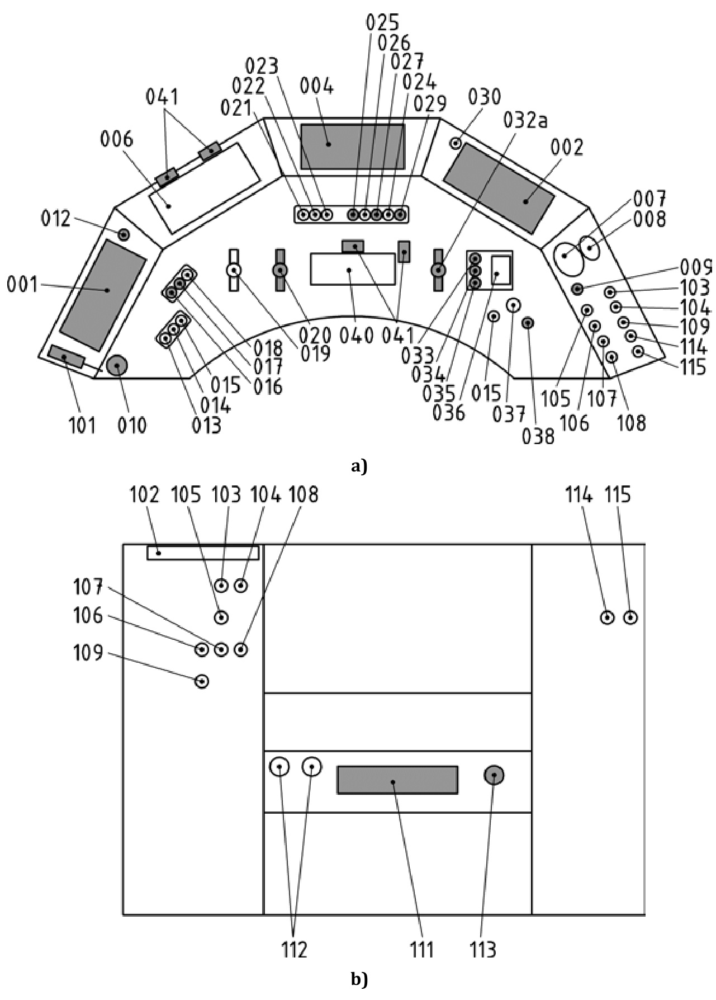
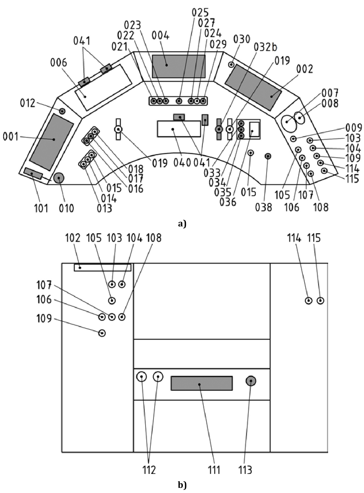

# Railway applications - Driver's cab  

Part 2: Integration of displays, controls and indicators  

# National foreword  

This British Standard is the UK implementation of EN 16186‑2:2017.  

The UK participation in its preparation was entrusted to Technical Committee RAE/4/-/4, Railway Applications - Driver's Cab.  

A list of organizations represented on this committee can be obtained on request to its secretary.  

This publication does not purport to include all the necessary provisions of a contract. Users are responsible for its correct application.  

$\circledcirc$ The British Standards Institution 2017   
Published by BSI Standards Limited 2017  

ISBN 978 0 580 74371 9  

ICS 45.060.10  

# Compliance with a British Standard cannot confer immunity from legal obligations.  

This British Standard was published under the authority of the Standards Policy and Strategy Committee on 31 August 2017.  

Amendments/corrigenda issued since publication  

Date Text affected  

# English Version  

# Railway applications - Driver's cab - Part 2: Integration of displays, controls and indicators  

Applications ferroviaires - Cabines de conduite - Partie 2 : Intégration des afficheurs, commandes et indicateurs  

Bahnanwendungen - Führerraum - Teil 2: Integration von Displays, Bedien- und Anzeigeelementen  

This European Standard was approved by CEN on 14 May 2017.  

CEN members are bound to comply with the CEN/CENELEC Internal Regulations which stipulate the conditions for giving this European Standard the status of a national standard without any alteration. Up-to-date lists and bibliographical references concerning such national standards may be obtained on application to the CEN-CENELEC Management Centre or to any CEN member.  

This European Standard exists in three official versions (English, French, German). A version in any other language made by translation under the responsibility of a CEN member into its own language and notified to the CEN-CENELEC Management Centre has the same status as the official versions.  

CEN members are the national standards bodies of Austria, Belgium, Bulgaria, Croatia, Cyprus, Czech Republic, Denmark, Estonia, Finland, Former Yugoslav Republic of Macedonia, France, Germany, Greece, Hungary, Iceland, Ireland, Italy, Latvia, Lithuania, Luxembourg, Malta, Netherlands, Norway, Poland, Portugal, Romania, Serbia, Slovakia, Slovenia, Spain, Sweden, Switzerland, Turkey and United Kingdom.  

# Contents  

European foreword...... 5   
Introduction ... 6   
1 Scope .....   
2 Normative references .....   
3 Terms and definitions ... 8   
4 Symbols and abbreviations .. 9   
5 Driver's cab displays, controls and indicators for operational functions .......................... ..... 10   
5.1 General.. . 10   
5.2 Display or unit for train communication, monitoring and control ..... 10   
5.3 Controls.... 10   
5.3.1 Controls for Intercom ... . 10   
5.3.2 Controls for external passenger access.. 10   
5.3.3 Controls for driver's cab temperature 10   
5.3.4 Controls for coupling and uncoupling of vehicles ................. 11   
5.3.5 Controls for auxiliary desk .. 11   
5.4 Warnings .. 11   
5.4.1 Alarm due to a safety system .. 11   
5.4.2 Alarm due to emergency opening of one or more external doors...... 11   
5.4.3 Driver interface with fire extinguishing system .... 12   
5.4.4 Alarm due to speed reduction ... 12   
6 Characteristics of displays, controls and indicators .... 12   
6.1 General 12   
6.1.1 Design principles.. 12   
6.1.2 Reading zone..... . 12   
6.1.3 Resistance to damage from cleaning activity... 12   
6.1.4 Design to prevent the accumulation of dirt .... 12   
6.1.5 Labelling .... ..... 12   
6.2 Characteristics of displays . 13   
6.2.1 Use of analogue and alphanumeric display ...... ... 13   
6.2.2 Requirements for arrays of display..... . 13   
6.2.3 Pointer and scale requirements .. . 13   
6.3 Characteristics of controls . 13   
6.3.1 General Principles 13   
6.3.2 Design criteria ... ... 14   
6.3.3 General characteristics of DAC, controls for external lights and remote control.... 15   
6.4 Characteristics of indicators . 15   
6.4.1 Readability... . 15   
6.4.2 Warning design principles... . 15   
6.4.3 Audibility of driving related acoustic signals . 16   
6.4.4 Volume of the loudspeakers 16   
7 Positioning of displays and controls .... .. 16   
7.1 General rules for positioning 16   
Driver’s desk design.. 16   
7.1.2 Human factors/ergonomic aspects......... ... 16   
7.1.3 Devices positioning principle .. 17   
7.1.4 Driving position at the side window .. 17   
7.1.5 Space constraints .. .. 18   
7.1.6 Positioning of elements deviating from this standard.. 18   
7.2 Positioning of displays......... . 18   
7.2.1 Display location and orientation .. . 18   
7.2.2 Preferred fields of vision . . 18   
7.2.3 Positioning ATP signalling information ... .. 18   
Integration of heritage ATP systems .. .. 18   
7.3 Positioning of controls.... . 19   
7.3.1 Reachability of controls on the driver’s desk .... . 19   
7.3.2 Grouping of controls ... .... 19   
7.3.3 Allocation to hands .. .. 20   
7.3.4 Accessibility... .... 20   
7.3.5 Synchronous operation of elements .. . 20   
7.3.6 Risk of inadvertent activation.. .... 20   
7.3.7 Position of specific controls .. . 20   
7.3.8 Controls used while driving, but not located on the driver’s desk .. ...... 21   
7.3.9 Controls only operated during standstill. .... 21   
8 Lighting of cab, displays, controls and indicators....... .... 22   
8.1 Cab lighting ..... ... 22   
8.2 Reading zone lighting.... .. 22   
8.3 Instruments' lighting...... ..... 22   
8.4 Prevent disturbing the driver ... .... 22   
8.5 No green lighting............................. ................ 22   
9 Symbol and text definition .. .. 22   
9.1 Symbol appearance.. ... 22   
9.2 Harmonized symbols............ ..... 22   
9.2.1 General .. . 22   
9.2.2 Combinations of colours ........ ... 23   
9.2.3 Style of symbols........ .... 23   
9.2.4 Location with respect to controls ...... .... 23   
9.2.5 Field for symbols.. .... 23   
9.2.6 New symbols.. .. 23   
9.3 Character type.. .. 23   
Annex A (normative)  Reach envelopes and fields of vision on the desk .. . 24   
Figure A.1 — Reach envelopes for arms ... .. 24   
Figure A.2 — Optimum and preferred fields of vision in seated position ... .. 25   
Annex B (informative)  Examples of main driver's desk configurations - Functional   
allocation of operating elements and integration constraints at the driver's desk   
level... .. 26   
Figure B.1 — Top view and front view of standardized driver's desk... 27   
Figure B.2 — Top view and front view of optional standardized EMU/DMUs' central driver's   
desk...... ... 28   
Table B.1 — List of elements and their locations including function codes (in accordance   
with EN 15380–4) ...... .. 29   
Annex C (normative)  Operating elements and relationship with symbols ... ....... 46   
Table C.1 — Operating elements and relationship with symbols ..... ...... 46   
Annex D (informative)  Project specific symbols .. .... 61  

Table D.1 — Operating elements and relationship with symbols .... 61   
Annex E (informative)  Links between requirements and the Functional Breakdown Structure (FBS) of EN 15380-4 . 65   
Table E.1 — Requirement management elements ... . 65   
Annex F (informative)  A-deviations . 69   
Annex ZA (informative)  Relationship between this European Standard and the Essential Requirements of EU Directive 2008/57/EC .. 70  

Bibliography.. 71  

# European foreword  

This document (EN 16186-2:2017) has been prepared by Technical Committee CEN/TC 256 “Railway Applications”, the secretariat of which is held by DIN.  

This European Standard shall be given the status of a national standard, either by publication of an identical text or by endorsement, at the latest by February 2018, and conflicting national standards shall be withdrawn at the latest by February 2018.  

Attention is drawn to the possibility that some of the elements of this document may be the subject of patent rights. CEN shall not be held responsible for identifying any or all such patent rights.  

This document has been prepared under a mandate given to CEN by the European Commission and the European Free Trade Association, and supports essential requirements of EU Directive 2008/57/EC.  

For relationship with EU Directive 2008/57/EC, see informative Annex ZA, which is an integral part of this document.  

EN 16186, Railway applications — Driver's cab is written as an EN series on all the aspects to be considered when designing a driver's cab, from anthropometric data and visibility, over the integration of displays, controls and indicators as well as the design of displays to cab layout and access facilities. The background information on the anthropometric data used is provided in CEN/TR 16823 [2].  

EN 16186, Railway applications — Driver’s cab currently consists of the following parts:  

Part 1: Anthropometric data and visibility;   
Part 2: Integration of displays, controls and indicators; Part 3: Design of displays.   
Part 4: Layout and access  

According to the CEN-CENELEC Internal Regulations, the national standards organisations of the following countries are bound to implement this European Standard: Austria, Belgium, Bulgaria, Croatia, Cyprus, Czech Republic, Denmark, Estonia, Finland, Former Yugoslav Republic of Macedonia, France, Germany, Greece, Hungary, Iceland, Ireland, Italy, Latvia, Lithuania, Luxembourg, Malta, Netherlands, Norway, Poland, Portugal, Romania, Serbia, Slovakia, Slovenia, Spain, Sweden, Switzerland, Turkey and the United Kingdom.  

# Introduction  

This European Standard addresses operational requirements for train driving, shunting and related preparatory work as far as driver’s cab interfaces are concerned. It provides current cab design principles and considers latest available research findings provided by the European Research project $\mathrm{EUDD+}$ [3].  

The informative Annex E is provided for Requirement Management purposes in accordance with EN 15380-4 [4].  

Where no standard requirement has been specified in this standard, it addresses the need for specifications or choices of standard options to be done on project level.  

# 1 Scope  

This European Standard is applicable to Electric Multiple Units (EMU), Diesel Multiple Units (DMU), Railcars, Locomotives, Driving Trailers (Driving Coaches).  

NOTE 1 This European Standard applies to rolling stock in the scope of the Directive 2008/57/EC [1].  

This European Standard is not intended to be applicable to metros, tramways and light rail vehicles.  

This part of EN 16186 applies to driver's desks installed on the left, on the right, or in a central position in the driver’s cab.  

NOTE 2 For OTMs, see EN 14033–1 [5] and EN 15746–1 [6].  

This European Standard gives design rules and guidance in order to ensure visibility and operability of screens, controls and indicators in the cab in all operating conditions (day, night, natural or artificial lighting).  

It covers four aspects:  

the characteristics of the displays, controls and indicators in order to ensure proper visibility: i.e range of luminance and contrast as well as the possibility of adjustment of perceived brightness; rules for positioning of the displays, keyboards, controls and indicators in the cab and on the driver’s desk: i.e position, angle of visibility, etc. with consideration of the normal driving position and the working environment (windscreen, natural or artificial lighting in the cab, unwanted glare and reflections, etc.);   
the characteristics and rules for positioning microphones and loudspeakers;   
— design of symbols.  

NOTE 3 All element numbers within the text refer to Table B.1.  

# 2 Normative references  

The following documents, in whole or in part, are normatively referenced in this document and are indispensable for its application. For dated references, only the edition cited applies. For undated references, the latest edition of the referenced document (including any amendments) applies.  

EN 894-2, Safety of machinery – Ergonomics requirements for the design of displays and control actuators   
– Part 2: Displays   
prEN 13272-1 Railway applications – Electrical lighting for rolling stock in public transport systems - Part   
1 -  Mainline rail systems   
EN 15892, Railway applications - Noise Emission - Measurement of noise inside driver's cabs   
EN 16186-1:2014, Railway applications - Driver's cab - Part 1: Anthropometric data and visibility   
EN 16186-3:2016, Railway applications - Driver's cab - Part 3: Design of displays   
EN 16683, Railway applications - Call for aid and communication device - Requirements   
ISO 3381, Railway applications — Acoustics — Measurement of noise inside railbound vehicles  

# 3 Terms and definitions  

For the purposes of this document, the terms and definitions given in EN 16186-1:2014, EN 16186-3:2016 and the following apply.  

3.1   
alarm   
audible and/or visual warning requiring immediate action, with a defined priority   
3.2   
cab lighting   
lighting that illuminates the whole driver’s cab to provide save operation at standstill e.g. during   
preparation work   
3.3   
class B cab signalling system   
national legacy control-command and signalling systems  

Note 1 to entry: Legacy ATP (Automatic Train Protection) is historical ATP in accordance with TSI CCS CR&HS (see [7]).  

# 3.4  

# contrast  

perception of a difference visually between one surface or element of a building/rail vehicle and another be reference to their light reflectance values (LRV) according to BS 8300:2009  

[SOURCE: EN 16584-1:2017]  

3.5   
control   
device used to interact with the vehicle   
3.6   
indicator   
element designed to indicate the system status   
3.7   
instrument lighting   
lighting that illuminates specific gauges to make there scales visible at dark ambient conditions   
3.8   
position-dependent control   
control which command is proportional to the position of the operating part of the device within a   
defined range   
3.9   
RAL xxxx   
colour codification from Deutsches Institut für Gütesicherung und Kennzeichnung, former Reichs  
Ausschuss für Lieferbedingungen  

Note 1 to entry: RAL 3020 is the coding for traffic red.  

3.10   
reading zone lighting   
lighting that illuminates the reading area of the desk to ensure readability of documents  

# 3.11  

# time-dependent control  

control which command is proportional to the duration of the application of the operating part of the device in a specific position  

3.12  

warning   
visual and/or audible indication triggered by an event of which the recipient needs to be aware and   
which may not require immediate action  

# 4 Symbols and abbreviations  

ASC Automatic Speed Control   
ATC Automatic Train Control   
ATP Automatic Train Protection   
BP Brake Pipe   
CCD Control Command Display   
CCS Control-command and signalling   
CCTV Closed Circuit Television   
DAC Driver Activity Control   
DMU Diesel Multiple Unit   
EMU Electric Multiple Unit   
EOA End Of Authority   
ep electro-pneumatic   
ETCS European Train Control System   
ETD Electronic Timetable Display   
EUDD European Driver's Desk   
FBS Functional Breakdown Structure   
HVAC Heating, Ventilation and Air Conditioning   
KVB Contrôle de vitesse par balise   
MCB Main Circuit Breaker   
MRP Main Reservoir Pipe   
NSO National Standards Organization   
OTM On-Track Machine   
PAS Passenger Alarm System   
PIS Passenger Information System   
RAL Reichs-Ausschuss für Lieferbedingungen (German Institute for Quality Assurance and Certification)   
SRP Seat reference Point   
TCMS Train Control and Monitoring System   
TDD Technical and Diagnostic Display   
TRD Train Radio Display  

# 5 Driver's cab displays, controls and indicators for operational functions  

# 5.1 General  

Elements required for operation are shown in Annex B. The symbols to be used for the operating elements shall be provided in accordance with Annex C. For project specific functions the symbols of Annex D should be used.  

In the following text, three-digit numbers refer to Table B.1 that lists all the elements  

# 5.2 Display or unit for train communication, monitoring and control  

Vehicle monitoring, vehicle control and train communication shall be provided, as a minimum, by the following desk equipment:  

004 - control command display (CCD);   
002 - technical and diagnostic display (TDD);   
001 - train radio display (TRD).  

For train radio display, different solutions are possible, for example with a simplified driver's interface.  

If other displays are added (additional TDD for EMU/DMU, passenger information system display…) the forward visibility (according to EN 16186-1) shall not be impeded.  

For vehicles internally used within a country the CCD may be substituted by equipment with equivalent functionality.  

# 5.3 Controls  

# 5.3.1 Controls for Intercom  

The driver’s cab of units designed for Driver Only Operation, i.e. without staff on-board other than the driver, shall have in accordance with EN 16683:  

a device (e.g. microphone) to support the “call for aid” function; a device for acknowledging the call for aid; a control to cancel the communication link to the operated device.  

These devices can be integrated or combined with other devices or functionalities  

# 5.3.2 Controls for external passenger access  

If external passenger access to the train (door control) is provided, the desk shall have the following devices:  

021 - left doors release and cancel release;   
023 - right doors release and cancel release;   
022 - central closing all doors.  

# 5.3.3 Controls for driver's cab temperature  

There shall be a means of regulating the temperature. This should be compliant with EN 14813-1 and EN 14813-2.  

# 5.3.4 Controls for coupling and uncoupling of vehicles  

If rolling stock is equipped with an automatic coupler, the cab shall have a control to manage the coupling function. See EN 16186-3.  

# 5.3.5 Controls for auxiliary desk  

If auxiliary desks are provided, they shall include the following operating elements:  

013 - ATP override;   
015 - ATP acknowledgement;   
213 – combined traction/brake controller with minimum functionality $\mathrm{T}+$ , T, T-, SOS) or $(\mathrm{T}+,\mathrm{T},0,$ SOS);   
042 - activation of the auxiliary traction controller, if elements 033 - direction of travel “forwards”;   
and/or 035 - direction of travel “reverse” are not provided.  

As an option:  

021 - release and cancel release doors left side;   
023 - release and cancel release doors right side;   
213 – combined traction/brake controller with one or more additional functions $(\mathrm{T}-,\ 0,\mathrm{B}{\bar{\cdot}},\mathrm{B},\mathrm{B}{+})$ ;   
033 - direction of travel “forwards”;   
035 - direction of travel “reverse”;  

NOTE $\mathrm{T}+$ means increasing traction set point; T means constant traction set point, T- means decreasing traction set point. 0 means ramp down of any set point. B - means decreasing brake set point. B means constant brake set point, ${\mathsf{B}}+$ means increasing brake set point and SOS means emergency brake.  

side microphone. The following operating elements should be provided on or close to an auxiliary desk: 037 - direct brake; 038 - horn; 111 or 211 - DAC.  

# 5.4 Warnings  

# 5.4.1 Alarm due to a safety system  

It is permissible to provide an audible and/or visual alarm to prevent imminent intervention by a safety system.  

# 5.4.2 Alarm due to emergency opening of one or more external doors  

This requirement only applies to EMUs, DMUs, driving coaches and locomotives that operate passenger trains.  

Audible and visual alarms shall indicate to the driver an emergency opening of one or more passenger doors. It should be possible to acknowledge and cancel audible signals for emergency door opening.  

# 5.4.3 Driver interface with fire extinguishing system  

There shall be no means for the driver to interfere with the fire extinguishing system, if provided. Information that the fire extinguishing system has operated or is not available should be provided in the cab.  

# 5.4.4 Alarm due to speed reduction  

If a system other than automatic speed control (ASC) intervenes to reduce the train speed, an audible and/or visual alarm shall be given.  

# 6 Characteristics of displays, controls and indicators  

# 6.1 General  

# 6.1.1 Design principles  

The design (e.g. the shape, the colour, the location) of the elements should assist the recognition of different functions under all ambient lighting conditions.  

As design reference for controls and displays, EN 894 (all parts) and EN 1005 (all parts) may apply.  

# 6.1.2 Reading zone  

To allow the display on the driver's desk surface of paper documents required during driving, a reading zone of minimum size $300\mathrm{mm}\mathrm{~x~}210\mathrm{mm}$ in landscape orientation shall be available in front of the driver's seat. The reading zone may be used optionally as a writing zone if required.  A means of holding shall be provided. If these means are not provided on the desk, the distance between the mid-point of the tall driver's eyes, in seated driving position (see EN 16186-1) and the document should not be more than $900\mathrm{mm}$ .  

NOTE For the minimum character heights of paper documents to be read at a maximum distance of $900\mathrm{mm}$ see EN 894–2.  

# 6.1.3 Resistance to damage from cleaning activity  

Labelling of operational elements shall not be rendered illegible by cleaning agents.  

NOTE The list of acceptable cleaning agents is usually provided by the manufacturer.  

# 6.1.4 Design to prevent the accumulation of dirt  

Engravings deeper than $_{0,5\mathrm{mm}}$ shall be protected against the accumulation of dirt, e.g. by a cover or by sealing, in order to maintain their readability.  

# 6.1.5 Labelling  

Where plain-text labels are provided, the following applies:  

the function $"0\mathrm{n}^{\prime\prime}$ is represented by the Roman “I”; the function $"0\mathrm{ff^{\prime}}$ is represented by the Arabic zero $"0"$ ; for plain-text markings see 9.2.1 and 9.3.  

# 6.2 Characteristics of displays  

# 6.2.1 Use of analogue and alphanumeric display  

In general, an alphanumeric display should only be used where a precise discrete information is required and the values presented remain visible long enough to be read, i.e. they are not continually changing. Otherwise, an analogue or graphical display should be used, see also [9].  

# 6.2.2 Requirements for arrays of display  

If analogue or graphical displays require to be monitored on a regular basis to check whether conditions are ‘normal’, the displays should be arranged so that all the pointers are aligned alike when the instruments are indicating normal operation.  

NOTE See [9] and [10] for ergonomic aspects.  

# 6.2.3 Pointer and scale requirements  

Generally a pointer moving against a fixed scale should be used, rather than vice versa.  

# 6.3 Characteristics of controls  

# 6.3.1 General Principles  

# 6.3.1.1 Interface specific for the function  

Interfaces should be specific for the functions to be executed by the driver, for example by different shapes, colours or positions.  

Controls may combine several associated functions.  

The relevant driving tasks shall determine the choice to combine functions, e.g. a combined lever for traction and braking.  

# 6.3.1.2 Control principle  

Position-dependent controls should be the preferred option rather than time-dependent ones.  

213 - combined traction/brake controller for auxiliary desks, controls for remote control desks and 037 - direct brake should be time dependent.  

# 6.3.1.3 Direction of actuation  

The direction of actuation of controls should be coherent with the behaviour of their related control systems.  

# 6.3.1.4 Position indication of isolation devices  

If an isolating device shows its position, e.g. by direction of a handle or a marking, the following rules apply:  

a) ${\mathrm{I}}=0{\mathrm{n}}$ or in operation; $0=0$ ff or not in operation.   
b) If this device is a stop cock mounted in a visible pipe, then the position of the stop cock shall refer to the direction of the pipe: Open $\mathbf{\tau}=\mathbf{\tau}$ in line with the pipe, Closed $\mathbf{\tau}=\mathbf{\tau}$ at right angle to the pipe.   
c) For checking for normal operation at brake panels the position for normal operation shall be vertical. Marking according to d) is required.   
d) In case of design constraints, the rules b and c may be superseded by permanent labelling.  

The distributor isolating device may deviate from rule b; see EN 15355.  

Straight and angled end cocks for brake pipe and main reservoir pipe may also deviate from rule b; see EN 14601.  

For non-symmetric cocks the vertical position of the handle shall be downwards.  

# 6.3.1.5 Legibility of controls  

Controls should be graduated (tactile sense) and/or illuminated (vision) so that their operating positions can be recognized (using tactile sense for graduated controls or vision for non-graduated controls). Where controls  are graduated, the graduations should be fine and precise for driving purposes.  

# 6.3.1.6 Legibility of instruments  

For graduation refer to requirements for identification of visual displays according to EN 894-2.  

# 6.3.2 Design criteria  

# 6.3.2.1 Identification by shape  

The shape of controls for the following functions should be:  

a mushroom for 010 - emergency brake;   
a lever with a ball  for 025 - sanding;   
a lever with a cylinder for 016 - pantograph;   
a lever for 038 - external warning horn;   
push buttons for 021, 022 and 023 - doors;   
a push button for 012 - train radio emergency call.  

# 6.3.2.2 Tactile coding of ATP controls  

013, 014 and 015 - ATP controls should have a different shape in order to facilitate the tactile recognition of its function.  

# 6.3.2.3 Colours  

# 6.3.2.3.1General  

Controls that shall be operated at the driver’s desk while driving shall have a colour differentiation relative to the desk surface. Black or grey from the range of finishes RAL 9004, 9011, 9017 or 7016, 7021, 7024 in accordance with register RAL 840-HR or equivalent may be used.  

Markings and symbols of the controls in the driver’s cab should be realized with a high contrast to the background e.g. RAL 9003, 9010 and 9016 may be used for the markings and symbols of the controls, RAL 9005 may be used for the base.  

# 6.3.2.3.2Colour red  

Essentially, controls that are only operated in the case of safety critical faults or emergency and associated indicators shall be finished in red (RAL 3000, 3001, 3002, 3020 or equivalent).  

# 6.3.2.3.3Colour yellow  

If there is some requirement to high-light a control, e.g. in case of frequent use for prescribed regular procedures, yellow (e.g. RAL 1003, 1004, 1018, 1021, 1023) can be used on the element or on an adjacent surface.  

# 6.3.2.3.4Colours for less important elements  

In order to avoid visual distraction, controls or operating equipment of minor operating importance (e.g. light switches, socket covers), operated infrequently or for maintenance purposes should be coloured in white, black, grey, metal finish (not coated) or neutral colour (in comparison with the surroundings).  

# 6.3.2.4 Robustness of design for controls  

The controls should be designed to withstand adverse ambient conditions and excessive mechanical stress (e.g. drinking, eating, dust, force effects during operation (e.g. shunting, coupling) and panic situations). Their operability should not be affected by such impacts.  

6.3.3 General characteristics of DAC, controls for external lights and remote control  

# 6.3.3.1 Driver activity control  

There shall be at least one control element for the DAC function on the desk and one on the footrest.  

# 6.3.3.2 Controls for external lights  

Controls for the 027 - external lights (head and marker lights) shall control at least the external lights at the vehicle end adjacent to the cab. The head and marker lamps of the vehicle shall be controlled from the normal driving position. The control for 304 - tail lights shall be in the cab.  

# 6.3.3.3 Radio remote control  

The switching device from “manual mode” to “radio remote control” mode may be located in the cab according to EN 50239.  

# 6.4 Characteristics of indicators  

# 6.4.1 Readability  

All indicator lights should be designed so that they can be read correctly under natural or artificial lighting conditions, including incidental lighting.  

# 6.4.2 Warning design principles  

# 6.4.2.1 General  

Warnings should be designed in accordance with the following principles:  

Audible and visual warnings inside the cab should be distinctive and have appropriate loudness and sound qualities and/or light intensities, in accordance with their functions, urgency and importance; audible and visual warnings should not unnecessarily distract the driver’s attention from normal driving duties;   
audible and visual warnings should be consistent in their meaning;   
audible information should meet all the following requirements: each audible information should be distinguishable from all other audible information in the cab;   
be audible from all applicable driving positions inside the cab and in all driving conditions;   
—   the audible warning should not cause drivers audible discomfort when triggered.  

NOTE For audible and visual warnings, see also EN 16186–3.  

# 6.4.2.2 Hierarchy of audible warnings  

At least for the warnings provided through a single channel there shall be a hierarchy of audible warnings such that the most important, when triggered and until cancelled or acknowledged, will suppress less important audible warnings.  

# 6.4.3 Audibility of driving related acoustic signals  

Audible information generated by acoustic signals inside the cab shall be at least $\mathrm{L}\mathrm{p}\mathrm{A}=6$ dB above the interior noise at the one-third octave band corresponding to the main tonal frequency of the alarm. The interior noise used to compare the alarm in one-third octave frequency shall be the one measured at maximum operational speed of the train in accordance with EN 15892 or ISO 3381.  

# 6.4.4 Volume of the loudspeakers  

The volume of the loudspeakers should be adjustable by a control in the cab. The pre-set minimum audible level is defined in 6.4.3.  

# 7 Positioning of displays and controls  

# 7.1 General rules for positioning  

# 7.1.1 Driver’s desk design  

Driver's desk design shall permit operation by a single driver.  

Driver’s desks should be designed in accordance with Annex B.  

If auxiliary desks are required, they should be located on or close to the side wall.  

# 7.1.2 Human factors/ergonomic aspects  

Human factors principles should be applied to optimize the arrangements in the driver's cab taking into account:  

a) the ideal positions of controls and instruments in terms of visibility, reach and force requirements;   
b) constraints due to requirements arising from familiarity with existing designs;   
c) constraints due to physical / technical requirements of the cab space.  

NOTE 1 The above applies for normal driving and for reasonably foreseeable demanding scenarios usually caused by train faults.  

The operation of controls and the viewing of instruments/displays should not be unduly fatiguing and should take into account the strength and biomechanical characteristics considering the anthropometric range of drivers described in part 1 of this standard.  

NOTE 2 For further information on forces, repetition and postures, see EN 1005 (all parts) and for information on displays see EN 894–2.  

# 7.1.3 Devices positioning principle  

Cab devices should be positioned in accordance with the following principles:  

a) Importance principle – those displays and controls which are most essential to safe and efficient operation should be in the most accessible positions, such as controls for brake, traction, horn.   
b) Frequency of use principle – those displays and controls which are used most frequently should be in the most accessible positions, such as controls for brake, DAC, signalling.   
c) Function principle – displays and controls with closely related functions should be located close to each other.   
d) Sequence of use principle – displays and controls which are used in sequence should be located close to each other and their layout should relate logically to the sequence of operation.  

In order to have all safety related and/or frequently used equipment on the desk easily grasped and visible while driving, the access to safety elements shall not be inhibited or impeded by elements that do not have a function essential to safety.  

Elements that are not needed while driving should not be located in the normal area of the driver's desk (see Annex A).  

In order to avoid the driver's attention being unnecessarily diverted from observation of the line, the reach envelopes in accordance with Figure A.1 shall only encompass the controls and information needed while driving or in cases of danger and the preferred field of vision in accordance with Figure A.2 should only encompass the controls and information needed while driving or in cases of danger.  

Only information that is necessary for operation shall be provided within the reach envelopes and the preferred fields of vision. There should be no writing or logos or other advertisement of manufacturers within these areas.  

The location of the controls and displays should take account of the amount of driver’s head and eye movements needed, with the aim of maximizing the driver’s visual concentration on track and signals.  

If the TCMS has been switched on, the following information shall be available at all times on the main desk:  

007 and 008 - brake information;   
information pertaining to signal aspects for monitoring train control systems (driver’s cab signalling, 004 - CCD);   
timetable (006 - ETD or alternative means).  

If the cab is not activated, information may only be displayed on request.  

The arrangement in a set of elements shall be coherent with the functional behaviour of the train (e.g.   
forward, backward or right, left).  

# 7.1.4 Driving position at the side window  

If a driving position at the side window is foreseen (e.g. auxiliary desk) this position shall allow the driver to see brake and speed information of the main desk. This may be achieved by moving the head in standing position, but without leaving the position.  

# 7.1.5 Space constraints  

In cases of space constraints, displays or instruments (controls, indicators, etc.) beyond the ones specified in Annex B can be placed above the horizontal (see Figure A.2), if the forward visibility (in accordance with EN 16186-1) is not impeded.  

In cases of space constraints in shunting locomotives or in EMU/DMU with front gangway and cab, in side position, those controls used in the cab should be oriented according to this standard and shall at least provide the same functionality. The direction function (033, 034, 035) may be grouped into a rotary switch.  

# 7.1.6 Positioning of elements deviating from this standard  

For positioning of elements deviating from this standard, a task analysis should be considered.  

NOTE Task analysis including postural assessment have been used in the course of the EUDD programmes and are used as a source for the recommendations of this standard.  

# 7.2 Positioning of displays  

# 7.2.1 Display location and orientation  

The display surfaces should be as nearly as possible perpendicular to the driver’s line of sight and free from direct or reflected glare.  

At least the following displays:  

001 – TRD;   
002 – TDD;   
004 – CDD;   
006 – ETD if applied;  

shall be designed for a viewing distance range of $500\mathrm{mm}$ to $1000\mathrm{mm}$ from the normal driving position.   
They shall be located such that they do not interfere with the operation of other cab equipment.  

# 7.2.2 Preferred fields of vision  

The important information identified in 7.1.3 should be located in the preferred fields of vision on the desk in accordance with Figure A.2. If an assessment is required, it shall be done with a drawing based on the tall driver's reference eye point in seated driving position as defined in EN 16186-1.  

# 7.2.3 Positioning ATP signalling information  

The speed and 004 - ETCS signalling information shall be in the preferred field of vision (see Figure A.2), class B cab signalling information in accordance with TSI CCS should be in this field.  

001 - train radio – and, if provided, CCTV and class B cab signalling systems in accordance with TSI CCS – may be positioned outside this preferred field of vision.  

# 7.2.4 Integration of heritage ATP systems  

In case of integration of heritage ATP systems either the distance between the displays may be enlarged in order to mount ATP-driver-interfaces between adjacent displays or such heritage components may be installed on top of the display area respecting for the seated position the preferred field of vision as set out in Figure A.2 as well as the forward visibility according EN 16186-1.  

# 7.3 Positioning of controls  

# 7.3.1 Reachability of controls on the driver’s desk  

There are three reach envelopes defining the following three areas: normal, extended and maximum, see Figure A.1.  

For definition and application of the elements see Annex B and Annex C. The location of a single control refers to its centre point in neutral position.  

a) Normal: All controls having high importance and/or a high frequency and/or prolonged periods of use in sitting and, if applicable, standing position shall be located within the normal reach envelope in line with the anthropometric requirements of this standard. This encompasses areas that can be reached with a sweep of the forearm. In this area, there shall be at least controls and information of element 019, 020, 032a or 032b, 037. b) Extended: Controls of less importance and/or a lower frequency of use, should be located within the extended reach envelope which encompasses those areas when the upper arm shall move away from the normal conditions and which can include shoulder thrust. In this area, which includes the normal area, there shall be at least controls and information of element 013, 014, 015, 016, 017,   
018, 021, 022, 023, 025, 026, 027, 033, 034, 035, 038, 040 in addition to the elements of the normal area. Elements 024, 028 and 029 should also be located in this area. c) Maximum: Controls which can be reached by moving the driver’s body in the seated position. In this area, which includes the normal and the extended area, there shall be at least the following desk located controls and information: 001, 002, 004, 006, 009, 010, 012, 030, 036, 101, 102, 103,   
104, 105, 106, 107, 108, 109, 114, 115. Elements 021, 022, 023 may be located in this area for rolling stock not designed for frequent stops. Elements: 102, 103, 104, 105, 106, 107, 108, 109, 114,   
115 may be located underneath the desk.  

NOTE The measurements are based on European anthropometric data given in CEN/TR 16823.  

# 7.3.2 Grouping of controls  

# 7.3.2.1 General  

The controls related to the same function should be combined or grouped together on the driver's desk.   
The number of controls in a group should be limited to three.  

# 7.3.2.2 Grouping of door controls  

The 021, 022 and 023 - controls on the desk related to doors shall be grouped together or be integrated into one combined element. The position of these elements shall reflect the associated side of the unit.  

# 7.3.2.3 Grouping of direction of travel controls  

The 033, 034 and 035 controls related to the direction of travel shall be grouped together on the desk or be integrated into one combined element. The position of these elements shall reflect the associated direction of travel.  

# 7.3.2.4 Grouping of ATP controls  

013, 014 and 015 - ATP controls shall be grouped.  

# 7.3.2.5 Examples for further groupings  

Further examples for grouping of controls are:  

7.3.2.6 coupling controls;   
7.3.2.7 HVAC controls;   
7.3.2.8 windscreen wiping/washing controls;   
7.3.2.9 panto/main switch controls, etc.  

# 7.3.3 Allocation to hands  

For trains the controls for the pneumatic brake (the 032a - automatic brake or the 032b - combined traction brake controller) shall be located on the right-hand side of the driver's desk. Thus, the left hand stays free for other operations (e.g. 020 - traction dynamic brake controller, 001 - train radio, 013, 014 and 015 ATC/ATP, 016 - pantograph, 017 - main circuit breaker, 012 - train radio emergency call push button, etc.).  

NOTE For UK and Ireland, see Annex F.  

# 7.3.4 Accessibility  

The accessibility of one element should not be obstructed by another element.  

# 7.3.5 Synchronous operation of elements  

The operating elements, which are operated both when accelerating and when braking, should be arranged in such a way that they can be reached by both hands; these are the 025 - controls for sanding, 026 - release for the traction unit’s automatic brake, 027 - external front lights and 029 - reading zone and driver’s cab lighting.  

# 7.3.6 Risk of inadvertent activation  

The location of controls and the grouping of controls should minimize the risk of inadvertent activation.  

# 7.3.7 Position of specific controls  

# 7.3.7.1 General  

If possible in terms of desk integration, controls should be placed on or above the desk (e.g. extended area) rather than at a console underneath the desk. If the 104, 105, 106, 107 and 108 - HVAC controls, 103 – centre console lighting and 109 – pressure protection control are accessible from a seated position they may be located beneath the desk.  

# 7.3.7.2 Automatic speed control  

The 019 - automatic speed control shall be close to the 020 - traction/dynamic braking lever. This may not apply in case of a 32b - single combined traction/brake controller (see Figure B.2). It should be position dependent.  

# 7.3.7.3 Driver's traction and brake control  

If the traction and/or braking effort is set up by a lever (combined one or separated ones), the “tractive effort” shall increase by pushing the lever forward, and the “braking effort” shall increase by drawing the lever towards the driver. For an emergency brake position, if provided, there shall be a notch clearly distinguishable from other positions of the lever.  

Driver’s 032a - automatic brake handle, 020 - traction/dynamic brake controller and 032b - combined traction/brake elements should be position dependent.  

NOTE For UK and Ireland, see Annex F  

# 7.3.7.4 Emergency brake control  

At least one emergency brake control 010 – emergency brake control shall be provided in the cab so that it can be reached by the driver from his driving position and from the driver's assistant position by any other authorized person.  

# 7.3.7.5 Brake pipe overcharge control  

The 009 - brake pipe overcharge control where fitted should be arranged preferably close to the brake pipe pressure information. Alternatively, the brake pipe overcharge function can be arranged in such a way that the related information is located in the viewing direction while operating the element.  

# 7.3.7.6 Public address control  

If public address/PIS is required, a control for announcements and, in case of:  

manual system: a control to trigger the information;   
automatic system: a control to suppress information;  

shall be located within the maximum area defined in Annex A.  

# 7.3.8 Controls used while driving, but not located on the driver’s desk  

Controls that are operated from a seated position while driving but which are not essential for a quick and targeted operation may be located on the vertical surfaces beside the driver leg room space (see Annex B).  

If the HVAC controls are accessible from a seated position they may be located beneath the desk.  

For a quick and targeted operation without distraction from the track system there may be foot operated controls (e.g. pedals) in the driver leg room space. There shall not be more than four foot operated control elements.  

Next to foot operated controls other than DAC there shall be two free spaces, each of a min. width of $140\mathrm{mm}$ , for resting the driver’s feet in seated position without touching any of those controls, except for the DAC.  

# 7.3.9 Controls only operated during standstill  

# 7.3.9.1 General  

Controls that are only operated during standstill should be located outside any of the three reach envelopes in accordance with Figure A.1.  

# 7.3.9.2 Isolation of ATP systems and DAC  

Access to 520, 543 - isolate ATP systems and isolate 503 - DAC shall not be possible from the driving position.  

# 7.3.9.3 Location of door controls  

Where for the purpose of monitoring external doors the driver is required to move from the main driving position to a side window to view platform-mounted equipment or to look back down the train, then the door controls applying to that side shall be located at each side window.  

# 8 Lighting of cab, displays, controls and indicators  

# 8.1 Cab lighting  

Cab lighting shall be compliant with prEN 13272-1.  

# 8.2 Reading zone lighting  

Reading zone lighting shall be provided with element 029. It shall be independent from the cab lighting and it shall be adjustable with element 039.  

# 8.3 Instruments' lighting  

The instruments' lighting should be provided in accordance with element 028. If provided, it shall be independent from the cab lighting and it shall be adjustable in accordance with element 104. The range for the value of illuminance should be 0,3 lx to $30\mathrm{lx}$ .  

The instrument lighting is needed if gauges (007 and 008) are used.  

# 8.4 Prevent disturbing the driver  

When additional lamps are provided (e.g. a lamp for the second person) these should not dazzle the driver in the normal operating position of the lamp.  

# 8.5 No green lighting  

In order to prevent any dangerous confusion with outside operational signalling, no green lights or green illuminations are permitted in a driver’s cab, except for existing class B cab signalling system (in accordance with TSI CCS).  

# 9 Symbol and text definition  

# 9.1 Symbol appearance  

The symbols shall be visible in normal daylight working condition for easy identification of the element.   
The symbols should be simple in design, easy to read and self-explanatory.  

# 9.2 Harmonized symbols  

# 9.2.1 General  

Controls and indicators shall be clearly marked, so that they are identifiable. Harmonized symbols shall be used to mark controls and indicators in the cab (see Annex C), if the function is provided. The symbols should be reproduced as shown in Table C.1. Table C.1 provides symbol originals in a uniform $30\mathrm{mm}$ size with corner marks to enable accurate enlargement and reduction scaling. The symbol illustrations are shown without borders in order to allow for consistent reproduction scaling, i.e. a change of the size of symbols can be done by a scaling factor.  

For functions listed in Table C.1 the associated symbol shall be used.  

NOTE 1 For new functions not listed in Table C.1, the proposed symbol associated with any new function is asked to be notified to an NSO in order to facilitate timely amendment of this standard.  

Conformity with the symbols provided in Table C.1 is achieved, if the characteristic parameters defining the symbol are perceived as equal. For example, this perception of equivalence is deemed to be achieved, if a max. tolerance of $10\%$ for the graphic elements (thickness of lines, dimension of fields, radii, …) is respected.  

If a symbol is provided as an electronic vector graphic data information by the standardization organization providing this standard and the applicant does neither corrupt nor change this information in the course of processing up to the final product, then a symbol derived from this information shall be deemed to be compliant with this standard.  

NOTE 2 Changing the scaling factor (zoom) does neither mean a corruption nor a change of information.  

NOTE 3 Method for validating new symbols is described in ISO 9186.  

# 9.2.2 Combinations of colours  

Combinations of colours shall comply with Table 4 of EN 16186-3:2016.  

# 9.2.3 Style of symbols  

A graphical symbol may be depicted in outlined or filled-in form.  

# 9.2.4 Location with respect to controls  

Symbols, if required, shall be placed next to or integrated into every control or instrument.  

# 9.2.5 Field for symbols  

The field for symbols, except for class B cab signalling system (legacy ATP systems), shall have a minimum side length of $10\mathrm{mm}$ .  

# 9.2.6 New symbols  

Any new symbol in the scope of this standard shall respect the requirements of this standard, and should be based on dark background.  

If text is used, this text should be short and unambiguous.  

Symbols related to functions listed in Table D.1 are not mandatory symbols. They represent specific or deviating functions and serve as informative examples.  

# 9.3 Character type  

The character type shall not use serifs.   
Chicago, Helvetica, Swiss or Verdana or any other Arial-like font should be used.  

Annex A (normative)  

# Reach envelopes and fields of vision on the desk  

Figure A.1 shows the reach envelopes for arms (projection from top view).  

# Key  

  
SRP seat reference point of tall driver (see EN 16186–1:2014, Figure 2)   
Figure A.1 — Reach envelopes for arms  

1 normal area   
2 extended area   
3 maximum area   
4 limit of arm travel   
5 shoulder pivot of smallest person (see EN 16186–1:2014, Figure 2)  

NOTE The reach envelopes were developed based on the body sizes of the smallest person. But the SRP of the tall driver is used in this figure: The main reference point for cab assembly criteria is the SRP of the tall driver, therefore it is used as reference point in this annex. SRP of the small driver is assumed to be $150\mathrm{mm}$ in front of the SRP of the tall driver due to anthropometrics, see EN 16186-1:2014, Figure 2, value range for $"\mathrm{\mathbf{v}}^{\prime\prime}$ . These reach envelopes with their fixed positions are valid for the whole range of drivers. The drawing assumes pointed fingers.  

Figure A.2 shows the optimum and preferred fields of vision (side and top view).  

# a) Side elevation showing optimum and preferred vertical placement of displays Line-of-sight in seated position $\mathbf{\varepsilon}=35^{\circ}$ below the horizontal  

Optimum position for most important displays is within $\pm\:15^{\circ}$ in the vertical from the line-of-sight  

Displays should be placed between horizontal and $60^{\circ}$ below  

  
Figure A.2 — Optimum and preferred fields of vision in seated position  

# b) Plan view showing optimum and preferred horizontal placement of visual displays  

Optimum position for most important displays is within $\pm15^{\circ}$ in the horizontal from the line-ofsight  

Displays should be placed within $\pm60^{\circ}$ in the horizontal from the line-of-sight  

# Annex B (informative)  

# Examples of main driver's desk configurations - Functional allocation of operating elements and integration constraints at the driver's desk level  

The operating elements that have a standardized location at the desk should be located in accordance with the prescriptions of Figure B.1 and Figure B.2. The other elements (as indicated in Table B.1) have optional location. Whether an operating element itself is a standard interface to the driver or not is provided in Table B.1, elements shown in grey in Figure B.1 and Figure B.2 mean standard for all types of vehicles.  

NOTE No scale is applied to the drawings and no link to Figure A.1 exists.  

Figure B.1: Layout of standardized driver’s desk (top and consoles) with maximum integration of equipment, but without integration of heritage ATP systems (class B cab signalling system). For some elements, two possible positions are shown.  

  
Figure B.1 — Top view and front view of standardized driver's desk  

Figure B.2: Layout of optional standardized EMU/DMUs’ central driver’s desk (top and consoles) with maximum integration of equipment, but without integration of heritage ATP systems (class B). For some elements, two possible positions are shown.  

  
Figure B.2 — Top view and front view of optional standardized EMU/DMUs' central driver's desk  

Table B.1 — List ofelements and their locations including function codes (in accordance with EN 15380-4)   

<html><body><table><tr><td rowspan="2">Elements</td><td rowspan="2"></td><td colspan="3">Availability for</td><td rowspan="2"></td><td rowspan="2">Comment (e.g. reason for the optional location) element - not subject to cab assessment in the scope of this standard</td><td rowspan="2"></td></tr><tr><td>Loco- motive</td><td>Driving coach</td><td>EMU/DMU/ Railcar</td></tr><tr><td>001 Train radio display (TRD)</td><td>Yes</td><td> Standard</td><td> Standard</td><td> Standard</td><td>KD, HEH, H</td><td>UIC 612-04 CLC/TS 50459-1 CLC/TS 50459-2</td><td>Different solutions are possible, for example with a simplified driver's interface</td></tr><tr><td>002 Technical and diagnostic display (TDD)</td><td>Yes</td><td> Standard</td><td> Standard</td><td> Standard</td><td>DB, EB, H, CFE, HGE, HGD, FCH,</td><td>UIC 612-03</td><td></td></tr><tr><td>004 Control command display (CCD)</td><td>Yes</td><td> Standard</td><td> Standard</td><td> Standard</td><td>HBE</td><td>CLC/TS 50459-1 CLC/TS 50459-3- ERA_ERTSM_015560 Subset 026</td><td></td></tr><tr><td>006 Electronic timetable display (ETD)</td><td>Yes</td><td>Option</td><td> Option</td><td> Option</td><td>HEH, CL, HBE</td><td>TSI CCS Annex A UIC 612-05</td><td></td></tr><tr><td>007 BP (brake pipe) and MP (main pipe) pressure gauge</td><td>Yes</td><td> Option</td><td> Option</td><td> Option</td><td>G</td><td>EN 15734 (all parts) EN 14198 UIC 612-0</td><td>If there is no brake pipe gauge information shall be integrated into the TDD</td></tr><tr><td>008 Brake-cylinder pressure gauges</td><td>Yes</td><td>Option</td><td>Option</td><td>Option</td><td>G</td><td>EN 15734 (all parts) EN 14198 UIC 612-0</td><td>If there is no brake-cylinder pressure gauge information shall be integrated into the TDD</td></tr></table></body></html>  

<html><body><table><tr><td rowspan="2">Elements</td><td rowspan="2"></td><td colspan="3">Availability for</td><td rowspan="2"></td><td rowspan="2">Bibliographic to cab assessment in the scope of this standard</td><td rowspan="2">Comment (e.g. reason for the optional location)</td></tr><tr><td>Loco- motive</td><td>Driving coach</td><td>EMU/DMU/ Railcar</td></tr><tr><td>009 Brake pipe pressure adjuster (overcharge)</td><td>Yes</td><td> Standard</td><td> Standard</td><td> Option</td><td>G</td><td>EN 15734 (all parts) EN 14198 UIC 612-0 UIC 612-2</td><td>Option for EMU/DMU: alternatively to be integrated into the TDD</td></tr><tr><td>010 Emergency stop valve with “Emergency stop" function</td><td>Yes</td><td> Standard</td><td> Standard</td><td>Standard</td><td>G</td><td>EN 15734 (all parts) EN 14198 UIC 612-0 UIC 612-2 ETCS subset 034 (FFFIS TIU)</td><td></td></tr><tr><td>012 Train radio emergency call</td><td></td><td> Standard</td><td> Standard</td><td>Standard</td><td> KD, HEH</td><td>CLC/TS 50459-2 UIC 612-04 UIC Project EIRENE (SRS V25.3.0 and FRS V7.3.0</td><td>Shall be close to the TRD, preferably on the right sid o the TRD or might bean integraed element</td></tr><tr><td>013 ATP: override (EOA)</td><td>Yes</td><td>Option</td><td>Option</td><td>Option</td><td>HCC</td><td>ERA_ERTMS_015560 Subset 026 TS 50459-3 TSI CCS Annex A, UIC 612-0</td><td> Option: to be integrated into the CCD</td></tr></table></body></html>  

<html><body><table><tr><td rowspan="2">Elements</td><td rowspan="2"></td><td colspan="3">Availability for</td><td rowspan="2"></td><td rowspan="2">element - not subject to cab assessment in the scope of this standard</td><td rowspan="2">Comment (e.g. reason for the optional location)</td></tr><tr><td>Loco- motive</td><td>Driving coach</td><td>EMU/DMU/ Railcar</td></tr><tr><td>014 ATP: release intervention</td><td>Yes</td><td> Option</td><td> Option</td><td> Option</td><td>HCC</td><td>ERA_ERTMS_015560 Subset 026 TSI CCS Annex A,</td><td> Option: to be integrated into the CCD</td></tr><tr><td>015 ATP: acknowledge</td><td>Yes</td><td> Option</td><td> Option</td><td> Option</td><td>HCC</td><td>ERA_ERTMS_015560 Subset 026 TSI CCS Annex A,</td><td> Option: to be integrated into the CCD</td></tr><tr><td>016 Pantograph/Diesel</td><td></td><td> Standard</td><td> Standard</td><td> Standard</td><td>FB, FDB</td><td>EUN 6206 (larts) UIC 612-2 ETCS subset 034</td><td>Dendit B.2. For Diesel engines, 016 may be merged with 017</td></tr><tr><td>BlreaMarn Circwit transmission</td><td></td><td> Standard</td><td> Standard</td><td> Standard</td><td>FB</td><td>(FFFIS TIU) UIC 612-2 ETCS subset 034</td><td>Ddt B.2. For Diesel engines, 017 may be merged with 016</td></tr><tr><td> 018 Train Power Supply</td><td></td><td>Option</td><td> Option</td><td>Option</td><td>FB</td><td>(FFFIS TIU) UIC 62-2</td><td>Doceaendingfon ti acioedancthit deskuprefered B.2.</td></tr></table></body></html>  

<html><body><table><tr><td rowspan="2">Elements</td><td rowspan="2"></td><td colspan="3">Availability for</td><td rowspan="2"></td><td rowspan="2">Bibliographic informatioerelated element - not subject to cab assessment in the scope of this standard</td><td rowspan="2">Comment (e.g. reason for the optional location)</td></tr><tr><td>Loco- motive</td><td>Driving coach</td><td>EMU/DMU/ Railcar</td></tr><tr><td>019 Automatic Speed Control (ASC)</td><td>No</td><td>Option</td><td>Option</td><td>Option</td><td>FBB, G</td><td>UIC 612-0</td><td>If Pos. 019 is located on the right hand side of the desk, the following preconditions apply: only electric control of the brake, the visible height above desk surface of Pos. 019 shall be less than 60 % of Pos. 032b; Pos. 019 shall have a different shape than Pos. 032b;</td></tr><tr><td>020 Combined traction/dynamic brake controller with integrated driver activity control push</td><td>Yes</td><td> Standard</td><td> Standard</td><td> Option</td><td>FBB, HEC</td><td>EN 15734 (all parts) EN 14198 UIC 612-0 UIC 612-2</td><td>032b without any other element in between. The combined traction/dynamic brake shall be located at the left hand side in a locomotive configuration</td></tr><tr><td>d1 Dor cotrolett cancel release</td><td>aas</td><td> Option</td><td>Standard</td><td>Standard</td><td>DBB</td><td>(FFFIS TIU) EN 14752</td><td>Thalocationftoeratn menri handlocaedine</td></tr><tr><td>02 dorcontaldors</td><td>aas</td><td>Option</td><td>Standard</td><td>Standard</td><td>DBB</td><td>EN 14752</td><td>Thalecat hand ie b locatedin the intersectonof the reach</td></tr></table></body></html>  

<html><body><table><tr><td rowspan="2">Elements</td><td rowspan="2"></td><td colspan="3">Availability for</td><td rowspan="2"></td><td rowspan="2">Bibliographic Comment (e.g. reason for the optional location) informationrelated element - not subject to cab assessment in the scope of this standard</td><td rowspan="2"></td></tr><tr><td>Loco- motive</td><td>Driving coach</td><td>EMU/DMU/ Railcar</td></tr><tr><td>cancel release</td><td>aas</td><td></td><td> Standard</td><td> Standard</td><td>DBB</td><td>EN 14752</td><td>Thalecation of the ereratibg hlemen shouldt hand, i.e be located in the intersection of the reach envelopes</td></tr><tr><td>024 Train lighting (may be replaced in the target system due to TCMS providing the trigger information)</td><td>aas</td><td> Option</td><td> Option</td><td> Option</td><td>CDB</td><td>EN 13272 UIC 612-0</td><td>The location of the operating element should enable convenient operation by the left or right hand, i.e be located in the intersection of the reach envelopes</td></tr><tr><td> 025 Sanding</td><td>aas</td><td></td><td> Standard</td><td> Standard</td><td>HEC</td><td>UIC 612-0 UIC 612-2</td><td>The location of the operating element should enable convenient operation by the left or right hand, i.e be located in the intersection of the reach envelopes</td></tr><tr><td>026 Release brake</td><td> </td><td> Standard</td><td>Option</td><td> Option</td><td>G</td><td>EN 15734 (all parts) EUN 41-0 UIC 612-2 ETCS subset 034</td><td>The location of the operating element should envelopes</td></tr><tr><td>027 External front light</td><td></td><td></td><td> Standard</td><td> Standard</td><td>HEJ, KB</td><td>EN 15153-1</td><td>Thalecationientheraeratiny the ment shosldt hand ie e locatedin the intersectonof the reach</td></tr></table></body></html>  

<html><body><table><tr><td rowspan="2">Elements 028 Instrument lighting</td><td rowspan="2"></td><td colspan="3">Availability for</td><td rowspan="2">CDB</td><td rowspan="2">Bibliographic informatioerlated element - not subject to cab assessment in the scope of this standard UIC 612-0 Depending on the size of the desk. Preferred</td><td rowspan="2">Comment (e.g. reason for the optional location)</td></tr><tr><td>Loco- motive Option</td><td>Driving coach Option</td><td>EMU/DMU/ Railcar Option</td></tr><tr><td>(may be replaced in the target system due to TCMS providing the trigger information) 029 reading zone and driver's cab lighting</td><td>aas</td><td></td><td> Standard</td><td> Standard</td><td>CDB</td><td>EN 13272 UIC 612-0</td><td>location defined in the standard Depending on the size of the desk. Preferred location defined in the standard</td></tr><tr><td> 030 Microphone</td><td>aas</td><td>Option</td><td>Option</td><td> Option</td><td>CFF, CFC</td><td>IEC 62580 UIC 612-0</td><td>Depending on the size of the desk. Preferred location defined in the standard</td></tr><tr><td>032a Automatic brake controller (automatic</td><td>aas Yes</td><td> Standard</td><td> Standard</td><td> Option</td><td>G, HEC</td><td>EN 15734 (all parts) EN 14198</td><td>032a may be used for passenger alarm acknowledgement</td></tr><tr><td>brake)</td><td></td><td></td><td></td><td></td><td></td><td>EN 16334 UIC 612-0 UIC 612-2 ETCS subset 034 (FFFIS TIU)</td><td></td></tr></table></body></html>  

<html><body><table><tr><td rowspan="2">Elements</td><td rowspan="2"></td><td colspan="3">Availability for</td><td rowspan="2"></td><td rowspan="2">Bibliographic informatioerelated element - not subject to cab assessment in the scope of this standard</td><td rowspan="2"></td></tr><tr><td>Loco- motive</td><td>Driving coach</td><td>EMU/DMU/ Railcar</td></tr><tr><td>032b Combined traction/brake controller (position dependent) with integrated driver activity control push</td><td>Yes</td><td></td><td></td><td> Option</td><td>G, HEC</td><td>EN 15734 (all parts) EN 14198 EN 16334 UIC 612-0 UIC 612-2</td><td>032b may be used for passenger alarm acknowledgement</td></tr><tr><td>033 Direction of travel "Forward"</td><td>Yes</td><td> Standard</td><td> Standard</td><td> Standard</td><td>GDB</td><td>(FFFIS TIU) UIC 612-0</td><td> Pos. 033 shall not be lit after leaving standstill</td></tr><tr><td>034 No Direction of travel“Neutral"</td><td>Yes</td><td> Standard</td><td> Standard</td><td> Standard</td><td>GDB</td><td>UIC 612-0</td><td></td></tr><tr><td>035 Direction of travel "Reverse"</td><td>Yes</td><td> Standard</td><td> Standard</td><td> Standard</td><td>GDB</td><td>UIC 612-0</td><td> Pos. 035 shall not be lit after leaving standstill</td></tr><tr><td>036 Driver's Identity card reader</td><td>No</td><td> Option</td><td>Option</td><td> Option</td><td>HD, HE</td><td>UIC 612-0 CLC/TR 50610 IEC 61375-2-4</td><td></td></tr><tr><td>037 Direct brake</td><td>Yes</td><td> Standard</td><td>Option</td><td> Option</td><td>G</td><td>EN 15734 (all parts) EN 14198 UIC 612-0</td><td></td></tr><tr><td>038 External warning horn</td><td>Yes</td><td> Standard</td><td> Standard</td><td> Standard</td><td>HEJ</td><td>UIC 612-2 EN 15153-2 UIC 612-0</td><td>If pneumatically controlled horn is used, the location can be different</td></tr></table></body></html>  

<html><body><table><tr><td rowspan="2">Elements</td><td rowspan="2"></td><td colspan="3">Availability for</td><td rowspan="2"></td><td rowspan="2">element - not subject to cab assessment in the scope of this standard</td><td rowspan="2"></td></tr><tr><td>Loco- motive</td><td>Driving coach</td><td>EMU/DMU/ Railcar</td></tr><tr><td>039 Desk light</td><td>No</td><td> Standard</td><td>Standard</td><td>Standard</td><td>CDB</td><td>EN 13272 UIC 612-0</td><td></td></tr><tr><td> 040 Keyboard</td><td>Yes</td><td> Option</td><td> Option</td><td> Option</td><td>H</td><td>UIC 612-0</td><td></td></tr><tr><td>041 Document holders 042 Activation of the</td><td>No</td><td> Standard</td><td> Standard</td><td> Standard</td><td>G</td><td>UIC 612-0</td><td></td></tr><tr><td>auxiliary desk 051 Second person</td><td>No No</td><td> Option</td><td> Option</td><td> Option</td><td></td><td>EN 13272</td><td></td></tr><tr><td>reading zone lighting (on desk) 101 Train radio-handset</td><td></td><td></td><td></td><td></td><td></td><td>UIC 612-0</td><td></td></tr><tr><td>102 Lamp centre</td><td>Yes</td><td> Standard</td><td> Standard</td><td>Standard</td><td>CFF</td><td>UIC 612-0 UIC 612-04</td><td></td></tr><tr><td>console 103 Centre console</td><td>No</td><td> Option</td><td>Option</td><td> Option</td><td>CDB</td><td>EN 13272 UIC 612-0 EN 13272</td><td>The console lighting should be supplied, if there are</td></tr><tr><td>lighting</td><td></td><td> Option</td><td> Option</td><td> Option</td><td>CDB</td><td>UIC 612-0</td><td>hand operated operational elements below the desk</td></tr><tr><td>104 Lighting level of the instrument ighting 105 Floor and knee</td><td>No</td><td> Option</td><td>Option</td><td> Option</td><td>CDB CEC</td><td>EN 13272 UIC 612-0 EN 14813-1</td><td>Depending on the size and/or location of the desk; preferred location is on the right side on the desk Depending on the size and/or location of the desk;</td></tr><tr><td>space (knee hole) heating 106 Cab air blower</td><td></td><td></td><td></td><td></td><td></td><td>UIC 612-0</td><td> preferred location is on the right side on the desk</td></tr><tr><td>rotational speed</td><td>No</td><td> Standard</td><td>Standard</td><td> Standard</td><td>CED</td><td>EN 14813-1 UIC 612-0</td><td>Depending on the size and/or location of the desk; preferred location is on the right side on the desk</td></tr></table></body></html>  

<html><body><table><tr><td rowspan="2">Elements</td><td rowspan="2"></td><td colspan="3">Availability for</td><td rowspan="2"></td><td rowspan="2">Bibliographic Comment (e.g. reason for the optional location) information rlated element - not subject to cab assessment in the scope of this standard</td><td rowspan="2"></td></tr><tr><td>Loco- motive</td><td>Driving coach</td><td>EMU/DMU/ Railcar</td></tr><tr><td>107 Driver's cab temperature</td><td>No</td><td> Option</td><td> Option</td><td> Option</td><td>CEC</td><td>EN 14813-1 UIC 612-0</td><td>Depending on the size and/or location of the desk; preferred location is on the right side on the desk </td></tr><tr><td>108 Air- conditioning/ventilation</td><td>No</td><td> Option</td><td> Option</td><td> Option</td><td>CEB</td><td>EN 14813-1 UIC 612-0</td><td>Depending on the size and/or location of the desk; preferred location is on the right side on the desk </td></tr><tr><td>109 Pressure protection driver's cab</td><td>No</td><td> Option</td><td> Option</td><td> Option</td><td>CEB</td><td>EN 14813-1 UIC 612-0</td><td>Depending on the size and/or location of the desk; preferred location is on the right side on the desk</td></tr><tr><td>111 Driver activity control (DAC) foot switch</td><td>Yes</td><td> Standard</td><td> Standard</td><td> Standard</td><td>HJ</td><td>EN 16186-1 UIC 612-0</td><td></td></tr><tr><td>112 Foot switch for height adjustment of automatically lifting the foot rest (1 or optionally 2 switches)</td><td>No</td><td> Option</td><td> Option</td><td> Option</td><td>CB</td><td>EN 16186-1 UIC 612-0</td><td>The switch can be implemented using one or two switch(es) on or underneath the desk</td></tr><tr><td>113 Foot switch for external warning horn</td><td>Yes</td><td> Standard</td><td>Standard</td><td> Standard</td><td>HEJ</td><td>EN 15153-2 UIC 612-0</td><td></td></tr><tr><td>114 Windscreen wiper and windscreen washer (mway bedided into</td><td>No</td><td> Standard</td><td> Standard</td><td> Standard</td><td>CC</td><td>EN 15152 EN 16186-1 UIC 612-0</td><td>Depending on the size and/or location of the desk; preferred location is on the right side on the desk</td></tr><tr><td>115 Windscreen heating</td><td>No</td><td> Standard</td><td> Standard</td><td> Standard</td><td>CCC</td><td>EN 15152 EN 16186-1 UIC 612-0</td><td>Depending on the size and/or location of the desk; preferred location is on the right side on the desk</td></tr></table></body></html>  

<html><body><table><tr><td rowspan="2">Elements</td><td rowspan="2"></td><td colspan="3">Availability for</td><td rowspan="2"></td><td rowspan="2">Bibliographic informetion rlated element - not subject to cab assessment in the scope of this standard</td><td rowspan="2">Comment (e.g. reason for the optional location)</td></tr><tr><td>Loco- motive</td><td>Driving coach</td><td>EMU/DMU/ Railcar</td></tr><tr><td>availability of the auxiliary desk, cab rear walls, etc. 121 Diagnosis socket</td><td>No</td><td> Option</td><td> Option</td><td> Option</td><td></td><td>UIC 557</td><td></td></tr><tr><td>122 Electric Shock Proof</td><td>No</td><td> Option</td><td> Option</td><td> Option</td><td></td><td>UIC 612-0 UIC 612-0</td><td></td></tr><tr><td>socket 230 V/ 50 Hz 211 Driver activity</td><td>No</td><td> Option</td><td> Option</td><td> Option</td><td>HJ</td><td>EN 16186-1</td><td></td></tr><tr><td>control button (DAC) 212 Cab lighting</td><td>No</td><td> Option</td><td> Option</td><td> Option</td><td>CDB</td><td>UIC 612-0 EN 13272</td><td> Every external cab access from outside the vehicle</td></tr><tr><td>213 Combined traction/brake controler(time</td><td>Yes</td><td> Option</td><td> Option</td><td> Option</td><td>G, HEC</td><td>UIC 612-0 EN 15734 (all parts) EN 14198 EN 16334 UIC 612-0</td><td>should be associated with Pos. 212 For auxiliary desk only</td></tr><tr><td>301 Activation/deactivation</td><td>No</td><td> Standard</td><td> Standard</td><td> Standard</td><td></td><td>ETCS subset 034 (FFFIS TIU) UIC 612-0</td><td>If Position 036 does not exist, this element triggers the activation and deactivation of the cab</td></tr></table></body></html>  

<html><body><table><tr><td rowspan="2">Elements</td><td rowspan="2"></td><td colspan="3">Availability for</td><td rowspan="2"></td><td rowspan="2">Bibliographic information related to the operating element - not subject to cab assessment in the scope of this standard</td><td rowspan="2">Comment (e.g. reason for the optional location)</td></tr><tr><td>Loco- motive</td><td>Driving coach</td><td>EMU/DMU/ Railcar</td></tr><tr><td>302 Engine room lighting 303 Isolation of</td><td>No No</td><td>Standard Standard</td><td>Option Standard</td><td>Option Standard</td><td>CDB</td><td>EN 13272 UIC 612-0 EN 15734 (all parts) EN 14198 UIC 612-0</td><td>May be combined with ATP isolation. For ATP isolation see also elements 520 - 543</td></tr><tr><td> 304 External light</td><td></td><td> Standard</td><td> Standard</td><td> Standard</td><td>KB</td><td>ETCS subset 034 (FFFIS TIU) EN 15153-1</td><td></td></tr><tr><td> 305 ep brake</td><td>No</td><td> Standard</td><td> Standard</td><td> Standard</td><td>G</td><td>UIC 612-0 EN 15734 (all parts) EN 14198 UIC 612-2 ETCS subset 034</td><td> Option: to be integrated into the TDD</td></tr><tr><td>306 Manual application of the parking brake</td><td>No</td><td> Standard</td><td> Standard</td><td> Standard</td><td>G</td><td>(FFFIS TIU) EN 15734 (all parts) EN 14198 UIC 612-0 ETCS subset 034</td><td></td></tr></table></body></html>  

<html><body><table><tr><td rowspan="2">Elements</td><td rowspan="2"></td><td colspan="3">Availability for</td><td rowspan="2"></td><td rowspan="2">element - not subject to cab assessment in the scope of this standard</td><td rowspan="2">Comment (e.g. reason for the optional location)</td></tr><tr><td>Loco- motive</td><td>Driving coach</td><td>EMU/DMU/ Railcar</td></tr><tr><td>307  Manual release of the parking braking</td><td>No</td><td> Standard</td><td> Standard</td><td> Standard</td><td>G</td><td>EN 15734 (all parts) EN 14198 UIC 612-0 ETCS subset 034</td><td></td></tr><tr><td> 308 Uncoupling</td><td>No</td><td> Option</td><td> Option</td><td> Option</td><td></td><td>(FFFIS TIU) UIC 612-0 UIC 612-1</td><td> Only for automatic coupler</td></tr><tr><td>320 Thermo compartment (fridge/stove)</td><td>No</td><td> Option</td><td> Option</td><td> Option</td><td></td><td>UIC 612-0</td><td></td></tr><tr><td>321 Locker for thermo compartment</td><td>No</td><td> Option</td><td> Option</td><td> Option</td><td></td><td>UIC 612-0</td><td></td></tr><tr><td>401 Automatic brake release device</td><td>No</td><td> Option</td><td> Option</td><td> Option</td><td>G</td><td>EN 15734 (all parts) EN 14198 UIC 612-0</td><td></td></tr><tr><td>402 Brake isolating cock </td><td>No</td><td> Option</td><td> Option</td><td> Option</td><td>G</td><td>EN 15734 (all parts) EN 14198 UIC 612-0 ETCS subset 034 (FFFIS TIU)</td><td></td></tr></table></body></html>  

<html><body><table><tr><td rowspan="2">Elements</td><td rowspan="2"></td><td colspan="3">Availability for</td><td rowspan="2"></td><td rowspan="2">element - not subject to cab assessment in the scope of this standard</td><td rowspan="2">Comment (e.g. reason for the optional location)</td></tr><tr><td>Loco- motive</td><td>Driving coach</td><td>EMU/DMU/ Railcar</td></tr><tr><td>403 Brake indicator</td><td>Yes</td><td> Standard</td><td> Standard</td><td> Option</td><td>G</td><td>EN 15734 (all parts) EN 14198 UIC 612-0 ETCS subset 034 (FFFIS TIU)</td><td>Only for disc brake and located outside the vehicle as defined in EN 15220-1</td></tr><tr><td>405a Mg brake</td><td>No</td><td> Option</td><td> Option</td><td> Option</td><td>G</td><td>EN 15734 (all parts) EN 14198 UIC 612-0 ETCS subset 034 (FFFIS TIU)</td><td></td></tr><tr><td>405b eddy current brake</td><td>No</td><td> Option</td><td> Option</td><td> Option</td><td>G</td><td>EN 15734 (all parts) EN 14198 UIC 612-0 ETCS subset 034 (FFFIS TIU)</td><td></td></tr><tr><td>406 Brake changeover for brake mode "G"</td><td>No</td><td>Option</td><td>Option</td><td> Option</td><td>G</td><td>EN 15734 (all parts) EN 14198 UIC 612-0 ETCS subset 034</td><td></td></tr><tr><td>407 Brake changeover for brake mode “p"</td><td>No</td><td>Option</td><td>Option</td><td> Option</td><td>G</td><td>(FFFIS TIU)</td><td></td></tr><tr><td>408 Brake changeover for brake mode "R"</td><td>No</td><td> Option</td><td> Option</td><td> Option</td><td>G</td><td></td><td></td></tr></table></body></html>  

<html><body><table><tr><td rowspan="2">Elements</td><td rowspan="2"></td><td colspan="3">Availability for</td><td rowspan="2"></td><td rowspan="2">Comment (e.g. reason for the optional location) element - not subject to cab assessment in the scope of this standard</td><td rowspan="2"></td></tr><tr><td>Loco- motive</td><td>Driving coach</td><td>EMU/DMU/ Railcar</td></tr><tr><td>409 Tail signal at the left end of the traction unit</td><td>No</td><td> Option</td><td> Option</td><td> Option</td><td></td><td>EN 15153-1 UIC 612-0</td><td> A dedicated symbol shall provide the orientation</td></tr><tr><td>410 Tail signal at the right end of the traction unit</td><td>No</td><td> Option</td><td> Option</td><td> Option</td><td></td><td></td><td>A dedicated symbol shall provide the orientation</td></tr><tr><td>411 Indicator for external power supply</td><td>No</td><td> Option</td><td> Option</td><td> Option</td><td></td><td>CLC/TS 50546 UIC 612-0</td><td></td></tr><tr><td>412 Socket for external power supply (shore supply)</td><td>No</td><td> Option</td><td> Option</td><td> Option</td><td></td><td>CLC/TS 50546 UIC 612-0</td><td></td></tr><tr><td>413 Rotary switch for external power supply</td><td>No</td><td> Option</td><td> Option</td><td> Option</td><td></td><td>CLC/TS 50546 UIC 612-0</td><td></td></tr><tr><td>501 Passenger Information System (PIS)</td><td>No</td><td> Option</td><td> Option</td><td> Option</td><td></td><td>EN 62580-1 UIC 612-0</td><td></td></tr><tr><td>502 Engine room lighting</td><td>No</td><td> Option</td><td> Option</td><td>Option</td><td></td><td>EN 15153-1 UIC 612-0</td><td></td></tr><tr><td>503 Isolation switch for driver activity control (DAC)</td><td>No</td><td> Option</td><td> Option</td><td> Option</td><td>HJ</td><td>EN 16186-1 UIC 612-0</td><td></td></tr><tr><td>504 Mode selection: Train bus-selection</td><td>No</td><td> Option</td><td> Option</td><td> Option</td><td></td><td>EN 61375 UIC 612-0</td><td></td></tr></table></body></html>  

<html><body><table><tr><td rowspan="2">Elements</td><td rowspan="2"></td><td colspan="3">Availability for</td><td rowspan="2"></td><td rowspan="2">element - not subject to cab assessment in the scope of this standard</td><td rowspan="2">Comment (e.g. reason for the optional location)</td></tr><tr><td>Loco- motive</td><td>Driving coach</td><td>EMU/DMU/ Railcar</td></tr><tr><td>505 Isolation switch "TCMS emergency brake"</td><td>No</td><td>Option</td><td> Option</td><td> Option</td><td>G</td><td>EN 15734 (all parts) EN 14198 UIC 612-0 ETCS subset 034</td><td></td></tr><tr><td>506 0verride of traction cut-off in case of an open door</td><td>No</td><td> Option</td><td> Option</td><td> Option</td><td></td><td>EN 14752 UIC 612-0</td><td></td></tr><tr><td>507 Back-up option for brake mode selection</td><td>No</td><td> Option</td><td> Option</td><td> Option</td><td>G</td><td>EN 15734 (all parts) EN 14198 UIC 612-0</td><td></td></tr><tr><td>508 Preparation/shut- down 509 Isolation/de-</td><td>No No</td><td> Standard</td><td>Standard Option</td><td> Standard</td><td></td><td>UIC 612-0 EN 15734 (all parts)</td><td></td></tr><tr><td>isolation of the automatic brake controller</td><td></td><td></td><td></td><td> Option</td><td></td><td>EN 14198 UIC 612-0 ETCS subset 034 (FFFIS TIU)</td><td></td></tr><tr><td>510 Key lock "Pantograph"</td><td>No</td><td>Option</td><td> Option</td><td> Option</td><td>FB</td><td>EN 50206 (all parts) UIC 612-0</td><td></td></tr><tr><td>511 Isolation cock "sanding"</td><td>No</td><td>Option</td><td> Option</td><td> Option</td><td>HEC</td><td>UIC 612-0</td><td></td></tr></table></body></html>  

<html><body><table><tr><td rowspan="2">Elements</td><td rowspan="2"></td><td colspan="3">Availability for</td><td rowspan="2"></td><td rowspan="2">Bibliographic informatioerelated element - not subject to cab assessment in the scope of this standard</td><td rowspan="2">Comment (e.g. reason for the optionallocation)</td></tr><tr><td>Loco- motive</td><td>Driving coach</td><td>EMU/DMU/ Railcar</td></tr><tr><td>512 Isolation cock "automatic emergency brake valve 1"</td><td>No</td><td> Option</td><td> Option</td><td> Option</td><td>G</td><td>EN 15734 (all parts) EN 14198 UIC 612-0</td><td></td></tr><tr><td>513 Isolation cock "automatic emergency brake valve 2"</td><td>No</td><td> Option</td><td> Option</td><td> Option</td><td>G</td><td>(FFFIS TIU) EN 15734 (all parts) EN 14198 UIC 612-0 ETCSsubset 034</td><td></td></tr><tr><td>514 Isolation cock "Air Brake bogie 1"</td><td>No</td><td> Option</td><td>Option</td><td>Option</td><td>G</td><td>(FFFIS TIU) EN 15734 (all parts) EN 14198 UIC 612-0 ETCS subset 034</td><td></td></tr><tr><td>515 Isolation cock “Air Brake bogie2"</td><td>No</td><td>Option</td><td> Option</td><td>Option</td><td>G</td><td>(FFFIS TIU) EN 15734 (all parts) EN 14198 UIC 612-0 ETCS subset 034</td><td></td></tr><tr><td>516 Isolation switch for passenger alarm function of the PAS</td><td>No</td><td> Option</td><td> Option</td><td> Option</td><td>CFD</td><td>(FFFIS TIU) EN 16334 UIC 612-0</td><td></td></tr></table></body></html>  

<html><body><table><tr><td rowspan="2">Elements</td><td rowspan="2"></td><td colspan="3">Availability for</td><td rowspan="2"></td><td rowspan="2">Bibliographic informatioerelated element - not subject to cab assessment in the scope of this standard</td><td rowspan="2"></td></tr><tr><td>Loco- motive</td><td>Driving coach</td><td>EMU/DMU/ Railcar</td></tr><tr><td>517 Isolation switch for Call For Aid (CFA)</td><td>No</td><td>Option</td><td> Option</td><td>Option</td><td>CG</td><td>EN 16683</td><td></td></tr><tr><td>520-543 Isolation of ATP NOTE The class B cab signalling systems are listed in TSI CCS.</td><td>No</td><td> Option</td><td> Option</td><td> Option</td><td>HCC</td><td>For ETCS Baseline 2: CLC/EN xxxxx (BL 2) For ETCS Baseline 3: TSI CCS Annex A, sub- set xxx</td><td>Numbering of ATP systems in accordance with class B list of the TSI CCS, e.g. 524 crocodile</td></tr><tr><td>600 Starting on a rising gradient</td><td>No</td><td> Option</td><td> Option</td><td> Option</td><td>G</td><td>UIC 612-0</td><td></td></tr><tr><td>601 Microphone activation</td><td>No</td><td> Option</td><td> Option</td><td> Option</td><td>CF</td><td></td><td></td></tr><tr><td>602 Rear view activation</td><td>No</td><td> Option</td><td> Option</td><td>Option</td><td>CCC</td><td></td><td></td></tr><tr><td colspan="8">Stadadifla parts of the standard (e.g. reachability of controls). a</td></tr></table></body></html>  

Annex C (normative)  

# Operating elements and relationship with symbols  

Independent of the placement, Table C.1 lists all operating elements, which are subject of this European Standard.  

NOTE 1 The ID numbers in Table C.1 refer to Table B.1.  

NOTE 2 A symbol on dark background shows the label describing the associated operating element. Where a push button is shown in the table, it serves as an example for the operating element, while the symbol itself is precisely defined. If a function with a white on black symbol is provided by a lit push button, the colours of the symbol may be inverted.  

Table C.1 — Operating elements and relationship with symbols   

<html><body><table><tr><td>ID#</td><td>Name (Main target function)</td><td>Comment / Symbol</td></tr><tr><td>007</td><td>BP(brake pipe) and MP (main pipe pressure</td><td>a Option: to be integrated into the TDD.</td></tr><tr><td>008</td><td>Brake-cylinder pressure gauge</td><td>01/2 Option: to be integrated into the TDD.</td></tr><tr><td>009</td><td>Brake pipe pressure adjuster (overcharge)</td><td>(f) Option: to be integrated into the TDD. If the function is provided by a lit push button, the colours of the</td></tr><tr><td>012</td><td>Train radio emergency call</td><td>symbol shall be inverted. Option: to be integrated into the TRD. If the function is provided by a lit push button, the basic colour of</td></tr></table></body></html>  

<html><body><table><tr><td>ID#</td><td>Name (Main target function)</td><td>Comment / Symbol</td></tr><tr><td>013</td><td>ATP: override (e.g. EOA)</td><td>8. Option: to be integrated into the CCD.</td></tr><tr><td>014</td><td>ATP: release intervention</td><td>Option: to be integrated into the CCD.</td></tr><tr><td>015</td><td>ATP: acknowledge</td><td>Option: to be integrated into the CCD.</td></tr><tr><td rowspan="2">016</td><td>Pantegan</td><td></td></tr><tr><td>Lower pantograph / stop diesel engine</td><td></td></tr><tr><td colspan="3">NOTE 1 In case the diesel and the electric propulsion are controlled separately on the same unit or in units in the same train configuration, then the symbols may not be used in combination. NOTE2 Fordedicat EN 6186-3.CTDD)</td></tr></table></body></html>  

<html><body><table><tr><td>ID#</td><td>Name (Main target function)</td><td colspan="2">Comment / Symbol</td></tr><tr><td rowspan="3">017</td><td>Main Circuit Breaker / Power Transmission Close MCB / connect power transmission</td><td>o1 S</td><td rowspan="3"></td></tr><tr><td>Open MCB / disconnect power transmission</td><td>Jol</td></tr><tr><td>In case the diesel and the electric propulsion are controlled separately on the same unit or in units in the same train configuration, then the symbols may not be used in combination.</td><td></td></tr><tr><td colspan="5">NOTE 4 For dedicated combinations of traction control, see also EN 16186-3 (TDD).</td></tr><tr><td rowspan="2">018</td><td>Train Power Supply on</td><td></td><td></td></tr><tr><td>Train Power Supply off</td><td></td><td></td></tr><tr><td>019</td><td>Automatic Speed Control (ASC)</td><td></td><td>0 km/h</td></tr></table></body></html>  

<html><body><table><tr><td>ID#</td><td>Name (Main target function)</td><td>Comment / Symbol</td></tr><tr><td>020</td><td>Combined traction/dynamic brake controller with integrated driver activity control push button</td><td>100% 0% OFF 0% B 100 %</td></tr><tr><td>021</td><td>Door control: left doors-release and cancel release</td><td>If the function is provided by a lit push button, the symbol shall be as follows:</td></tr><tr><td>022</td><td> Door control: Central closing all doors</td><td>可可</td></tr></table></body></html>  

<html><body><table><tr><td>ID# Name (Main target function)</td><td></td><td>Comment / Symbol</td><td></td></tr><tr><td>023</td><td>Door control: right doors-release and cancel release</td><td>If the function is provided by a lit push button, the symbol shall be as follows:</td><td></td></tr><tr><td rowspan="2">024</td><td> Train lighting on</td><td>旧</td><td></td></tr><tr><td>Train lighting off</td><td></td><td></td></tr><tr><td>025</td><td> Sanding</td><td>p</td><td></td></tr><tr><td>026</td><td> Release brake</td><td>1O</td><td>[Application of ISO 7000-2448 "Spring brake release"]</td></tr><tr><td rowspan="3">027</td><td>External front light Full beam head-light and marker light</td><td></td><td></td><td></td></tr><tr><td>Dimmed head-light and marker light</td><td></td><td>三D</td><td></td></tr><tr><td>Marker light</td><td></td><td></td><td></td></tr></table></body></html>  

<html><body><table><tr><td>ID#</td><td>Name (Main target function)</td><td colspan="2">Comment / Symbol</td></tr><tr><td rowspan="2"></td><td>Dimmed marker light</td><td></td><td></td></tr><tr><td>No light</td><td>D</td><td></td></tr><tr><td>028</td><td>Instrument lighting</td><td></td><td></td></tr><tr><td rowspan="2">029</td><td>Reading zone lighting (on desk)</td><td></td><td></td></tr><tr><td>Cab lighting</td><td></td><td></td></tr><tr><td>032a</td><td>Automatic brake controller (automatic brake)</td><td>5 bar sos( >5 bar</td><td></td></tr><tr><td>032b</td><td>Combined traction/brake controller (position dependent)</td><td></td><td>100 % T 0% OFF 0% B 100 % sos4</td></tr></table></body></html>  

<html><body><table><tr><td>ID#</td><td>Name (Main target function)</td><td>Comment / Symbol</td></tr><tr><td rowspan="2"></td><td></td><td>Option: 100% 0% -OFF 0% B</td></tr><tr><td></td><td>100% Sos NOTE The line in front of the “B" shows the limit between using dynamic brake only (upper part) and blending of dynamic and pneumatic brake (lower part).</td></tr><tr><td>033</td><td>Direction of travel "Forward"</td><td>If the function is provided by a lit push button, the colours of the symbol shall be inverted.</td></tr><tr><td>034</td><td>No Direction of travel “Neutral"</td><td>?</td></tr><tr><td>035</td><td>Direction of travel "Reverse"</td><td>If the function is provided by a lit push button, the colours of the symbol shall be inverted.</td></tr><tr><td>036</td><td>Driver's Identity card reader</td><td></td></tr></table></body></html>  

<html><body><table><tr><td>ID#</td><td> Name (Main target function)</td><td>Comment / Symbol</td><td></td></tr><tr><td rowspan="2">037</td><td>Release direct brake</td><td>1O [Application of IS0 7000-2448 "Spring brake release"]</td><td></td></tr><tr><td>Apply direct brake</td><td></td><td>O</td></tr><tr><td rowspan="2">038</td><td>External warning horn High frequency</td><td></td><td>&</td></tr><tr><td>Low frequency</td><td></td><td></td></tr><tr><td>039</td><td>Lighting level of reading zone lighting device</td><td></td><td></td></tr><tr><td>042</td><td>Activation of auxiliary traction controller</td><td>G</td><td></td></tr><tr><td>103</td><td>Centre console lighting</td><td></td><td></td></tr><tr><td>104</td><td>Lighting level of the instrument lighting</td><td></td><td></td></tr><tr><td rowspan="2">105</td><td>Floor and knee space (knee hole) heating</td><td></td><td></td></tr><tr><td>Floor heating</td><td>[Application of ISO 7000-0637A "Interior heating; heater"]</td><td></td></tr></table></body></html>  

<html><body><table><tr><td>ID#</td><td> Name (Main target function)</td><td>Comment / Symbol</td></tr><tr><td></td><td>Niche heating</td><td></td></tr><tr><td>106</td><td>Cab air blower rotational speed</td><td>Option: For intensity control, if there are speed steps, these steps may be represented as in the following example:</td></tr><tr><td>107</td><td> Driver's cab temperature</td><td>1 [Based on IS0 7000-0034]</td></tr><tr><td>108</td><td>Air-conditioning/ventilation</td><td>兴 [Symbol on the left: Application of ISO 7000-0027] Option: Replace HVAC symbol by the two following symbols: man 米</td></tr><tr><td>109</td><td>Pressure protection driver's cab Pressure protection on</td><td>(p)</td></tr></table></body></html>  

<html><body><table><tr><td>ID#</td><td> Name (Main target function)</td><td colspan="2">Comment / Symbol</td></tr><tr><td rowspan="2"></td><td>Pressure protection off</td><td></td><td></td></tr><tr><td>Pressure protection auto</td><td>(P auto</td><td></td></tr><tr><td>112 114</td><td>Adjustment of the height of the foot rest</td><td></td><td>↑</td></tr><tr><td rowspan="6"></td><td>Windscreen wiper</td><td></td><td>D</td><td></td></tr><tr><td>Off</td><td></td><td>0</td><td></td></tr><tr><td> Interval</td><td></td><td>[Application of ISO 7000-0647]</td><td></td></tr><tr><td>Slow</td><td></td><td></td><td></td></tr><tr><td>Fast</td><td></td><td></td><td></td></tr><tr><td>Windscreen washer</td><td></td><td></td><td></td></tr><tr><td>115</td><td>Windscreen heating</td><td></td><td></td><td></td></tr><tr><td>212</td><td>Cab lighting</td><td></td><td></td><td></td></tr></table></body></html>  

<html><body><table><tr><td>ID#</td><td>Name (Main target function)</td><td>Comment / Symbol</td></tr><tr><td>213</td><td>Combined traction/brake controller (time dependent). It shall be adapted in accordance with functions available</td><td></td></tr><tr><td>301</td><td>Activation/deactivation of the cab NOTE  Overrides the driver's ID card reader, if used. The pictogram shall be put close to the I position</td><td>0</td></tr><tr><td>302</td><td> Engine room lighting</td><td>If the engine room lighting depends on the battery status, the following symbol should be added (15 min are used here as an example): 15mir</td></tr><tr><td>303</td><td>Isolation of automatic brake controller</td><td>If the function is provided by a lit push button, the colours of the</td></tr><tr><td>304</td><td>External light</td><td>symbol shall be inverted. The following positions apply:</td></tr></table></body></html>  

<html><body><table><tr><td>ID#</td><td>Name (Main target function)</td><td colspan="2">Comment / Symbol</td></tr><tr><td></td><td></td><td rowspan="2"></td><td>auto</td></tr><tr><td>305</td><td>ep brake NOTE: As an option, further symbols may be added for specific modes, as defined in UIC 545/EN 15877-1.</td><td>ep ep</td></tr><tr><td>306</td><td>Manual application of the parking brake</td><td colspan="2">This marking should be associated with a red push button that will be illuminated in case of activation.</td></tr><tr><td>307</td><td>Manual release of the parking brake</td><td colspan="2">( This marking should be associated with a green push button that shall not be illuminated</td></tr><tr><td>308</td><td>Uncoupling</td><td colspan="2">></td></tr><tr><td>501</td><td colspan="3">Passenger Information System (PIS)</td></tr></table></body></html>  

<html><body><table><tr><td>ID#</td><td> Name (Main target function)</td><td>Comment / Symbol</td><td></td></tr><tr><td>502</td><td>Engine room lighting</td><td>If the engine room lighting depends on the battery status, the following symbol should be added (15 min are used here as an example). 15 min. auto</td><td rowspan="2"></td></tr><tr><td>503</td><td> Isolation switch for driver activity control (DAC)</td><td></td></tr><tr><td>504</td><td>Mode selection: Train bus-selection</td><td>可</td><td></td></tr><tr><td>505</td><td>Isolation switch "TCMS emergency brake"</td><td></td><td>sos<( sos(</td></tr><tr><td>506</td><td>Override of traction inhibition in case of an open door</td><td>KN Normal position (operating position): If at least one door is open, the traction shall be inhibited. ←KN 可回</td><td>Override of traction inhibition in case of an open door: Even if a</td></tr></table></body></html>  

<html><body><table><tr><td>ID#</td><td>Name (Main target function)</td><td>Comment / Symbol</td></tr><tr><td></td><td></td><td>possible. NOTE For status of activation see EN 16186-3.</td></tr><tr><td>507</td><td>Back-up option for brake mode selection</td><td>R P G</td></tr><tr><td>508</td><td>Preparation/shut-down (Battery main switch = Battery isolation switch function + air-supply)</td><td>Option if the rolling stock design is unable to support the combined activation of electric and pneumatic supply: Use separate symbols. TIX</td></tr><tr><td>509</td><td>isolation/de-isolation of the automatic brake controller in case of degraded situation.</td><td></td></tr><tr><td>511</td><td>Isolation cock "sanding"</td><td>g Q1</td></tr></table></body></html>  

<html><body><table><tr><td>ID#</td><td>Name (Main target function)</td><td colspan="2">Comment / Symbol</td></tr><tr><td>512</td><td>Isolation cock "automatic emergency brake valve" NOTE If there is more than one isolation cock, the operating element will be clearly identified (see Pos. 512 and Pos. 513 in Annex B)</td><td>sos<(</td><td></td></tr><tr><td>514</td><td>Isolation cock "Air Brake bogie 1"</td><td></td><td>(06</td></tr><tr><td>516</td><td>Isolation switch for passenger alarm function of PAS</td><td></td><td>百</td></tr><tr><td>520</td><td>Isolation of ATP (e.g. KVB, generally the system that is isolated)</td><td></td><td>KVB KVB</td></tr><tr><td>600</td><td>Starting on a rising gradient</td><td></td><td></td></tr><tr><td>601</td><td>Microphone activation</td><td></td><td>曲</td></tr><tr><td>602</td><td>Rear view activation</td><td></td><td></td></tr></table></body></html>  

# Annex D (informative)  

# Project specific symbols  

The following table provides a set of symbols for project specific functions. They are specific. This annex may serve as a reference in order to prevent inflation of symbols for future projects, if specific functions are needed.  

This table is not exhaustive.  

Table D.1 — Operating elements and relationship with symbols   

<html><body><table><tr><td>ID#</td><td>Name (Main target function)</td><td>Comment / Symbol</td></tr><tr><td>D-1</td><td>Trainwide air circulation</td><td></td></tr><tr><td>D-3</td><td>Emergency</td><td>SOS</td></tr><tr><td>D-4</td><td>Brake pipe vent valve</td><td></td></tr><tr><td>D-5</td><td>Towing rotary switch</td><td>司</td></tr><tr><td>D-6</td><td>Auxiliary compressor</td><td>T</td></tr><tr><td>D-7</td><td>Train radio activation</td><td>Radio Radio xx min.</td></tr></table></body></html>  

<html><body><table><tr><td>ID#</td><td> Name (Main target function)</td><td>Comment / Symbol</td><td></td></tr><tr><td rowspan="2">D-8</td><td rowspan="2">Traction inhibition override in case of emergency brake</td><td>Traction inhibition active sosH</td><td>KN ↑乏</td></tr><tr><td>Traction inhibition override</td><td></td></tr><tr><td>D-9</td><td>Battery voltmeter</td><td></td><td></td></tr><tr><td>D-10</td><td>Battery test rotary switch Compressor control</td><td></td><td>Test</td></tr><tr><td>D-11</td><td> Activate next passenger information message</td><td>書</td><td></td></tr><tr><td>D-12</td><td></td><td></td><td></td></tr><tr><td>D-13</td><td>Internal audible announcement</td><td></td><td>Inside</td></tr><tr><td>D-14</td><td>External audible announcement</td><td></td><td>= Outside</td></tr><tr><td>D-15</td><td> Press to talk button for the gooseneck microphone</td><td></td><td>4</td></tr><tr><td>D-16</td><td>Open coupler cover hatch / Front</td><td></td><td></td></tr></table></body></html>  

<html><body><table><tr><td>ID#</td><td>Name (Main target function)</td><td colspan="2">Comment / Symbol</td></tr><tr><td>D-17</td><td> Open coupler cover hatch / Tail</td><td></td><td></td></tr><tr><td>D-18</td><td>Sunblind up/ down</td><td></td><td></td></tr><tr><td>D-19</td><td>Wiping / Back-up control</td><td></td><td>SOS</td></tr><tr><td>D-20</td><td>Washing mode</td><td></td><td>10</td></tr><tr><td>D-21</td><td>Continuity test of the main pipe</td><td></td><td>Test</td></tr><tr><td>D-22</td><td>Override of traction inhibition due to external power supply</td><td></td><td>230V</td></tr><tr><td>D-23</td><td>Alternator excitation on</td><td></td><td>G</td></tr><tr><td>D-24</td><td>Alternator excitation off</td><td></td><td>?</td></tr><tr><td>D-25</td><td> Radio remote control activated</td><td></td><td></td></tr><tr><td>D-26</td><td>Radio remote control deactivated</td><td></td><td></td></tr></table></body></html>  

<html><body><table><tr><td>ID#</td><td>Name (Main target function)</td><td>Comment / Symbol</td></tr><tr><td>D-27</td><td>Start radio control</td><td></td></tr><tr><td>D-28</td><td>Stop radio control</td><td></td></tr></table></body></html>  

# Annex E (informative)  

# Links between requirements and the Functional Breakdown Structure (FBS) of EN 15380-4  

For the purposes of requirements management, Table E.1 shows the relation between the functional requirements of EN 15380-4 and the (sub-)clauses of this standard. Not all functions of EN 15380-4 are addressed by this standard.  

Table E.1 — Requirement management elements   

<html><body><table><tr><td>Requirement</td><td>FBS No.</td><td>(Sub-)clause(s) of this standard</td></tr><tr><td>Provide appropriate conditions to passenger, train crew and load</td><td>C</td><td> 8 Lighting of cab, displays, controls and indicators</td></tr><tr><td>Provide interior lighting</td><td>CD</td><td>8.4 Prevent disturbing the driver</td></tr><tr><td>Provide workspace lighting</td><td>CDB</td><td>8.3 Instruments' lighting 8.2 Reading zone lighting</td></tr><tr><td>Provide proper climate</td><td>CE</td><td>5.3.3 Controls for driver's cab temperature</td></tr><tr><td>Provide public address, passenger information, intercommunication and entertainment</td><td>CF</td><td>5.3.1 Controls for intercom 7.3.7.6 Public address control</td></tr><tr><td>Provide passenger information</td><td>CFE</td><td>7.3.7.6 Public address control</td></tr><tr><td>Provide intercom</td><td>CFF</td><td>5.3.1 Controls for intercom</td></tr><tr><td>Provide  train communication, monitoring and control</td><td>H</td><td>5 Driver's cab displays, controls and indicators for operational functions 5.2 Display or unit for train communication, monitoring and control 5.3 Controls 5.3.2 Controls for external passenger access 5.4 Warnings 6.2 Characteristics of displays 6.3.1.3 Direction of actuation 6.3.2.1 Identifications by shape 6.3.2.3 Colours 6.3.2.4 Robustness of design for controls 7.1 General rules for positioning 7.1.2 Human factors/ergonomic aspects 7.1.3 Devices positioning principle 7.1.6 Positioning of elements deviating from this standard 7.2.2 Preferred fields of vision</td></tr></table></body></html>  

<html><body><table><tr><td>Requirement</td><td>FBS No.</td><td>(Sub-)clause(s) of this standard</td></tr><tr><td>Keep the train staff informed</td><td></td><td>7.3.2 Grouping of controls 7.3.3 Allocation to hands 7.3.4 Accessibility 7.3.5 Synchronous operation of elements 7.3.6 Risk of inadvertent activation 7.3.7 Position of specific controls 9 Symbol and text definition 9.1 Symbol appearance</td></tr><tr><td></td><td>HB</td><td>9.2 Harmonized symbols 5.4 Warnings 5.4.1 Alarm due to a safety system 5.4.2 Alarm due to emergency opening of one or more external doors 5.4.3 Driver interface with fire extinguishing system 6.3 Characteristics of controls 6.3.1.5 Legibility of controls 6.4 Characteristics of indicators 6.4.1 Readability 6.4.2 Warning design principles 6.4.3 Audibility of driving related acoustic signals</td></tr><tr><td>Ensure display of information</td><td>HBD</td><td>7.2.3 Positioning ATP signalling information 6.1.3 Resistance to damage from cleaning activities 6.1.4 Design to prevent the accumulation of dirt 6.1.5 Labelling 6.2 Characteristics of displays 6.3.1.4 Position indication of isolation devices</td></tr><tr><td>Provide operation relevant information</td><td>HBE</td><td>5.4.1 Alarm due to a safety system 5.4.2 Alarm due to emergency opening of one or more external doors 5.4.3 Driver interface with fire extinguishing system 5.4.4 Alarm due to speed reduction 6.4.3 Audibility of driving related acoustic signals 6.4.4 Volume of the loudspeaker 7.1.1 Driver's desk design 7.1.4 Driving position at the side window</td></tr></table></body></html>  

<html><body><table><tr><td>Requirement Allow proper control</td><td>FBS No.</td><td>(Sub-)clause(s) of this standard</td></tr><tr><td></td><td>HE</td><td>5.3.5 Controls for auxiliary desk 6.2 Characteristics of displays 6.3 Characteristics of controls 7 Positioning of displays and controls 7.1 General rules for positioning 7.1.1 Driver's desk design 7.1.2 Human factors /ergonomic aspects 7.2 Positioning of displays 7.2.1 Display location and orientation 7.2.2 Preferred fields of vision 7.3 Positioning of controls 7.3.1 Reachability of controls on the driver's desk 7.3.2 Grouping of controls 7.3.2.2 Grouping of door controls 7.3.2.3 Grouping of direction of travel controls 7.3.2.4 Grouping of ATP controls 7.3.3 Allocation to hands 7.3.4 Accessibility</td></tr><tr><td>Manage cab control</td><td>HEB</td><td>7.3.7.2 Automatic speed control 7.3.8 Controls used while driving, but not located on the driver's desk 5.3.5 Controls for auxiliary desk 6.1.1 Design principles 7.1.4 Driving position at the side window 7.1.5 Space constraints 7.2.4 Integration of heritage ATP systems 7.3.5 Synchronous operation of elements 7.3.6 Risk of inadvertent activation</td></tr><tr><td>Manage propulsion and brake demand</td><td>HEC</td><td>7.3.9 Controls only operated during standstill 6.3.1.2 Control principle 7.3.7.2 Automatic speed control 7.3.7.3 Driver's traction and brake control 7.3.7.4 Emergency brake control 7.3.7.5 Brake pipe overcharge control</td></tr></table></body></html>  

<html><body><table><tr><td>Requirement</td><td>FBS No.</td><td>(Sub-)clause(s) of this standard</td></tr><tr><td>Manage appropriate and safe conditions</td><td>HEE</td><td>5.3.3 Controls for driver's cab temperature 8.2 Reading zone lighting 8.5 No green lighting</td></tr><tr><td> Manage connecting of vehicles</td><td>HEG</td><td>5.3.4 Controls for coupling and uncoupling of vehicles</td></tr><tr><td>Provide remote control</td><td>HEH</td><td>6.3.3.3 Radio remote control</td></tr><tr><td>Manage integration of  the vehicle in the complete railway system</td><td>HEJ</td><td>6.3.3 General characteristics of DAC, controls for external lights and remote control, 6.3.3.2 Controls for external lights</td></tr><tr><td>Control driver activity</td><td>HJ</td><td>6.3.3.1 Driver activity control</td></tr></table></body></html>  

# Annex F (informative)  

# A-deviations  

A-deviation: National deviation due to regulations, the alteration of which is for the time being outside the competence of the CEN-CENELEC member.  

This European Standard falls under Directive 2008/57/EC.  

NOTE (from CEN/CENELEC IR Part 2:2015, 2.16) Where standards fall under EC Directives or Regulations, it is the view of the Commission of the European Communities (OJ No C 59; 1982–03–09) that the effect of the decision of the Court of Justice in case 815/79 Cremonini/Vrankovich (European Court Reports 1980, p. 3583) is that compliance with A-deviations is no longer mandatory and that the free movement of products complying with such a standard should not be restricted within the EC except under the safeguard procedure provided for in the relevant Directive or Regulation.  

A-deviations in an EFTA-country are valid instead of the relevant provisions of the European Standard in that country until they have been removed.  

<html><body><table><tr><td rowspan="2">Clause</td><td> Deviation</td></tr><tr><td>Regarding the descriptions provided in the following chapters, other solutions are permitted for trains captive to the networks in the United Kingdom and Ireland:</td></tr><tr><td>6.3.2.1</td><td>Identification by shape</td></tr><tr><td>7.3.3</td><td>Allocation to hands</td></tr><tr><td rowspan="2">7.3.7.3</td><td>Driver's traction and brake control These deviating solutions are permitted only for the internal traffic within the United</td></tr><tr><td>Kingdom and Ireland. It is permitted to increase the brake demand by pushing the lever away from the driver</td></tr></table></body></html>  

# Annex ZA (informative)  

# Relationship between this European Standard and the Essential Requirements of EU Directive 2008/57/EC  

This European Standard has been prepared under a Commission’s standardization request M/483 to provide one voluntary means of conforming to the essential requirements of the Directive2008/57/EC on the interoperability of the rail system (recast).  

Once this standard is cited in the Official Journal of the European Union under that Directive2008/57/EC, compliance with the normative clauses of this standard given in Table ZA.1 for locomotive and passenger RST confers within the limits of the scope of this standard, a presumption of conformity with the corresponding Essential Requirements of that Directive and associated EFTA regulations.  

Table ZA.1 — Correspondence between this European Standard, the Commission regulation 1302/2014 of 18 November 2014 concerning the technical specification for interoperability relating to the ‘rolling stock locomotives and passenger rolling stock’ of the rail system in the European Union (published in the Official Journal L 356, 12.12.2014, p.228) and Directive 2008/57/EC   

<html><body><table><tr><td>Clause/subclauses of this European Standard</td><td>Chapter/s/annexes of the TSI</td><td>Corresponding text, articles/s/annexes of the Directive 2008/57/EC</td><td>Comments</td></tr><tr><td>The whole standard is applicable.</td><td>4. Characterisation of the rolling stock subsystem 4.2. Functional and technical specification of the sub-system 4.2.9. Driver's Cab and driver- machine interface 4.2.9.1. Driver's Cab $4.2.9.1.6 Driver's desk- Ergonomics $4.2.9.1.8 Internal lighting 4.2.9.3. Driver machine interface $4.2.9.3.3 Driver display unit and screens $4.2.9.3.4 Controls and indicators</td><td>Annex III, Essential Requirements 1 General requirements 1.1 Safety Clause 1.1.5. 2. Requirements specific to each subsystem 2.3 Control-command and signalling 2.3.2 Technical compatibility $2 2.6 Operation and traffic management 2.6.3 Technical compatibility</td><td></td></tr></table></body></html>  

WARNING 1 — Presumption of conformity stays valid only as long as a reference to this European Standard is maintained in the list published in the Official Journal of the European Union. Users of this standard should consult frequently the latest list published in the Official Journal of the European Union.  

WARNING 2 — Other Union legislation may be applicable to the products falling within the scope of this standard.  

# Bibliography  

[1] Directive 2008/57/EC of the European Parliament and of the Council of 17 June 2008 on the interoperability of the rail system within the Community; OJEU L 191, 18.07.2008   
[2] CEN/TR 16823, Railway applications - Driver's cab - Background information on anthropometric data   
[3] EU Project “EUDDplus”: Final Report (2010), Project No: 031555 — EUDDplus “European Driver’s Desk advanced concept implementation — contribution to foster interoperability”, Specific Targeted Research or Innovation Project, Priority 6.2 — Sustainable Surface Transport, EU 6th framework programme   
[4] EN 15380-4:2013, Railway applications - Classification system for railway vehicles - Part 4: Function groups   
[5] EN 14033 (all parts), Railway applications - Track - Railbound construction and maintenance machines   
[6] EN 15746-1, Railway applications - Track - Road-rail machines and associated equipment - Part 1: Technical requirements for running and working   
[7] Commission Decision 2012/88/EU of 25 January 2012 on the technical specification for interoperability relating to the control-command and signalling subsystems of the transEuropean rail system (TSI CCS); OJEU L 51/1, 23.2.2012   
[8] Commission Decision 2009/965/EC on the reference document referred to in Article 27(4) of Directive 2008/57/EC or the European Parliament and of the Council on the interoperability of the rail system within the Community   
[9] MARK S. Sanders, Ernest McCormick: “Human Factors. In: Engineering and Design. McGraw-Hill, 1993   
[10] ISO 11064-4, Ergonomic design of control centres — Part 4: Layout and dimensions of workstations   
[11] Directive 2003/10/EC of the European Parliament and of the Council of 6 February 2003 on the minimum health and safety requirements regarding the exposure of workers to the risks arising from physical agents (noise); OJEU L 42, 15.2.2003, p. 38-44   
[12] Commission Regulation (EU) No 1302/2014 of 18 November 2014 concerning a technical specification for interoperability relating to the ‘rolling stock — locomotives and passenger rolling stock’ subsystem of the rail system in the European Union (TSI LOC&PAS); OJEU L 356/228, 12.12.2014   
European legislation, recommended publications:  

[13] Commission Regulation (EU) No 1304/2014 of 26 November 2014 on the technical specification for interoperability relating to the subsystem 'rolling stock – noise' amending Decision 2008/232/EC and repealing Decision 2011/229/EU (TSI NOI); OJEU L 356/421, 12.12.2014  

[14] Commission Decision of 14 November 2012 (2012/757/EC) concerning the technical specification for interoperability relating to the 'operation and traffic management' subsystem of the rail system in the European Union and amending Decision 2007/756/EC (TSI OPE); OJEU L 345/1, 15.12.2012  

[15] Commission Decision of 6 November 2012 (2012/696/EU) amending Decision 2012/88/EU on the technical specification for interoperability relating to the control-command and signalling subsystems of the trans-European rail system (TSI CCS); OJEU L 311/3, 10.11.2012  

ean and international standards, recommended publications: CLC/TS 50459 (all parts), Railway applications - Communication, signalling and processing systems - European Rail Traffic Management System - Driver-Machine Interface CLC/TR 50610, Railway applications - Train Modes functional interface specification   
EN 894 (all parts), Safety of machinery - Ergonomics requirements for the design of displays and control actuators EN 1005 (all parts), Safety of machinery - Human physical performance   
EN 14601, Railway applications - Straight and angled end cocks for brake pipe and main reservoir   
pipe EN 14813-1, Railway applications - Air conditioning for driving cabs - Part 1: Comfort parameters EN 14813-2, Railway applications - Air conditioning for driving cabs - Part 2: Type tests EN 15153 (all parts), Railway applications - External visible and audible warning devices for trains EN 15355, Railway applications - Braking - Distributor valves and distributor-isolating devices EN 15380-5, Railway applications - Classification system for railway vehicles - Part 5: System Breakdown Structure (SBS) EN 16334, Railway applications - Passenger Alarm System - System requirements EN 45545 (all parts), Railway applications - Fire protection on railway vehicles EN 50126 (all parts), Railway applications - The Specification and Demonstration of Reliability,   
Availability, Maintainability and Safety (RAMS)   
EN 50129, Railway applications - Communication, signalling and processing systems - Safety   
related electronic systems for signalling EN 50239, Railway applications - Radio remote control system of traction vehicle for freight traffic EN 50533, Railway applications - Three-phase train line voltage characteristics EN ISO 3411, Earth-moving machinery - Physical dimensions of operators and minimum operator space envelope (ISO 3411) EN ISO 7010, Graphical symbols - Safety colours and safety signs - Registered safety signs (ISO 7010)   
[34] EN ISO 9241 (all parts), Ergonomics of human-system interaction (ISO 9241)   
[35] ISO 3864-1, Graphical symbols — Safety colours and safety signs — Part 1: Design principles for safety signs and safety markings   
[36] ISO 7001, Graphical symbols — Public information symbols   
[37] ISO 8201, Acoustics - Audible emergency evacuation signal   
[38] ISO 9186 (all parts), Graphical symbols - Test methods   
[39] ISO 11429, Ergonomics — System of auditory and visual danger and information signals   
[40] ISO 22727, Graphical symbols — Creation and design of public information symbols — Requirements   
[41] IEC 61375-2-4, Electronic railway equipment — Train Communication Network (TCN) — Part 2-4: TCN Application profile   
[42] EN ISO 7731, Ergonomics - Danger signals for public and work areas - Auditory danger signals (ISO 7731)   
[43] ISO 7000, Graphical symbols for use on equipment — Registered symbols   
Other standards, recommended publications:   
[44] DIN 5566 (all parts), Railway vehicles - Driver cabs   
[45] UIC 413:2008, Measures to facilitate travel by rail   
[46] UIC 640:2003, Motive power units — Inscriptions, marks and signs   
[47] UIC 641:2001, Conditions to be fulfilled by automatic vigilance devices used in international traffic   
[48] UIC 651:2002, Layout of driver's cabs in locomotives, railcars, multiple unit trains and driving trailers   
[49] UIC 612-0:2009, Driver Machine Interfaces for EMU/DMU, Locomotives and driving coaches — Functional and system requirements associated with harmonised Driver Machine Interfaces   
[50] UIC 612-01, Display System in driver cabs (DDS): General Requirements, Set Up and Technical Specifications, 1st edition, July 2011   
[51] UIC 612-03, Display System in driver cabs (DDS) – Technical and Diagnostic Display (TDD), 1st edition, July 2011   
[52] UIC 612-04, Display System in driver cabs (DDS) – Train Radio Display (TRD)   
[53] UIC 612-05, Display System in driver cabs (DDS) – Electronic Timetable Display (ETD)   
[54] UIC 612-1:2009, Rolling stock configurations and main activated functions for EMU/DMU, locomotives and driving coaches  

[55] UIC 612-2:2009, Specific sub-system requirements (traction, braking, etc.) for EMU/DMU, locomotives and driving coaches (Rolling stock sub- system requirements, requirements for economic purposes, requirements for railway standardisation)  

Other documents, recommended publications:  

[56] ETCS Driver Machine Interface Specification, version 3.2.0; ERA ERTMS Unit, June 2012 [57] EU Project “Modtrain/Modlink/EUCAB”: EUCAB: Report on functional test results (L6.6), Project nb. FP6-PLT-506652 / TIP3-CT-2003-506652, Priority 6.3 — Transport, EU 6th Framework Programme for Research and Technological Development  

Human Factors Guidelines for Locomotive cabs, published by the U. S. Department of Transportation, Federal Railroad Administration, November 1998  

Technical Recommendation Driver Machine Interfaces in the scope of TSI High Speed and Conventional Rail, UNIFE and UIC, June 2010  

[60] Trans-European Conventional Rail System, Subsystem Rolling Stock, Technical Specification for Interoperability of Locomotives and Passenger coaches (TSI CR LOC/PAS); ERA Interoperability Unit, Final draft November 2009  

# British Standards Institution (BSI)  

BSI is the national body responsible for preparing British Standards and other standards-related publications, information and services.   
BSI is incorporated by Royal Charter. British Standards and other standardization products are published by BSI Standards Limited.  

# About us  

We bring together business, industry, government, consumers, innovators and others to shape their combined experience and expertise into standards -based solutions.  

The knowledge embodied in our standards has been carefully assembled in a dependable format and refined through our open consultation process. Organizations of all sizes and across all sectors choose standards to help them achieve their goals.  

# Information on standards  

We can provide you with the knowledge that your organization needs to succeed. Find out more about British Standards by visiting our website at bsigroup.com/standards or contacting our Customer Services team or Knowledge Centre.  

# Buying standards  

You can buy and download PDF versions of BSI publications, including British and adopted European and international standards, through our website at bsigroup.com/shop, where hard copies can also be purchased.  

If you need international and foreign standards from other Standards Development Organizations, hard copies can be ordered from our Customer Services team.  

# Copyright in BSI publications  

All the content in BSI publications, including British Standards, is the property of and copyrighted by BSI or some person or entity that owns copyright in the information used (such as the international standardization bodies) and has formally licensed such information to BSI for commercial publication and use.  

Save for the provisions below, you may not transfer, share or disseminate any portion of the standard to any other person. You may not adapt, distribute, commercially exploit, or publicly display the standard or any portion thereof in any manner whatsoever without BSI’s prior written consent.  

# Storing and using standards  

Standards purchased in soft copy format:  

• A British Standard purchased in soft copy format is licensed to a sole named user for personal or internal company use only.   
The standard may be stored on more than 1 device provided that it is accessible by the sole named user only and that only 1 copy is accessed at any one time.   
• A single paper copy may be printed for personal or internal company use only.  

Standards purchased in hard copy format:  

A British Standard purchased in hard copy format is for personal or internal company use only.   
t may not be further reproduced – in any format – to create an additional copy. This includes scanning of the document.  

If you need more than 1 copy of the document, or if you wish to share the document on an internal network, you can save money by choosing a subscription product (see ‘Subscriptions’).  

# Reproducing extracts  

For permission to reproduce content from BSI publications contact the BSI Copyright & Licensing team.  

# Subscriptions  

Our range of subscription services are designed to make using standards easier for you. For further information on our subscription products go to bsigroup.com/subscriptions.  

With British Standards Online (BSOL) you’ll have instant access to over 55,000 British and adopted European and international standards from your desktop. It’s available 24/7 and is refreshed daily so you’ll always be up to date.  

You can keep in touch with standards developments and receive substantial discounts on the purchase price of standards, both in single copy and subscription format, by becoming a BSI Subscribing Member.  

PLUS is an updating service exclusive to BSI Subscribing Members. You will automatically receive the latest hard copy of your standards when they’re revised or replaced.  

To find out more about becoming a BSI Subscribing Member and the benefits of membership, please visit bsigroup.com/shop.  

With a Multi-User Network Licence (MUNL) you are able to host standards publications on your intranet. Licences can cover as few or as many users as you wish. With updates supplied as soon as they’re available, you can be sure your documentation is current. For further information, email subscriptions@bsigroup.com.  

# Revisions  

Our British Standards and other publications are updated by amendment or revision.  

We continually improve the quality of our products and services to benefit your business. If you find an inaccuracy or ambiguity within a British Standard or other BSI publication please inform the Knowledge Centre.  

# Useful Contacts  

Customer Services   
Tel: +44 345 086 9001   
Email (orders): orders@bsigroup.com   
Email (enquiries): cservices@bsigroup.com  

Subscriptions Tel: +44 345 086 9001 Email: subscriptions@bsigroup.com  

Knowledge Centre   
Tel: +44 20 8996 7004   
Email: knowledgecentre@bsigroup.com  

Copyright & Licensing Tel: +44 20 8996 7070 Email: copyright@bsigroup.com  

# BSI Group Headquarters  

389 Chiswick High Road London W4 4AL UK  

# bsi.  